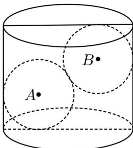

> [!faq]- 精品解析：2025年高考全国二卷数学真题（解析版）解析
>
> > [!success]- **【答案】** 2.5
>
> > [!note]- **【分析】**
> > 根据圆柱与球性质以及球的体积公式可求出球的半径；
>
> > [!note]- **【解析】**
> > 
> >
> > 圆柱的底面半径为 $4 \, cm$ ，设铁球的半径为 r，且 r < 4，
> >
> > 由圆柱与球的性质知 $AB^{2}=(2r)^{2}=(8-2r)^{2}+(9-2r)^{2}$
> >
> > 即 $4r^{2}-68r+145=(2r-5)(2r-29)=0$ ，∵r<4，
> >
> > $$
> > \therefore r = 2.
> >  5.
> > $$
> >
> > 故答案为：2.5.
