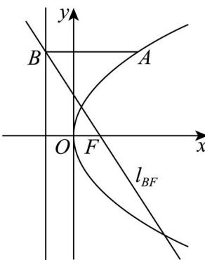

> [!faq]- 精品解析：2025年高考全国二卷数学真题（解析版）解析
>
> > [!success]- **【答案】** C
>
> > [!note]- **【分析】**
> > 先由直线 $l_{BF}$ 求出焦点F和p即抛物线C的方程，进而依次得抛物线的准线方程和点B，从而可依次求出 $y_{A}$ 和 $x_{A}$ ，再由焦半径公式即可得解.
> > 【
>
> > [!note]- **【解析】**
> > 对 $l_{BF}:y=-2x+2$ ，令y=0，则x=1，
> > 所以 $F(1,0)$ ，p=2 即抛物线 $C:y^{2}=4x$ ，故抛物线的准线方程为x=-1，
> >
> > 故 $B(-1,4)$ ，则 $y_{A} = 4$ ，代入抛物线 $C:y^{2} = 4x$ 得 $x_{A} = 4$ 。
> >
> > 所以 $\left|AF\right|=\left|AB\right|=x_{A}+\frac{p}{2}=4+1=5$
> >
> > 故选：C
> >
> > 
