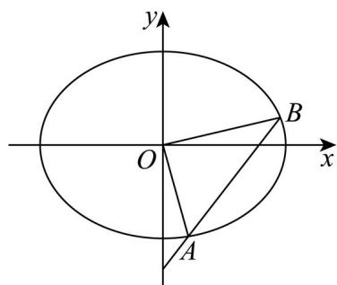

> [!faq]- 精品解析：2025年高考全国二卷数学真题（解析版）解析
>
> > [!success]- **【答案】** (1) $\frac{x^2}{4} + \frac{y^2}{2} = 1$ (2) $\sqrt{5}$
>
> > [!note]- **【分析】**
> > （1）根据长轴长和离心率求出基本量后可得椭圆方程；
> >
> > (2) 设出直线方程并联立椭圆方程后结合韦达定理用参数 $t$ 表示面积后可求 $t$ 的值，从而可求弦长.
>
> > [!note]- **【解析】**
> > 【小问1详解】
> >
> > 因为长轴长为 4，故 a=2 ，而离心率为 $\frac{\sqrt{2}}{2}$ ，故 $c=\sqrt{2}$ ，
> >
> > 故 $b=\sqrt{2}$ ，故椭圆方程为： $\frac{x^{2}}{4}+\frac{y^{2}}{2}=1$
> >
> > 【小问 2 详解】
> >
> > 
> >
> > 由题设直线 $AB$ 的斜率不为0，故设直线 $l: x = t(y + 2)$ ， $A(x_1, y_1), B(x_2, y_2)$ ，
> >
> > 由 $\left\{\begin{aligned}x=t(y+2)\\ x^{2}+2y^{2}=4\end{aligned}\right.$ 可得 $(t^{2}+2)y^{2}+4t^{2}y+4t^{2}-4=0$
> >
> > 故 $\Delta = 16t^4 - 4(t^2 + 2)(4t^2 - 4) = 4(8 - 4t^2) > 0$ 即 $-\sqrt{2} < t < \sqrt{2}$ ，
> >
> > 且 $y_{1} + y_{2} = -\frac{4t^{2}}{t^{2} + 2}, y_{1}y_{2} = \frac{4t^{2} - 4}{t^{2} + 2}$ ,
> >
> > $$
> > S _ {\triangle O A B} = \frac {1}{2} \times | 2 t | \times \left| y _ {1} - y _ {2} \right| = | t | \sqrt {\left(y _ {1} + y _ {2}\right) ^ {2} - 4 y _ {1} y _ {2}} = \frac {| t | \sqrt {3 2 - 1 6 t ^ {2}}}{t ^ {2} + 2} = \sqrt {2},
> > $$
> >
> > 解得 $t = \pm \frac{\sqrt{6}}{3}$
> >
> > $$
> > \text {故} \left| A B \right| = \sqrt {1 + t ^ {2}} \left| y _ {1} - y _ {2} \right| = \sqrt {1 + \frac {2}{3}} \times \sqrt {\left(y _ {1} + y _ {2}\right) ^ {2} - 4 y _ {1} y _ {2}} = \sqrt {\frac {5}{3}} \times \frac {\sqrt {3 2 - 1 6 \times \frac {2}{3}}}{\frac {2}{3} + 2} = \sqrt {5}.
> > $$
