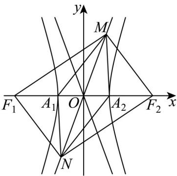
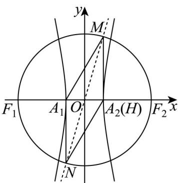

> [!faq]- 精品解析：2025年高考全国二卷数学真题（解析版）解析
>
> > [!success]- **【答案】** ACD
>
> > [!note]- **【分析】**
> > 由平行四边形的性质判断 A；由 $F_{1}M \perp F_{2}M$ 且 $\left|MO\right|=c$ 结合 M 在渐近线上可求 M 的坐标，从而可判断 B 的正误，或者利用三角函数定义和余弦定理也可判断；由中线向量结合 B 的结果可得 $c^{2}=13a^{2}$ ，计算后可判断 C 的正误，或者利用 $\frac{\left|MA_{2}\right|}{\left|A_{1}A_{2}\right|}=\frac{b}{2a}=\sqrt{3}$ 并结合离心率变形公式即可判断；结合 BC 的结果求出面积后可判断 D 的正误.
>
> > [!note]- **【解析】**
> > 不妨设渐近线为 $y = \frac{b}{a} x$ ， $M$ 在第一象限， $N$ 在第三象限，
> >
> > 对于A，由双曲线的对称性可得 $A_{1}MA_{2}N$ 为平行四边形，故 $\angle A_{1}MA_{2} = \pi -\frac{5\pi}{6} = \frac{\pi}{6}$
> >
> > 故 A 正确;
> >
> > 对于B，方法一：因为M在以 $F_{1}F_{2}$ 为直径的圆上，故 $F_{1}M\perp F_{2}M$ 且 $|MO|=c$ ，设 $M(x_{0},y_{0})$ ，则 $\left\{\begin{aligned}x_{0}^{2}+y_{0}^{2}&=c^{2}\\ \frac{y_{0}}{x_{0}}&=\frac{b}{a}\end{aligned}\right.$ ，故 $\left\{\begin{aligned}x_{0}&=a\\ y_{0}&=b\end{aligned}\right.$ ，故 $MA_{2}\perp A_{1}A_{2}$
> >
> > 由A得 $\angle A_{1}MA_{2} = \frac{\pi}{6}$ ，故 $\left|MA_2\right| = \left|MA_1\right|\times \frac{\sqrt{3}}{2}$ 即 $\left|MA_1\right| = \frac{2\sqrt{3}}{3}\left|MA_2\right|$ ，故B错误；
> >
> > 
> >
> > 方法二：因为 $\tan\angle MOA_{2}=\frac{b}{a}$ ，因为双曲线中， $c^{2}=a^{2}+b^{2}$ ，
> >
> > 则 $\cos \angle MOA_{2} = \frac{a}{c}$ ，又因为以 $F_{1}F_{2}$ 为直径的圆与 $C$ 的一条渐近线交于 $M$ 、 $N$ ，则 $OM = c$
> >
> > 则若过点 $M$ 往 $x$ 轴作垂线，垂足为 $H$ ，则 $\left|OH\right| = c\cdot \frac{a}{c} = a = \left|OA_2\right|$ ，则点 $H$ 与 $A_{2}(H)$ 重合，则 $MA_{2}\perp x$
> >
> > 轴，则 $\left|MA_{2}\right|=\sqrt{c^{2}-a^{2}}=b$ ，
> >
> > 
> >
> > 方法三：在 $\triangle OMA_{2}$ 利用余弦定理知， $\left|MA_{2}\right|^{2} = \left|OM\right|^{2} + \left|OA_{2}\right|^{2} - 2\left|OM\right|\left|OA_{2}\right|\cos \angle MOA_{2}$ ，即 $\left|MA_{2}\right|^{2} = c^{2} + a^{2} - 2ac \cdot \frac{a}{c} = b^{2}$ ，则 $\left|MA_{2}\right| = b$ ，
> >
> > 则 $\triangle A_{1}A_{2}M$ 为直角三角形，且 $\angle A_{1}MA_{2} = \frac{\pi}{6}$ ，则 $2|MA_2| = \sqrt{3}|MA_1|$ ，故B错误；
> >
> > 对于 C，方法一：因为 $MO = \frac{1}{2} (MA_{1} + MA_{2})$ ，故 $4MO^{2} = MA_{1}^{2} + 2MA_{1} \cdot MA_{2} + MA_{2}^{2}$
> >
> > 由B可知 $\left|MA_{2}\right|=b,\left|MA_{1}\right|=\frac{2\sqrt{3}}{3}b$ ，
> >
> > 故 $4c^{2} = b^{2} + \frac{4}{3} b^{2} + 2\times b\times \frac{2\sqrt{3}}{3} b\times \frac{\sqrt{3}}{2} = \frac{13}{3} b^{2} = \frac{13}{3}\left(c^{2} - a^{2}\right)$ 即 $c^2 = 13a^2$
> >
> > 故离心率 $e=\sqrt{13}$ ，故C正确；
> >
> > 方法二：因为 $\frac{|MA_2|}{|A_1A_2|} = \frac{b}{2a} = \sqrt{3}$ ，则 $\frac{b}{a} = 2\sqrt{3}$ ，则 $e = \frac{c}{a} = \sqrt{1 + \frac{b^2}{a^2}} = \sqrt{1 + (2\sqrt{3})^2} = \sqrt{13}$ ，故C正确；
> >
> > 对于D，当 $a = \sqrt{2}$ 时，由C可知 $e = \sqrt{13}$ ，故 $c = \sqrt{26}$ ，
> >
> > 故 $b=2\sqrt{6}$ ，故四边形 $NA_{1}MA_{2}$ 为 $2S_{\triangle MA_{1}A_{2}}=2\times\frac{1}{2}\times2\sqrt{6}\times2\sqrt{2}=8\sqrt{3}$
> >
> > 故D正确，
> >
> > 故选：ACD.
> >
> > ##
