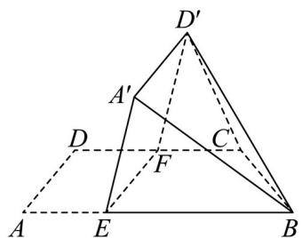

<!-- question-source:start -->
17. 如图，在四边形 $ABCD$ 中， $AB // CD, \angle DAB = 90^\circ$ ， $F$ 为 $CD$ 的中点，点 $E$ 在 $AB$ 上， $EF // AD$ ， $AB = 3AD, CD = 2AD$ ，将四边形 $EFDA$ 沿 $EF$ 翻折至四边形 $EFD'A'$ ，使得面 $EFD'A'$ 与面 $EFCB$ 所成的二面角为 $60^\circ$ 。

(1) 证明: $A'B//$ 平面 $CD'F$ ;

(2) 求面 $BCD'$ 与面 $EFD'A'$ 所成的二面角的正弦值.

【
<!-- question-source:end -->

![[高中/真题/按年份分类/2025/精品解析_2025年高考全国二卷数学真题_解析版_/解答题/题目/answers/Q00022017A1.md]]
