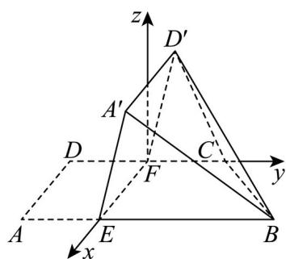

> [!faq]- 精品解析：2025年高考全国二卷数学真题（解析版）解析
>
> > [!success]- **【答案】** （1）证明见解析 (2) $\frac{\sqrt{42}}{7}$
>
> > [!note]- **【分析】**
> > （1）先应用线面平行判定定理得出 $A^{\prime}E / /$ 平面 $CD^{\prime}F$ 及 $EB / /$ 平面 $CD^{\prime}F$ 再应用面面平行判定定理得出平面 $A^{\prime}EB / /$ 平面 $CD^{\prime}F$ ，进而得出线面平行；
> > (2) 建立空间直角坐标系，利用已知条件将点 $B, C, D', E, F$ 的坐标表示出来，然后将平面 $BCD'$ 及平面 $EFD'A'$ 的法向量求出来，利用两个法向量的数量积公式可将两平面的夹角余弦值求出来，进而可求得其正弦值.
>
> > [!note]- **【解析】**
> > 【小问 1 详解】
> >
> > $$
> > A D = 1
> > $$
> >
> > $$
> > A B = 3, C D = 2
> > $$
> >
> > $$
> > F _ {\text {为}} C D
> > $$
> >
> > $$
> > D F = 1
> > $$
> >
> > $$
> > E F / / A D, A B / / C D
> > $$
> >
> > $$
> > A E F D
> > $$
> >
> > $$
> > A E / / D F
> > $$
> >
> > $$
> > A ^ {\prime} E / / D ^ {\prime} F
> > $$
> >
> > 因为 $D^{\prime}F \subset$ 平面 $CD^{\prime}F, A^{\prime}E \not\subset$ 平面 $CD^{\prime}F$ ，所以 $A^{\prime}E //$ 平面 $CD^{\prime}F$ ，
> >
> > 因为 $FC // EB, FC \subset$ 平面 $CD'F, EB \notin$ 平面 $CD'F$ ，所以 $EB //$ 平面 $CD'F$ ，
> >
> > 又 $EB \cap A'E = E$ ， $EB, A'E \subset$ 平面 $A'EB$ ，所以平面 $A'EB //$ 平面 $CD'F$ ，
> >
> > 又 $A'B \subset$ 平面 $A'EB$ ，所以 $A'B //$ 平面 $CD'F$ 。
> >
> > 【小问 2 详解】
> >
> > 
> >
> > 因为 $\angle DAB = 90^{\circ}$ ，所以 $AD \perp AB$ ，又因为 $AB //FC, EF //AD$ ，所以 $EF \perp FC$ ，
> >
> > 以 $F$ 为原点， $FE,FC$ 以及垂直于平面 $BECF$ 的直线分别为 $x,y,z$ 轴，建立空间直角坐标系.
> >
> > 因为 $D^{\prime}F\perp EF,CF\perp EF$ ，平面 $EFD'A'$ 与平面 $EFCB$ 所成二面角为 $60^{\circ}$
> >
> > 所以 $\angle D^{\prime}FC = 60^{\circ}$
> >
> > 则 $B(1,2,0), C(0,1,0), D'\left(0,\frac{1}{2},\frac{\sqrt{3}}{2}\right), E(1,0,0), F(0,0,0), \cdot$
> >
> > 所以 $BC = (-1, -1, 0), CD' = \left(0, -\frac{1}{2}, \frac{\sqrt{3}}{2}\right), FE = (1, 0, 0), FD' = \left(0, \frac{1}{2}, \frac{\sqrt{3}}{2}\right)$ .
> >
> > 设平面 $BCD'$ 的法向量为 $n = (x, y, z)$ ，则
> >
> > $\left\{ \begin{array}{l} BC \cdot n = 0 \\ CD' \cdot n = 0 \end{array} \right.$ ，所以 $\left\{ \begin{array}{l} -\frac{1}{2} y + \frac{\sqrt{3}}{2} z = 0 \\ -x - y = 0 \end{array} \right.$ ，令 $y = \sqrt{3}$ ，则 $z = 1, x = -\sqrt{3}$ ，则 $n = (-\sqrt{3}, \sqrt{3}, 1)$ .
> >
> > 设平面 $EFD'A'$ 的法向量为 $m=(x_{1},y_{1},z_{1})$ ,
> >
> > 则 $\left\{ \begin{array}{l} FE \cdot m = 0 \\ FD' \cdot m = 0 \end{array} \right.$ ，所以 $\left\{ \begin{array}{l} \frac{1}{2} y + \frac{\sqrt{3}}{2} z = 0 \\ x = 0 \end{array} \right.$ ，
> >
> > 令 $y = \sqrt{3}$ ，则 $z = -1, x = 0$ ，所以 $m = (0, \sqrt{3}, -1)$ .
> >
> > 所以 $\cos m, n = \frac{|m:n|}{|m||n|} = \frac{0 + 3 - 1}{\sqrt{3 + 3 + 1} \times \sqrt{1 + 3}} = \frac{1}{\sqrt{7}}.$
> >
> > 所以平面 $BCD'$ 与平面 $EFD'A'$ 夹角的正弦值为 $\sqrt{1-\left(\frac{1}{\sqrt{7}}\right)^2}=\frac{\sqrt{42}}{7}$ .
