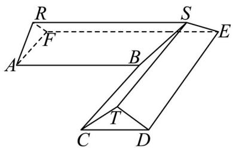

<!-- question-source:start -->
14. 某科技兴趣小组用 3D 打印机制作的一个零件可以抽象为如图所示的多面体，其中 $ABCDEF$ 是一个平面

多边形，平面 $AFR \perp$ 平面 $ABC$ ，平面 $CDT \perp$ 平面 $ABC$ ， $AB \perp BC$ ， $AB // EF // RS // CD$

$BC // DE // ST // AF$ . 若 $AB = BC = 8, AF = CD = 4, RA = RF = TC = TD = \frac{5}{2}$ ，则该多面体的体积为\_

【
<!-- question-source:end -->

![[高中/真题/按年份分类/2025/精品解析_2025年高考北京卷数学真题_解析版_/填空题/题目/answers/Q00022279A1.md]]
