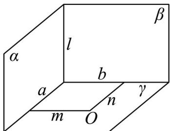
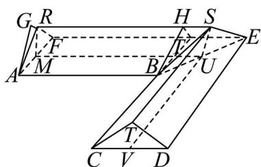

> [!faq]- 精品解析：2025年高考北京卷数学真题（解析版）解析
>
> > [!success]- **【答案】** 60 【
>
> > [!note]- **【分析】**
> > 如图，将一半的几何体分割成直三棱柱 ARF - BHT 和四棱锥 B - HTSE 后结合体积公式可求几何体的体积.
>
> > [!note]- **【解析】**
> > 先证明一个结论：如果平面 $\alpha \perp$ 平面 $\gamma$ ，平面 $\beta \perp$ 平面 $\gamma$ ，平面 $\alpha \cap \beta = l$ ，则 $l \perp \gamma$ .
> >
> > 证明：设 $\alpha\cap\gamma=a,\beta\cap\gamma=b$ ，在平面 $\gamma$ 取一点 O， $O\notin a, O\notin b$
> >
> > 在平面 $\gamma$ 内过 O 作直线 m，使得 $m \perp a$ ，作直线 n，使得 $n \perp b$ ，
> >
> > 因为平面 $\alpha \perp$ 平面 $\gamma$ ， $m \subset \gamma$ ，故 $m \perp \alpha$ ，而 $l \subset \alpha$ ，故 $m \perp l$ ，
> >
> > 同理 $n \perp l$ ，而 $m \cap n = O, m, n \subset \gamma$ ，故 $l \perp \gamma$ .
> >
> > 
> >
> > 下面回归问题.
> >
> > 连接 $BE$ ，因为 $AB\perp BC$ 且 $AF / / BC$ ，故 $AF\perp AB$ ，同理 $BC\perp CD$ ， $EF\perp ED$
> >
> > 而 $AB = BC = 8, AF = CD = 4$ ，故直角梯形ABEF与直角梯形CBED全等，
> >
> > 故 $\angle BEF = \angle BED = 45^{\circ}$
> >
> > 在直角梯形 $ABEF$ 中，过 $B$ 作 $BT \perp EF$ ，垂足为 $T$ ，
> >
> > 则四边形 ABTF 为矩形，且 $\triangle BTE$ 为以 $\angle BTE$ 为直角的等腰直角三角形，
> >
> > 故 $EF = FT + TE = AB + BT = AB + AF = 12$ ,
> >
> > 平面 $RAF \perp$ 平面 ABEF，平面 $RAF \cap$ 平面 $ABEF = AF$ ， $AF \perp AB$ ，
> >
> > $AB \subset$ 平面 $ABEF$ ，故 $AB \perp$ 平面 $RAF$ ，
> >
> > 取 $AF$ 的中点为 $M$ ， $BE$ 的中点为 $U$ ， $CD$ 的中点为 $V$ ，连接 $RM, MU, SU, UV$ ，
> >
> > 则 $MU // RS$ ，同理可证 $RM \perp$ 平面 $ABEF$ ，而 $RM \subset$ 平面 $RMUS$ ，
> >
> > 故平面 RMUS ⊥ 平面 ABEF，同理平面 VUS ⊥ 平面 ABEF，
> >
> > 而平面 $RMUS \cap$ 平面 VUS = SU ，故 $SU \perp$ 平面 ABEF ，
> >
> > 故 $RM // SU$ ，故四边形 $RMUS$ 为平行四边形，故 $MU = RS = \frac{1}{2} (8 + 12) = 10$
> >
> > 在平面 ABHR 中过 B 作 $BH \parallel AR$ ，交 RH 于 H，连接 HT.
> >
> > 则四边形 ABHR 为平行四边形，且 $RH \parallel AB, RH = AB$ ，故 $RH \parallel FT, RH = FT$ ，
> >
> > 故四边形 $RFTH$ 为平行四边形，
> >
> > 而 $BH \perp AB, BT \perp AB, BT \cap BH = B, BT, BH \subset$ 平面BHT，
> >
> > 故 $AB \perp$ 平面BHT，故平面 $ARF //$ 平面BHT，
> >
> > 而 $AR = BH, RF = HT, AF = BT$ ，故 $\triangle ARF \cong \triangle BHT$
> >
> > 故几何体 ARF - BHT 为直棱柱，
> >
> > 而 $S_{\triangle ARF} = \frac{1}{2}\times 4\times \sqrt{\left(\frac{5}{2}\right)^2 - 4} = 3$ ，故 $V_{ARF - BHT} = 8\times 3 = 24$
> >
> > 因为 $AB // EF$ ，故 $EF \perp$ 平面 $ARF$ ，
> >
> > 而 $EF \subset$ 平面 $RSEF$ ，故平面 $ARF \perp$ 平面 $RSEF$ ，
> >
> > 在平面 $ARF$ 中过A作 $AG \perp RF$ ，垂足为 $G$ ，同理可证 $AG \perp$ 平面 $RSEF$ ，
> >
> > 而 $\frac{1}{2} AG \times RF = 3$ ，故 $AG = \frac{12}{5}$ ，故 $V_{B-HTES} = \frac{1}{3} \times \frac{12}{5} \times \frac{1}{2}(2 + 4) \times \frac{5}{2} = 6$ ，
> >
> > 由对称性可得几何体的体积为 $2 \times (24 + 6) = 60$ ，
> >
> > 
> >
> > 故
