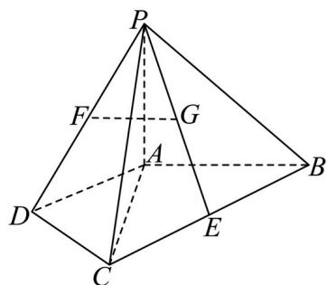

<!-- question-source:start -->
17. 如图，在四棱锥 $P - ABCD$ 中， $\triangle ADC$ 与 $\triangle BAC$ 均为等腰直角三角形，

$\angle ADC = 90^{\circ}$ ， $\angle BAC = 90^{\circ}$ ， $E$ 为 $BC$ 的中点.

(1) 若 $F, G$ 分别为 $PD, PE$

中点，求证： $FG \parallel$ 平面 PAB;

(2) 若 $PA \perp$ 平面 ABCD，PA = AC，求直线 AB 与平面 PCD 所成角的正弦值.

【
<!-- question-source:end -->

![[高中/真题/按年份分类/2025/精品解析_2025年高考北京卷数学真题_解析版_/解答题/题目/answers/Q00022282A1.md]]
