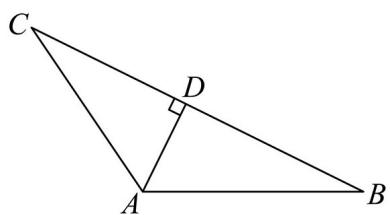

> [!faq]- 精品解析：2025年高考北京卷数学真题（解析版）解析
>
> > [!success]- **【答案】** (1) 6 (2)
>
> > [!note]- **【分析】**
> > （1）由平方关系、正弦定理即可求解；
>
> > [!note]- **【解析】**
> > 因为 $\cos A = -\frac{1}{3}, A \in (0, \pi)$ ，所以 $\sin A = \sqrt{1 - \cos^{2} A} = \frac{2\sqrt{2}}{3}$ ，
> >
> > 由正弦定理有 $a\sin C = c\sin A = \frac{2\sqrt{2}}{3} c = 4\sqrt{2}$ ，解得 $c = 6$
> >
> > 【
> >
> > 小问 2
> >
> > 如图所示，若 $\vee ABC$ 存在，则设其 $BC$ 边上的高为 $AD$ ，
> >
> > 
> >
> > 若选①， $a = 6$ ，因为 $c = 6$ ，所以 $C = A$ ，因为 $\cos A = -\frac{1}{3} < 0$ ，这表明此时三角形 $ABC$ 有两个钝角，
> >
> > 而这是不可能的，所以此时三角形 ABC 不存在，故 BC 边上的高也不存在；
> >
> > 若选②， $a\sin B=\frac{10\sqrt{2}}{3}$ ，由 $a\sin C=4\sqrt{2}$ 有 $\frac{\sin B}{\sin C}=\frac{\frac{10\sqrt{2}}{3}}{4\sqrt{2}}=\frac{5}{6}$ ，由正弦定理得 $\frac{b}{c}=\frac{5}{6}$ ，所以b=5，
> >
> > 所以由余弦定理得 $a = \sqrt{b^2 + c^2 - 2bc\cos A} = \sqrt{25 + 36 - 2\times 5\times 6\times\left(-\frac{1}{3}\right)} = 9,$
> >
> > 此时三角形 ABC 是存在的，且唯一确定，
> >
> > 所以 $S_{\triangle ABC} = \frac{1}{2} bc \sin A = \frac{1}{2} BC \cdot AD$ ，即 $\frac{1}{2} \times 5 \times 6 \times \frac{2\sqrt{2}}{3} = \frac{1}{2} \times 9AD$ ，
> >
> > 所以 $BC$ 边上的高 $AD = \frac{20\sqrt{2}}{9}$
> >
> > 若选③， $\forall ABC$ 的面积是 $10\sqrt{2}$ ，则 $S_{\triangle ABC} = \frac{1}{2} bc \sin A = \frac{1}{2} b \times 6 \times \frac{2\sqrt{2}}{3} = 10\sqrt{2}$ ，
> >
> > 解得 $b = 5$ ，由余弦定理可得 $a = \sqrt{b^2 + c^2 - 2bc\cos A} = \sqrt{25 + 36 - 2\cdot 5\cdot 6\cdot\left(-\frac{1}{3}\right)} = 9$ 可以唯一确定，进一步由余弦定理可得 $\cos B,\cos C$ 也可以唯一确定，即 $B,C$ 可以唯一确定，
> >
> > 这表明此时三角形 $ABC$ 是存在的，且 $BC$ 边上的高满足： $S_{\triangle ABC} = \frac{1}{2} a \cdot AD = \frac{9}{2} AD = 10\sqrt{2}$ ，即
> >
> > $$
> > A D = \frac {2 0 \sqrt {2}}{9}
> > $$
