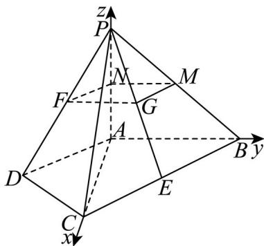

> [!faq]- 精品解析：2025年高考北京卷数学真题（解析版）解析
>
> > [!success]- **【答案】** （1）证明见
>
> > [!note]- **【分析】**
> > （1）取 $PA$ 的中点 $N$ ， $PB$ 的中点 $M$ ，连接 $FN$ 、 $MN$ ，只需证明 $FG\parallel MN$ 即可；
>
> > [!note]- **【解析】**
> > 取 $PA$ 的中点 $N$ ， $PB$ 的中点 $M$ ，连接 $FN$ 、 $MN$ ，
> >
> > $\because \triangle ACD_{\text{与}} \vee ABC_{\text{为等腰直角三角形且}} \angle ADC = 90^{\circ}, \angle BAC = 90^{\circ}$
> >
> > 不妨设 $AD = CD = 2$ ， $\therefore AC = AB = 2\sqrt{2}$ $\therefore BC = 4$
> >
> > ∵ E、F 分别为 BC、PD 的中点，
> >
> > $\therefore FN = \frac{1}{2} AD = 1, GM = \frac{1}{2} BE = 1$ ，且 $FN // AD, GM // BC$ .
> >
> > $Q \angle DAC = 45^{\circ}, \angle ACB = 45^{\circ}, \therefore AD \parallel BC,$
> >
> > $\therefore FN \parallel GM$ ，∴四边形FGMN为平行四边形，
> >
> > $\therefore FG \parallel MN$
> >
> > ∵ FG ∉ 平面 PAB, $MN \subset$ 平面 PAB, ∴ FG ∥ 平面 PAB;
> >
> > 【
> >
> > 小问 2
> >
> > ∵ PA ⊥ 平面 ABCD，∴ 以 A 为原点，AC、AB、AP 所在直线分别为 x、y、z 轴建立如图所示的空间直角坐标系，
> >
> > 
> >
> > 设 $AD = CD = 2$ ，则 $A(0,0,0),B(0,2\sqrt{2},0),C(2\sqrt{2},0,0),D(\sqrt{2}, - \sqrt{2},0),P(0,0,2\sqrt{2})$ $\therefore AB = (0,2\sqrt{2},0),DC = (\sqrt{2},\sqrt{2},0),CP = (-2\sqrt{2},0,2\sqrt{2})$
> >
> > 设平面 $PCD$ 的一个法向量为 $n = (x, y, z)$ ，
> >
> > $$
> > \therefore \left\{ \begin{array}{l} D C \cdot n = 0 \\ C P \cdot n = 0 \end{array} , \quad \therefore \left\{ \begin{array}{l} \sqrt {2} x + \sqrt {2} y = 0 \\ - 2 \sqrt {2} x + 2 \sqrt {2} z = 0 \end{array} , \right. \right.
> > $$
> >
> > 取 $x = 1$ ， $\therefore y = -1,z = 1$ ， $\therefore n = (1, - 1,1)$
> >
> > 设 AB 与平面 PCD 所成角为 $\theta$ ，
> >
> > $$
> > \sin \theta = \left| \cos \vec {\triangle} A B, n \vec {\triangledown} \right| = \frac {\left| A B \cdot \vec {n} \right|}{\left| A B \right| \cdot | n |} = \frac {\left| 0 \times 1 + 2 \sqrt {2} \times (- 1) + 0 \times 1 \right|}{2 \sqrt {2} \times \sqrt {1 ^ {2} + (- 1) ^ {2} + 1 ^ {2}}} = \frac {2 \sqrt {2}}{2 \sqrt {2} \times \sqrt {3}} = \frac {\sqrt {3}}{3},
> > $$
> >
> > 即 $AB$ 与平面 $PCD$ 所成角的正弦值为 $\frac{\sqrt{3}}{3}$ .
