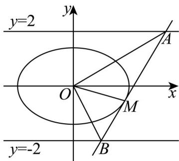

> [!faq]- 精品解析：2025年高考北京卷数学真题（解析版）解析
>
> > [!success]- **【答案】** （1） $\frac{x^{2}}{4}+\frac{y^{2}}{2}=1$ (2) $\frac{S_1}{S_2} = \frac{|OA|}{|OB|}$
>
> > [!note]- **【分析】**
> > （1）根据椭圆定义以及离心率可求出 $a, c$ ，再根据 $a, b, c$ 的关系求出 $b$ ，即可得到椭圆方程；
> > (2) 法一: 联立直线方程求出点 $A, B$ 坐标, 即可求出 $\frac{|OA|}{|OB|}$ , 再根据 $\frac{S_1}{S_2} = \frac{|AM|}{|BM|}$ , 即可得出它们的大小关系.
> >
> > 法二：利用直线的到角公式或者倾斜角之间的关系得到 $\angle AOM = \angle BOM$ ，再根据三角形的面积公式即可解出.
>
> > [!note]- **【解析】**
> > 【小问 1 详解】
> >
> > 由椭圆可知， $2a = 4$ ，所以 $a = 2$ ，又 $e = \frac{c}{a} = \frac{\sqrt{2}}{2}$ ，所以 $c = \sqrt{2}$ ， $b^{2} = a^{2} - c^{2} = 2$
> >
> > 故椭圆 E 的方程为 $\frac{x^{2}}{4} + \frac{y^{2}}{2} = 1$ ;
> >
> > 【小问 2 详解】
> >
> > 联立 $\left\{ \begin{array}{l} x_0x + 2y_0y - 4 = 0 \\ \frac{x^2}{4} +\frac{y^2}{2} = 1 \end{array} \right.$ ，消去得， $\left(\frac{4 - 2y_0y}{x_0}\right)^2 +2y^2 = 4,$
> >
> > 整理得， $\left(2x_0^2 +4y_0^2\right)y^2 -16y_0y + 16 - 4x_0^2 = 0$ $①$
> >
> > 又 $\frac{x_0^2}{4} +\frac{y_0^2}{2} = 1$ ，所以 $2x_{0}^{2} + 4y_{0}^{2} = 8$ ， $16 - 4x_0^2 = 8y_0^2$
> >
> > 故①式可化简为 $8y^{2} - 16y_{0}y + 8y_{0}^{2} = 0$ ，即 $(y - y_0)^2 = 0$ ，所以 $y = y_0$
> >
> > 所以直线 $x_{0}x + 2y_{0}y - 4 = 0$ 与椭圆相切，M 为切点.
> >
> > 设 $A(x_{1},y_{1}), B(x_{2},y_{2})$ ，易知，当 $x_{1}=x_{2}$ 时，由对称性可知， $\frac{S_{1}}{S_{2}}=\frac{|OA|}{|OB|}$ .
> >
> > 故设 $x_{2} < x_{0} < x_{1}$ ，易知 $\frac{S_1}{S_2} = \frac{|AM|}{|BM|} = \frac{|x_1 - x_0|}{|x_2 - x_0|} = \frac{x_1 - x_0}{x_0 - x_2}$ ，
> >
> > 联立 $\left\{ \begin{array}{l} x_0x + 2y_0y - 4 = 0 \\ y = 2 \end{array} \right.$ ，解得 $x_1 = \frac{4 - 4y_0}{x_0}, y_1 = 2$ ，
> >
> > 联立 $\left\{ \begin{array}{l} x_0x + 2y_0y - 4 = 0 \\ y = -2 \end{array} \right.$ ，解得 $x_{2} = \frac{4 + 4y_{0}}{x_{0}}, y_{2} = -2$ ，
> >
> > 所以 $\frac{S_1}{S_2} = \frac{x_1 - x_0}{x_0 - x_2} = \frac{\frac{4 - 4y_0}{x_0} - x_0}{x_0 - \frac{4 + 4y_0}{x_0}} = \frac{4 - 4y_0 - x_0^2}{x_0^2 - 4y_0 - 4}$
> >
> > $$
> > = \frac {2 y _ {0} ^ {2} - 4 y _ {0}}{- 2 y _ {0} ^ {2} - 4 y _ {0}} = \frac {2 - y _ {0}}{2 + y _ {0}},
> > $$
> >
> > $$
> > \frac {\left| O A \right|}{\left| O B \right|} = \frac {\sqrt {\left(\frac {4 - 4 y _ {0}}{x _ {0}}\right) ^ {2} + 4}}{\sqrt {\left(\frac {4 + 4 y _ {0}}{x _ {0}}\right) ^ {2} + 4}} = \frac {\sqrt {4 \left(1 - y _ {0}\right) ^ {2} + x _ {0} ^ {2}}}{\sqrt {4 \left(1 + y _ {0}\right) ^ {2} + x _ {0} ^ {2}}} = \frac {\sqrt {4 \left(1 - y _ {0}\right) ^ {2} + 4 - 2 y _ {0} ^ {2}}}{\sqrt {4 \left(1 + y _ {0}\right) ^ {2} + 4 - 2 y _ {0} ^ {2}}} = \frac {\sqrt {y _ {0} ^ {2} - 4 y _ {0} + 4}}{\sqrt {y _ {0} ^ {2} + 4 y _ {0} + 4}} = \frac {2 - y _ {0}}{2 + y _ {0}},
> > $$
> >
> > 故 $\frac{S_{1}}{S_{2}}=\frac{|OA|}{|OB|}$ .
> >
> > 法二：不妨设 $A(x_{1},y_{1}), B(x_{2},y_{2})$ ，易知，当 $x_{1}=x_{2}$ 时，由对称性可知， $\frac{S_{1}}{S_{2}}=\frac{|OA|}{|OB|}$ .
> >
> > 故设 $x_{2} < x_{0} < x_{1}$
> >
> > 联立 $\left\{ \begin{array}{l}x_0x + 2y_0y - 4 = 0\\ y = 2 \end{array} \right.$ ，解得 $x_{1} = \frac{4 - 4y_{0}}{x_{0}},y_{1} = 2$
> >
> > 联立 $\left\{ \begin{array}{l} x_0x + 2y_0y - 4 = 0 \\ y = -2 \end{array} \right.$ ，解得 $x_{2} = \frac{4 + 4y_{0}}{x_{0}}, y_{2} = -2$ ，
> >
> > 若 $x_{1} = 0$ ，则 $y_0 = 1, x_0 = \pm \sqrt{2}, x_2 = \pm 4\sqrt{2}$
> >
> > 由对称性，不妨取 $x_0 = \sqrt{2}, x_2 = 4\sqrt{2}$ ，则 $A(0,2), B(4\sqrt{2}, -2), M(\sqrt{2},1)$ ，
> >
> > $\tan\angle BOM=\sqrt{2}$ $\tan\angle BOM=\frac{\frac{\sqrt{2}}{2}+\frac{\sqrt{2}}{4}}{1-\frac{\sqrt{2}}{2}\times\frac{\sqrt{2}}{4}}=\sqrt{2}$ ，所以 $\angle AOM = \angle BOM$
> >
> > 同理，当 $x_{2} = 0$ 时， $\angle AOM = \angle BOM$
> >
> > 当 $x_{1}x_{2}\neq 0$ 时，则 $k_{OA} = \frac{y_1}{x_1} = \frac{2x_0}{4 - 4y_0} = \frac{x_0}{2 - 2y_0}, k_{OB} = \frac{y_2}{x_2} = \frac{-2x_0}{4 + 4y_0} = -\frac{x_0}{2 + 2y_0}, k_{OM} = \frac{y_0}{x_0},$
> >
> > 又 $\frac{x_0^2}{4} +\frac{y_0^2}{2} = 1$ ，所以 $x_0^2 +2y_0^2 = 4$
> >
> > 所以 $\tan\angle AOM=\frac{k_{OA}-k_{OM}}{1+k_{OA}\cdot k_{OM}}=\frac{\frac{x_{0}}{2-2y_{0}}-\frac{y_{0}}{x_{0}}}{1+\frac{x_{0}}{2-2y_{0}}\times\frac{y_{0}}{x_{0}}}$
> >
> > $$
> > = - \frac {x _ {0} ^ {2} + 2 y _ {0} ^ {2} - 2 y _ {0}}{x _ {0} (y _ {0} - 2)} = - \frac {4 - 2 y _ {0}}{x _ {0} (y _ {0} - 2)} = \frac {2}{x _ {0}},
> > $$
> >
> > $$
> > \tan \angle B O M = \frac {k _ {O M} - k _ {O B}}{1 + k _ {O M} \cdot k _ {O B}} = \frac {\frac {y _ {0}}{x _ {0}} + \frac {x _ {0}}{2 + 2 y _ {0}}}{1 + \frac {y _ {0}}{x _ {0}} \times \left(- \frac {x _ {0}}{2 + 2 y _ {0}}\right)} = \frac {x _ {0} ^ {2} + 2 y _ {0} ^ {2} + 2 y _ {0}}{x _ {0} (y _ {0} + 2)} = \frac {4 + 2 y _ {0}}{x _ {0} (y _ {0} + 2)} = \frac {2}{x _ {0}},
> > $$
> >
> > 则 $\tan \angle AOM = \tan \angle BOM$ ，即 $\angle AOM = \angle BOM$
> >
> > 所以 $\frac{S_1}{S_2} = \frac{|OA||OM|\sin\angle AOM}{|OB||OM|\sin\angle BOM} = \frac{|OA|}{|OB|}$
> >
> > 
