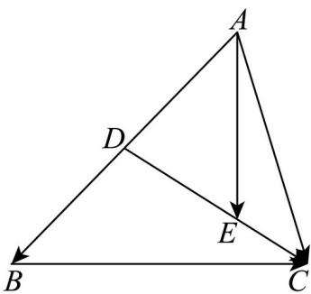

> [!faq]- 精品解析：2025年高考天津卷数学真题（解析版）解析
>
> > [!success]- **【答案】** $\frac{1}{6}a+\frac{2}{3}b$ ; -15
>
> > [!note]- **【分析】**
> > 根据向量的线性运算求解即可空一，应用数量积运算律计算求解空
> > 二.
>
> > [!note]- **【解析】**
> > 如图，
> >
> > 
> >
> > 因为 $CE = \frac{1}{3} CD$ ，所以 $AE - AC = \frac{1}{3}(AD - AC)$ ，所以 $AE = \frac{1}{3} AD + \frac{2}{3} AC$
> >
> > 因为 D 为线段 AB 的中点，所以 $AE = \frac{1}{6} AB + \frac{2}{3} AC = \frac{1}{6} a + \frac{2}{3} b$ ;
> >
> > 又因为 $\left|AE\right|=5, AE \perp CB$ ，所以 $AE^{2}=\left(\frac{1}{6}a+\frac{2}{3}b\right)^{2}=\frac{1}{36}a^{2}+\frac{2}{9}a\cdot b+\frac{4}{9}b^{2}=25$
> >
> > $AE\cdot CB = \left(\frac{1}{6} a + \frac{2}{3} b\right)\cdot (a - b) = \frac{1}{6} a^2 +\frac{1}{2} a\cdot b - \frac{2}{3} b^2 = 0$ ，所以 $a^2 +3a\cdot b = 4b^2$
> >
> > 所以 $a^{2} + 4a \cdot b = 180$ ,
> >
> > $$
> > A E \cdot C D = \left(\frac {1}{6} a + \frac {2}{3} b\right) \cdot \left(- b + \frac {1}{2} a\right) = \frac {1}{1 2} a ^ {2} + \frac {1}{6} a \cdot b - \frac {2}{3} b ^ {2} = \frac {1}{1 2} \left(a ^ {2} + 2 a \cdot b - 8 b ^ {2}\right)
> > $$
> >
> > $$
> > = \frac {1}{1 2} \left(a ^ {2} + 2 a \cdot b - 2 a ^ {2} - 6 a \cdot b\right) = \frac {1}{1 2} \left(- a ^ {2} - 4 a \cdot b\right) = - 1 5
> > $$
> >
> > 故答案为： $\frac{1}{6}a+\frac{2}{3}b$ ; -15.
