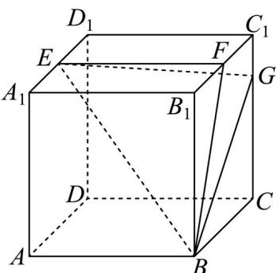

<!-- question-source:start -->
17. 正方体 $ABCD - A_{1}B_{1}C_{1}D_{1}$ 的棱长为 4， $E \setminus F$ 分别为 $A_{1}D_{1}, C_{1}B_{1}$ 中点， $CG = 3GC_{1}$

<!-- question-source:end -->

![[高中/真题/按年份分类/2025/精品解析_2025年高考天津卷数学真题_解析版_/解答题/题目/answers/Q00029390A1.md]]
