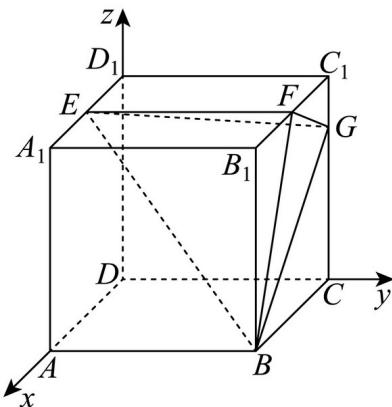

> [!faq]- 精品解析：2025年高考天津卷数学真题（解析版）解析
>
> > [!success]- **【答案】** （1）证明见
>
> > [!note]- **【分析】**
> > （1）法一、利用正方形的性质先证明 $FG \perp BF$ ，再结合正方体的性质得出 $EF \perp$ 平面 $BCC_{1}B_{1}$ ，利用线面垂直的性质与判定定理证明即可；法二、建立空间直角坐标系，利用空间向量证明线面垂直即可；
>
> > [!note]- **【解析】**
> > 法一、在正方形 $BCC_{1}B_{1}$ 中，
> >
> > 由条件易知 $\tan\angle C_{1}FG=\frac{C_{1}G}{C_{1}F}=\frac{1}{2}=\frac{FB_{1}}{BB_{1}}=\tan\angle B_{1}BF$ ，所以 $\angle C_{1}FG=\angle B_{1}BF$ ，
> >
> > 则 $\angle B_{1}FB + \angle B_{1}BF = \frac{\pi}{2} = \angle C_{1}FG + \angle B_{1}FB$
> >
> > 故 $\angle BFG = \pi - (\angle C_1FG + \angle B_1FB) = \frac{\pi}{2}$ ，即 $FG \perp BF$ ，
> >
> > 在正方体中，易知 $D_{1}C_{1}\perp$ 平面 $BCC_{1}B_{1}$ ，且 $EF / / D_1C_1$
> >
> > 所以 $EF \perp$ 平面 $BCC_{1}B_{1}$ ,
> >
> > 又 $FG \subset$ 平面 $BCC_{1}B_{1}$ , $\therefore EF \perp FG$ ,
> >
> > $\because EF \cap BF = F, EF \setminus BF \subset$ 平面 $BEF$ ， $\therefore GF \perp$ 平面 $BEF$ ；
> >
> > 法二、如图以 $D$ 中心建立空间直角坐标系，
> >
> > 则 $B(4,4,0),E(2,0,4),F(2,4,4),G(0,4,3)$
> >
> > 所以 $EF = (0, 4, 0)$ , $EB = (2, 4, -4)$ , $FG = (-2, 0, -1)$ ,
> >
> > 设 $m = (a,b,c)$ 是平面BEF的一个法向量，
> >
> > 则 $\left\{ \begin{array}{l} m \cdot EF = 4b = 0 \\ m \cdot EB = 2a + 4b - 4c = 0 \end{array} \right.$ ，令 $a = 2$ ，则 $b = 0, c = 1$ ，所以 $m = (2,0,1)$ ，
> >
> > 易知 $FG = -m$ ，则 $FG$ 也是平面 $BEF$ 的一个法向量， $\therefore GF\perp$ 平面 $BEF$
> >
> > 【
> >
> > 小问 2
> >
> > 同上法二建立的空间直角坐标系，
> >
> > 所以 $EG = (-2, 4, -1)$ , $BG = (-4, 0, 3)$ ,
> >
> > 由（1）知 $FG$ 是平面 $BEF$ 的一个法向量，
> >
> > 设平面 $_{BEG}$ 的一个法向量为 $n=(x,y,z)$ ，所以 $\left\{\begin{aligned}n\cdot EG&=-2x+4y-z=0\\ n\cdot BG&=-4x+3z=0\end{aligned}\right.$ ，
> >
> > 令 $x = 6$ ，则 $z = 8, y = 5$ ，即 $n = (6, 5, 8)$
> >
> > 设平面 BEF 与平面 BEG 的夹角为 $\alpha$ ，
> >
> > 则 $\cos\alpha=\left|\cos\left\langle FG,n\right\rangle\right|=\frac{\left|FG\cdot n\right|}{\left|FG\right|\cdot\left|n\right|}=\frac{20}{\sqrt{5}\times\sqrt{125}}=\frac{4}{5};$
> >
> > 【
> >
> > 小问3
> >
> > 由（1）知 $EF \perp$ 平面 $BCC_{1}B_{1}$ ， $FB \subset$ 平面 $BCC_{1}B_{1}$ ， $\therefore EF \perp FB$ ，
> >
> > 易知 $S_{\triangle BEF} = \frac{1}{2} EF \cdot BF = \frac{1}{2} \times 4 \times \sqrt{4^{2} + 2^{2}} = 4\sqrt{5}$ ,
> >
> > 又 $DE = (2,0,4)$ ，则 $D$ 到平面 $\underset{BEF}{\text{的距离为}} d = \frac{\left|DE \cdot FG\right|}{\left|FG\right|} = \frac{8}{\sqrt{5}}$
> >
> > 由棱锥的体积公式知： $V_{D-BEF}=\frac{1}{3}d\times S_{\triangle BEF}=\frac{1}{3}\times\frac{8}{\sqrt{5}}\times4\sqrt{5}=\frac{32}{3}$
> >
> > 
