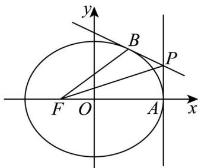

> [!faq]- 精品解析：2025年高考天津卷数学真题（解析版）解析
>
> > [!success]- **【答案】** （1） $\frac{x^{2}}{4}+\frac{y^{2}}{3}=1$ (2) 证明见解析
>
> > [!note]- **【分析】**
> > （1）根据题意，利用椭圆的离心率得到 $a = 2c$ ，再由直线 $PF$ 的斜率得到 $m = c$ ，从而利用三角形的面积公式得到关于 $c$ 的方程，解之即可得解；
> > (2) 联立直线与椭圆方程, 利用其位置关系求得 $k$ , 进而得到直线 $PB$ 的方程与点 $B$ 的坐标, 法一: 利用向量的夹角公式即可得证; 法二: 利用两直线的夹角公式即可得证; 法三利用正切的倍角公式即可得证; 法四: 利用角平分线的性质与点线距离公式即可得证.
>
> > [!note]- **【解析】**
> > 【小问 1 详解】
> >
> > 依题意，设椭圆 $\frac{x^2}{a^2} +\frac{y^2}{b^2} = 1(a > b > 0)$ 的半焦距为 $c$
> >
> > 则左焦点 $F(-c,0)$ ，右顶点 $A(a,0)$ ，离心率 $e=\frac{c}{a}=\frac{1}{2}$ ，即a=2c，
> >
> > 因为 $^{P}$ 为 $x=a$ 上一点，设 $P(a,m)$ ，
> >
> > 又直线 $PF$ 的斜率为 $\frac{1}{3}$ ，则 $\frac{m - 0}{a - (-c)} = \frac{1}{3}$ ，即 $\frac{m}{a + c} = \frac{1}{3}$ ，
> >
> > 所以 $\frac{m}{2c + c} = \frac{1}{3}$ ，解得 $m = c$ ，则 $P(a,c)$ ，即 $P(2c,c)$ ，
> >
> > 因为 $\triangle PFA$ 的面积为 $\frac{3}{2}$ ， $|AF| = a - (-c) = a + c = 3c$ ，高为 $|m| = c$ ，
> >
> > 所以 $S_{\triangle PFA}=\frac{1}{2}|AF||m|=\frac{1}{2}\times3c\times c=\frac{3}{2}$ ，解得 c=1，
> >
> > 则 $a = 2c = 2$ ， $b^{2} = a^{2} - c^{2} = 3$
> >
> > 所以椭圆的方程为 $\frac{x^2}{4} +\frac{y^2}{3} = 1$
> >
> > 
> >
> > 【小问 2 详解】
> >
> > 由
> > （1）可知 $P(2,1)$ ， $F(-1,0)$ ， $A(2,0)$
> >
> > 易知直线 $PB$ 的斜率存在，设其方程为 $y = kx + m$ ，则 $1 = 2k + m$ ，即 $m = 1 - 2k$ 联立 $\left\{\begin{aligned}y&=kx+m\\ \frac{x^{2}}{4}&+\frac{y^{2}}{3}=1\end{aligned}\right.$ ，消去得， $y=(3+4k^{2})x^{2}+8kmx+4m^{2}-12=0$
> >
> > 因 直线与椭圆有唯一交点，所以 $\Delta = (8k\cdot m)^2 -4(3 + 4k^2)\cdot (4m^2 -12) = 0$
> >
> > 即 $4k^{2} - m^{2} + 3 = 0$ ，则 $4k^{2} - (1 - 2k)^{2} + 3 = 0$ ，解得 $k = -\frac{1}{2}$ ，则 $m = 2$
> >
> > 所以直线 $PB$ 的方程为 $y = -\frac{1}{2} x + 2$
> >
> > 联立 $\left\{ \begin{array}{l} y = -\frac{1}{2} x + 2 \\ \frac{x^2}{4} + \frac{y^2}{3} = 1 \end{array} \right.$ ，解得 $\left\{ \begin{array}{l} x = 1 \\ y = \frac{3}{2}, \text{则} B(1, \frac{3}{2}) \end{array} \right.$ ，
> >
> > 以下分别用四种方法证明结论：
> >
> > 法一：则 $FB = \left(2, \frac{3}{2}\right), FP = (3, 1), FA = (3, 0)$ ，
> >
> > 所以 $\cos\angle BFP=\frac{FB\cdot FP}{|FB|\cdot|FP|}=\frac{2\times3+\frac{3}{2}\times1}{\sqrt{2^{2}+\left(\frac{3}{2}\right)^{2}}\cdot\sqrt{3^{2}+1^{2}}}=\frac{3\sqrt{10}}{10}$
> >
> > $$
> > \cos \angle P F A = \frac {F A \cdot F P}{| F A | \cdot | F P |} = \frac {3 \times 3 + 1 \times 0}{3 \sqrt {3 ^ {2} + 1 ^ {2}}} = \frac {3 \sqrt {1 0}}{1 0},
> > $$
> >
> > 则 $\cos \angle BFP = \cos \angle PFA$ ，又 $\angle BFP, \angle PFA \in (0, \frac{\pi}{2})$
> >
> > 所以 $\angle BFP = \angle PFA$ ，即 $PF$ 平分 $\angle AFB$
> >
> > 法二：所以 $k_{FB} = \frac{\frac{3}{2} - 0}{1 - (-1)} = \frac{3}{4}, k_{PF} = \frac{1 - 0}{2 - (-1)} = \frac{1}{3}, k_{AF} = 0,$
> >
> > 由两直线夹角公式，得 $\tan\angle BFP=\left|\frac{\frac{3}{4}-\frac{1}{3}}{1+\frac{1}{3}\times\frac{3}{4}}\right|=\frac{1}{3}$ ， $\tan\angle PFA=\left|\frac{\frac{1}{3}-0}{1+0}\right|=\frac{1}{3}$
> >
> > 则 $\tan\angle BFP=\tan\angle PFA$ ，又 $\angle BFP,\angle PFA\in(0,\frac{\pi}{2})$
> >
> > 所以 $\angle BFP = \angle PFA$ ，即 $PF$ 平分 $\angle AFB$
> >
> > 法三：则 $\tan\angle PFA=k_{PF}=\frac{1}{3},\quad\tan\angle BFP=k_{FB}=\frac{3}{4}$
> >
> > 故 $\tan2\angle PFA=\frac{2\tan\angle PFA}{1-\tan^{2}\angle PFA}=\frac{2\times\frac{1}{3}}{1-\left(\frac{1}{3}\right)^{2}}=\frac{3}{4}=\tan\angle BFP$
> >
> > 又 $\angle BFP, \angle PFA \in (0, \frac{\pi}{2})$
> >
> > 所以 $\angle BFP = \angle PFA$ ，即 $PF$ 平分 $\angle AFB$
> >
> > 法四：则 $k_{FB} = \frac{\frac{3}{2} - 0}{1 - (-1)} = \frac{3}{4}$
> >
> > 所以直线 $FB$ 的方程为 $y = \frac{3}{4} (x + 1)$ ，即 $3x - 4y + 3 = 0$
> >
> > 则点到直线的距离为 $d = \frac{|3\times 2 - 4\times 1 + 3|}{\sqrt{3^2 + (-4)^2}} = 1$
> >
> > 又点 P 到直线 FA 的距离也为 1，
> >
> > 所以 PF 平分 $\angle AFB$ .
