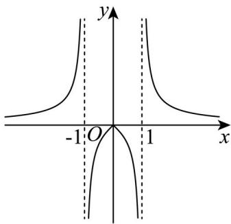

<!-- question-source:start -->
3. 已知函数 $y = f(x)$ 的图象如下，则 $f(x)$ 的解析式可能为（）

A. $f(x) = \frac{x}{1 - |x|}$ B. $f(x) = \frac{x}{|x| - 1}$ C. $f(x) = \frac{|x|}{1 - x^2}$ D. $f(x) = \frac{|x|}{x^2 - 1}$
<!-- question-source:end -->

![[高中/真题/按年份分类/2025/精品解析_2025年高考天津卷数学真题_解析版_/选择题/题目/answers/Q00030834A1.md]]
