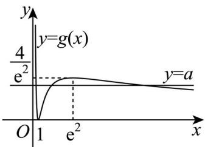

> [!faq]- 精品解析：2025年高考天津卷数学真题（解析版）解析
>
> > [!success]- **【答案】** 详见解析
>
> > [!note]- **【分析】**
> > 本题未单列分析。
>
> > [!note]- **【解析】**
> > 当 $a = 1$ 时， $f(x) = x - (\ln x)^2$ ， $x > 0$
> >
> > 则 $f^{\prime}(x) = 1 - \frac{2\ln x}{x}$ ，则 $f^{\prime}(1) = 1$ ，且 $f(1) = 1$
> >
> > 则切点 $^{(1,1)}$ ，且切线的斜率为 $^{1}$ ，
> >
> > 故函数 $f(x)$ 在点 $(1, f(1))$ 处的切线方程为 $y = x$ ；
> >
> > 【
> >
> > 小问 2
> >
> > (i) 令 $f(x) = ax - (\ln x)^2 = 0$ , $x > 0$ ,
> >
> > 得 $a = \frac{(\ln x)^2}{x}$
> >
> > 设 $g(x)=\frac{(\ln x)^{2}}{x}, x>0$
> >
> > 则 $g^{\prime}(x) = \frac{\frac{2\ln x}{x}\cdot x - (\ln x)^{2}}{x^{2}} = \frac{\ln x(2 - \ln x)}{x^{2}},$
> >
> > 由 $g'(x)=0$ 解得 x=1 或 $e^{2}$ ，其中 $g(1)=0$ ， $g(e^{2})=\frac{4}{e^{2}}$ ;
> >
> > 当 $0 < x < 1$ 时， $g'(x) < 0$ ， $g(x)$ $(0,1)$ 上单调递减；
> >
> > 当 $1 < x < \mathrm{e}^2$ 时， $g'(x) > 0$ ， $g(x)$ 在 $(1, \mathrm{e}^2)$ 上单调递增；
> >
> > 当 $x > e^{2}$ 时， $g'(x) < 0$ ， $g(x)$ 在 $(e^{2}, +\infty)$ 上单调递减；
> >
> > 且当 $x \to 0$ 时， $g(x) \to +\infty$ ；当 $x \to +\infty$ 时， $g(x) \to 0$ ；
> >
> > 如图作出函数 $g(x)$ 的图象，
> >
> > 
> >
> > 要使函数 $f(x)$ 有3个零点，
> >
> > 则方程 $a = g(x)$ 在 $(0, +\infty)$ 内有3个根，即直线 $y = a$ 与函数 $g(x)$ 的图象有3个交点.
> >
> > 结合图象可知， $0 < a < \frac{4}{\mathrm{e}^2}$
> >
> > 故 $a$ 的取值范围为 $(0, \frac{4}{\mathrm{e}^2})$ ；
> >
> > (ii) 由图象可知， $0 < x_{1} < 1 < x_{2} < e^{2} < x_{3}$
> >
> > 设 $\ln x_{1} = t_{1},\ln x_{2} = t_{2},\ln x_{3} = t_{3}$ ，则 $t_1 <   0 <   t_2 <   2 <   t_3$
> >
> > 满足 $\left\{ \begin{array}{l} a e^{t_1} = t_1^2 ① \\ a e^{t_2} = t_2^2 ② \\ a e^{t_3} = t_3^2 ③ \end{array} \right.$ ，由 可得 $\left\{ \begin{array}{l} \ln a + t_2 = 2 \ln t_2 \\ \ln a + t_3 = 2 \ln t_3 \end{array} \right.$ ，
> >
> > 两式作差可得 $t_3 - t_2 = 2(\ln t_3 - \ln t_2)$
> >
> > 则由对数均值不等式可得 $2=\frac{t_{3}-t_{2}}{\ln t_{3}-\ln t_{2}}>\sqrt{t_{2}t_{3}}$
> >
> > 则 $t_2t_3 < 4$ ，故要证 $(\ln x_2 - \ln x_1)\cdot \ln x_3 <   \frac{4\mathrm{e}}{\mathrm{e} - 1},$
> >
> > 即证 $t_2t_3 - t_1t_3 < \frac{4\mathrm{e}}{\mathrm{e} - 1}$ ，只需证 $4 - t_{1}t_{3}\leq \frac{4\mathrm{e}}{\mathrm{e} - 1},$
> >
> > 即证 $-t_{1}t_{3}\leq \frac{4}{\mathrm{e} - 1}$ ，又因为 $t_1 <   0,t_1^2 = ae^{t_1} <   a$ ，则 $\left|t_1\right| = -t_1 <   \sqrt{a}$
> >
> > 所以 $-t_{1}t_{3}<\sqrt{a}t_{3}=\frac{t_{3}^{2}}{\mathrm{e}^{\frac{t_{3}}{2}}}$ ，故只需证 $\frac{t_{3}^{2}}{\mathrm{e}^{\frac{t_{3}}{2}}}\leq\frac{4}{\mathrm{e}-1}$ ，
> >
> > 设函数 $\varphi(t) = \frac{t^2}{\mathrm{e}^{\frac{t}{2}}}, t > 2$ ，则 $\varphi'(t) = \frac{2te^{\frac{t}{2}} - \frac{1}{2}t^2e^{\frac{t}{2}}}{\mathrm{e}^t} = \frac{(2 - \frac{1}{2}t)t}{\mathrm{e}^{\frac{t}{2}}}$ ，
> >
> > 当 $2 < t < 4$ 时， $\varphi'(t) > 0$ ，则 $\varphi(t)$ 在 $(2,4)$ 上单调递增；
> >
> > 当 $t > 4$ 时， $\varphi^{\prime}(t) <   0$ ，则 $\varphi (t)$ 在 $(4, + \infty)$ 上单调递减；
> >
> > 故 $\varphi (t)_{\mathrm{max}} = \varphi (4) = \frac{16}{\mathrm{e}^2}$ ，即 $\varphi (t)\leq \frac{16}{\mathrm{e}^2}$
> >
> > 而由 $4\mathrm{e}^2 - 16\mathrm{e} + 16 = 4(\mathrm{e} - 2)^2 > 0$
> >
> > 可知 $\frac{16}{\mathrm{e}^2} < \frac{4}{\mathrm{e} - 1}$ 成立，故命题得证.
