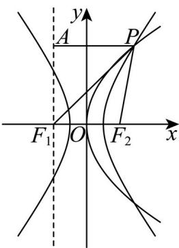

> [!faq]- 精品解析：2025年高考天津卷数学真题（解析版）解析
>
> > [!success]- **【答案】** A
>
> > [!note]- **【分析】**
> > 利用抛物线与双曲线的定义与性质得出 $\left\{\begin{aligned}|PF_{1}|&=3c+a\\ |PF_{2}|&=3c-a=|PA|\end{aligned}\right.$ ，根据勾股定理从而确定 P 的坐标，利用点在双曲线上构造齐次方程计算即可.
>
> > [!note]- **【解析】**
> > 根据题意可设 $F_{2}\left(\frac{p}{2},0\right)$ ，双曲线的半焦距为 $C$ ， $P(x_{0},y_{0})$ ，则 p=2c，
> >
> > 过 $F_{1}$ 作 x 轴的垂线 l，过 P 作 l 的垂线，垂足为 A，显然直线 $AF_{1}$ 为抛物线的准线，
> >
> > 则 $\left|PA\right|=\left|PF_{2}\right|$ ，
> >
> > 由双曲线的定义及已知条件可知 $\left\{\begin{aligned}|PF_{1}|-|PF_{2}|&=2a\\ |PF_{1}|+|PF_{2}|&=6c\end{aligned}\right.$ ，则 $\left\{\begin{aligned}|PF_{1}|&=3c+a\\ |PF_{2}|&=3c-a=|PA|\end{aligned}\right.$ 由勾股定理可知 $\left|AF_{1}\right|^{2}=y_{0}^{2}=\left|PF_{1}\right|^{2}-\left|PA\right|^{2}=12ac$ ，
> >
> > 易知 $y_0^2 = 4cx_0, \therefore x_0 = 3a$ ，即 $\frac{x_0^2}{a^2} - \frac{y_0^2}{b^2} = \frac{9a^2}{a^2} - \frac{12ac}{c^2 - a^2} = 1$ ，
> >
> > 整理得 $2c^{2} - 3ac - 2a^{2} = 0 = (2c + a)(c - 2a)$ ， $\therefore c = 2a$ ，即离心率为2.
> >
> > 故选：
> >
> > 
> >
> > ## 第Ⅱ卷（非选择题）
> >
> > ## 注意事项：
> >
> > 1. 用黑色墨水的钢笔或签字笔将答案写在答题卡上。
