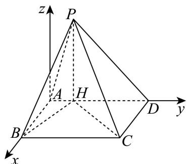

> [!faq]- 2026年高考上海卷数学高考真题（解析版）解析
>
> > [!success]- **【答案】** 详见解析
>
> > [!note]- **【分析】**
> > （1）建立空间直角坐标系，得出相关点和向量坐标，利用向量的数量积为0，推出向量垂直；
> >
> > （2）利用棱锥体积公式求出 $h$ ，进而求出点 $P$ ，得出相关向量坐标，求出平面的法向量，进而利用向量夹角余弦公式求解.
>
> > [!note]- **【解析】**
> > （1）根据已知四棱锥的性质，结合已知条件，以 $A$ 为坐标原点，建立下图所示空间直角坐标系，
> >
> > 
> >
> > 则 $A(0,0,0)$ , $B(2,0,0)$ , $H(0,1,0)$ , $C(2,5,0)$ ，设点 $P(0,1,t)$ ,
> >
> > 则 $\overrightarrow{CH} = (-2, -4, 0)$ , $\overrightarrow{PB} = (2, -1, -t)$ ,
> >
> > $$
> > \therefore \overrightarrow {C H} \cdot \overrightarrow {P B} = - 2 \times 2 - 4 \times (- 1) + 0 \times (- t) = - 4 + 4 + 0 = 0
> > $$
> >
> > $\therefore HC \perp PB.$
> >
> > (2) $\arccos\frac{1}{3}$
> >
> > 【小问1详解】
> >
> > 略
> >
> > 【小问 2 详解】
> >
> > 四棱锥体积 $V=\frac{1}{3}S\cdot PH=\frac{1}{3}\times(5\times2)\times PH=\frac{10\sqrt{5}}{3}$ ，解得 $PH=\sqrt{5}$ ，
> >
> > $\therefore P(0,1,\sqrt{5})$ ，则 $\overrightarrow{CP} = (-2, - 4,\sqrt{5}),\overrightarrow{CB} = (0, - 5,0)$ ， $\overrightarrow{HP} = (0,0,\sqrt{5}),\overrightarrow{HB} = (2, - 1,0)$
> >
> > 设平面 $PBH$ 的法向量为 $\vec{m} = (x,y,z)$ ，则 $\left\{ \begin{array}{l} \overrightarrow{HP} \cdot \vec{m} = \sqrt{5} z = 0 \\ \overrightarrow{HB} \cdot \vec{m} = 2x - y = 0 \end{array} \right.$ ，
> >
> > 令 $x = 1$ ，则 $\vec{m} = (1,2,0)$
> >
> > 设平面PCB的法向量为 $\vec{n} = (x_{1},y_{1},z_{1})$
> >
> > 则 $\left\{ \begin{array}{l} \overrightarrow{CP} \cdot \vec{n} = -2x_1 - 4y_1 + \sqrt{5}z_1 = 0 \\ \overrightarrow{CB} \cdot \vec{n} = -5y_1 = 0 \end{array} \right.$ ，令 $x_1 = \sqrt{5}$ ，则 $\vec{n} = (\sqrt{5}, 0, 2)$ ，
> >
> > 设二面角 $C - PB - H$ 为 $\theta$ ，则 $\left|\cos \theta \right| = \frac{\left|\vec{m}\cdot\vec{n}\right|}{\left|\vec{m}\right|\cdot\left|\vec{n}\right|} = \frac{\sqrt{5}}{\sqrt{5}\times\sqrt{9}} = \frac{1}{3},$
> >
> > 由图可知，二面角 C-PB-H 为锐角，则二面角 C-PB-H 大小为 $\arccos\frac{1}{3}$ .
