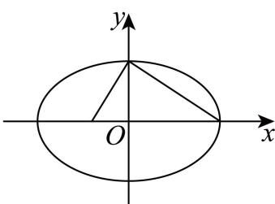
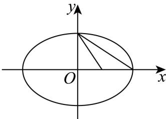

> [!faq]- 2026年高考上海卷数学高考真题（解析版）解析
>
> > [!success]- **【答案】** $\frac{2}{3}$ 【
>
> > [!note]- **【分析】**
> > 根据椭圆对称性
>
> > [!note]- **【解析】**
> > 因为 AB < BC < AC，
> >
> > 根据对称性可知：点 A, B, C 其中一个为上下顶点，一个为右顶点，一个为焦点，不妨取上顶点.
> >
> > ①当点 A, B, C 中一个为上顶点，一个为右顶点，一个为左焦点，如图 1
> >
> >   
> > 图1
> >
> > 则 $\left\{ \begin{array}{l} \sqrt{b^2 + c^2} = 3 \\ \sqrt{a^2 + b^2} = \sqrt{14} \\ a + c = 5 \end{array} \right.$ 或 $\left\{ \begin{array}{l} \sqrt{b^2 + c^2} = 3 \\ \sqrt{a^2 + b^2} = 5 \\ a + c = \sqrt{14} \end{array} \right.$ ，解得 $\left\{ \begin{array}{l} a = 3 \\ b = \sqrt{5} \text{或无解;} \\ c = 2 \end{array} \right.$
> >
> > ②当点 A, B, C 中一个为上顶点，一个为右顶点，一个为右焦点，如图 2，
> >
> >   
> > 图2
> >
> > 则 $\left\{\begin{aligned}a=3\\\sqrt{a^{2}+b^{2}}&=5\end{aligned}\right.$ 或 $\left\{\begin{aligned}a=\sqrt{14}\\\sqrt{a^{2}+b^{2}}&=5\end{aligned}\right.$ ，方程组均无解； $a-c=\sqrt{14}$
> >
> > 综上所述： $a = 3$ ， $b = \sqrt{5}$ ， $c = 2$ ，所以离心率 $e = \frac{c}{a} = \frac{2}{3}$
> >
> > ##
