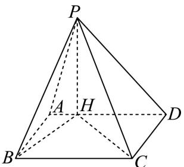

<!-- question-source:start -->
18. 已知四棱锥 P-ABCD，底面 ABCD 为矩形，PH⊥底面 ABCD，垂足 H 在 AD 边上，且 AH = 1，
HD = 4, AB = 2.

（1）求证： $HC \perp PB$ ;

（2）若四棱锥 $P - ABCD$ 的体积为 $\frac{10\sqrt{5}}{3}$ ，求二面角 $C - PB - H$ 的大小.

【
<!-- question-source:end -->

![[高中/真题/按年份分类/2026/2026年高考上海卷数学高考真题_解析版_/解答题/题目/answers/Q00022372A1.md]]
