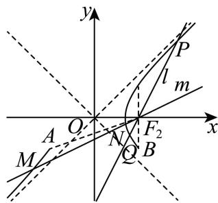

> [!faq]- 2026年高考上海卷数学高考真题（解析版）解析
>
> > [!success]- **【答案】** (1) $\sqrt{2}$ (2) $\sqrt{2}$ （3）存在实数 $\lambda$ 符合题意，此时 $\lambda$ 的取值范围为 $\left[\frac{9}{7}, +\infty\right)$ 【
>
> > [!note]- **【分析】**
> > （1）根据双曲线方程求 $a, b, c$ ，即可得渐近线方程以及点到直线的距离；
> > （2）解法一：根据余弦定理可得 $\left|PF_{1}\right|^{2}+\left|PF_{2}\right|^{2}=10$ ，结合定义可得 $\left|PF_{1}\right|\left|PF_{2}\right|=3$ ， $\cos\angle F_{1}PF_{2}=\frac{1}{3}$ ，
> > 即可得面积；解法二：设 $P(x_{0}, y_{0})$ ，根据数量积可得 $\left|y_{0}\right|=1$ ，即可得面积；解法三：根据极化恒等式和中线长性质可得 $\left|PF_{1}\right|\left|PF_{2}\right|=3$ ， $\cos\angle F_{1}PF_{2}=\frac{1}{3}$ ，结合面积公式运算求解；
> > （3）根据题意结合双曲线性质可得直线斜率取值范围，设直线方程结合弦长公式可得 $\left|PQ\right|=\frac{2\left(1+n_{1}^{2}\right)}{1-n_{1}^{2}}$ $\left|MN\right|=\frac{2\left(1+n_{2}^{2}\right)}{n_{2}^{2}-1}$ ，进而
>
> > [!note]- **【解析】**
> > 由题意可知： $a = b = 1$ ， $c = \sqrt{2}$
> >
> > 则 $F_{1}\left(-\sqrt{2},0\right)$ ， $F_{2}\left(\sqrt{2},0\right)$ ，渐近线方程为 $y = \pm x$ ，即 $x\pm y = 0$
> >
> > 所以点 $(2,0)$ 到双曲线渐近线的距离为 $\frac{2}{\sqrt{2}} = \sqrt{2}$ .
> >
> > 【
> >
> > 小问 2
> >
> > 解法一：因为 $\overrightarrow{PF_1}\cdot \overrightarrow{PF_2} = |PF_1|\cdot |PF_2|\cos \angle F_1PF_2 = 1$
> >
> > 由余弦定理可得 $\left|F_1F_2\right|^2 = \left|PF_1\right|^2 +\left|PF_2\right|^2 -2\left|PF_1\right|\cdot \left|PF_2\right|\cos \angle F_1PF_2,$
> >
> > 整理得： $\left|PF_{1}\right|^{2}+\left|PF_{2}\right|^{2}=10$ ，
> >
> > 因点 $P$ 是双曲线上一点，则 $\left|PF_1\right| - \left|PF_2\right| = 2$ ，可得 $\left|PF_1\right|^2 +\left|PF_2\right|^2 -2\left|PF_1\right|\left|PF_2\right| = 4$
> >
> > 代入可得 $\left|PF_{1}\right|\left|PF_{2}\right|=3$ ， $\cos\angle F_{1}PF_{2}=\frac{1}{3}$ ，则 $\sin\angle F_{1}PF_{2}=\sqrt{1-\cos^{2}\angle F_{1}PF_{2}}=\frac{2\sqrt{2}}{3}$ ，
> >
> > 所以 $\triangle PF_{1}F_{2}$ 的面积为 $\frac{1}{2}\left|PF_{1}\right|\left|PF_{2}\right|\sin \angle F_{1}PF_{2} = \frac{1}{2}\times 3\times \frac{2\sqrt{2}}{3} = \sqrt{2}$
> >
> > 解法二：设 $P\left(x_0,y_0\right)$ ，则 $x_0^2 -y_0^2 = 1$ ，即 $x_0^2 = y_0^2 +1$
> >
> > 可得 $\overrightarrow{PF_1} = (-x_0 - \sqrt{2}, -y_0)$ ， $\overrightarrow{PF_2} = (-x_0 + \sqrt{2}, -y_0)$
> >
> > 因为 $\overrightarrow{PF_1} \cdot \overrightarrow{PF_2} = x_0^2 + y_0^2 - 2 = 1$ ，即 $2y_0^2 - 1 = 1$ ，解得 $\left|y_0\right| = 1$
> >
> > 所以 $\triangle PF_{1}F_{2}$ 的面积为 $\frac{1}{2} \times 2\sqrt{2} \times 1 = \sqrt{2}$ ;
> >
> > 解法三：因为 $\overrightarrow{PF_1}\cdot \overrightarrow{PF_2} = (\overrightarrow{PO} +\overrightarrow{OF_1})\cdot (\overrightarrow{PO} -\overrightarrow{OF_1}) = \overrightarrow{PO^2} -\overrightarrow{OF_1}^2 = \overrightarrow{PO}^2 -2 = 1$ ，即 $\overrightarrow{PO}^2 = 3$
> >
> > 由中线长定理可知： $\left|PF_1\right|^2 +\left|PF_2\right|^2 = 2\left(\left|PO\right|^2 +\left|OF_1\right|^2\right) = 10$
> >
> > 因为 $\left|PF_1\right| - \left|PF_2\right| = 2$ ，可得 $\left|PF_1\right|^2 +\left|PF_2\right|^2 -2\left|PF_1\right|\left|PF_2\right| = 4$
> >
> > 代入可得 $\left|PF_{1}\right|\left|PF_{2}\right|=3$ ， $\cos\angle F_{1}PF_{2}=\frac{1}{3}$ ，可得 $2\cos^{2}\frac{\angle F_{1}PF_{2}}{2}-1=\frac{1}{3}$
> >
> > 解得 $\cos \frac{\angle F_1PF_2}{2} = \frac{\sqrt{6}}{3}$ ，则 $\sin \frac{\angle F_1PF_2}{2} = \sqrt{1 - \cos^2\frac{\angle F_1PF_2}{2}} = \frac{\sqrt{3}}{3}$ ， $\tan \frac{\angle F_1PF_2}{2} = \frac{\sin \frac{\angle F_1PF_2}{2}}{\cos \frac{\angle F_1PF_2}{2}} = \frac{\sqrt{2}}{2}$ ，
> >
> > 所以 $\triangle PF_{1}F_{2}$ 的面积为 $\frac{b^2}{\tan\frac{\angle F_1PF_2}{2}} = \sqrt{2}$
> >
> > 【
> >
> > 小问 3
> >
> > 不妨取 $A\left(-\sqrt{2}, - 1\right)$ ， $B\left(\sqrt{2}, - 1\right)$ ，则直线 $AF_{2}$ 的斜率 $k_{AF_2} = \frac{\sqrt{2}}{4}$
> >
> > 
> >
> > 依题意，设直线 $l: x = n_{1}y + \sqrt{2}$ ，则 $n_{1} \in [0,1)$ ，设直线 $m: x = n_{2}y + \sqrt{2}$ ，则 $n_{2} \in (1,2\sqrt{2}]$ ， $P(x_{1},y_{1})$ ， $Q(x_{2},y_{2})$ ，
> >
> > 联立方程 $\left\{ \begin{array}{l} x = n_{1}y + \sqrt{2}\\ x^{2} - y^{2} = 1 \end{array} \right.$ ，消去 $x$ 可得 $\left(n_1^2 -1\right)y^2 +2\sqrt{2} n_1y + 1 = 0$
> >
> > 则 $y_{1} + y_{2} = -\frac{2\sqrt{2}n_{1}}{n_{1}^{2} - 1}, y_{1}y_{2} = \frac{1}{n_{1}^{2} - 1},$
> >
> > 可得 $\left|PQ\right|=\sqrt{1+n_{1}^{2}}\sqrt{\left(-\frac{2\sqrt{2}n_{1}}{n_{1}^{2}-1}\right)^{2}-\frac{4}{n_{1}^{2}-1}}=\frac{2\left(1+n_{1}^{2}\right)}{1-n_{1}^{2}}=2\left(\frac{2}{1-n_{1}^{2}}-1\right)$
> >
> > 可知函数 $f(t) = 2\left(\frac{2}{1 - t^2} - 1\right)$ 在 $t \in [0,1)$ 内单调递增，则 $f(t) \geq f(0) = 2$ ，
> >
> > 且当 $t$ 趋近于1时， $f(t)$ 趋近于 $+\infty$ ，即 $f(t)$ 在 $[0,1)$ 内的值域为 $[2, +\infty)$ ，故 $|PQ| \in [2, +\infty)$ ，
> >
> > 因 $\lambda > 0$ ，所以 $\lambda |PQ| \in [2\lambda, +\infty)$ ;
> >
> > 同理可得： $\left|MN\right|=\frac{2\left(1+n_{2}^{2}\right)}{n_{2}^{2}-1}=2\left(\frac{2}{n_{2}^{2}-1}+1\right)$
> >
> > 可知 $g(s) = 2\left(\frac{2}{s^2 - 1} + 1\right)$ 在 $s \in (1, 2\sqrt{2}]$ 内单调递减，则 $g(s) \geq g(2\sqrt{2}) = \frac{18}{7}$ ，
> >
> > 且当 $s$ 趋近于1时， $g(s)$ 趋近于 $+\infty$ ，即 $g(s)$ 在 $\left(1,2\sqrt{2}\right]$ 内的值域为 $\left[\frac{18}{7}, +\infty\right)$ ，故 $\left|MN\right| \in \left[\frac{18}{7}, +\infty\right)$ ;
> >
> > 由题意可知： $\left[2\lambda,+\infty\right)\subseteq\left[\frac{18}{7},+\infty\right)$ ，可得 $2\lambda\geq\frac{18}{7}$ ，解得 $\lambda\geq\frac{9}{7}$ ，
> >
> > 所以存在实数 $\lambda$ 符合题意，此时 $\lambda$ 的取值范围为 $\left[\frac{9}{7}, +\infty\right)$ .
