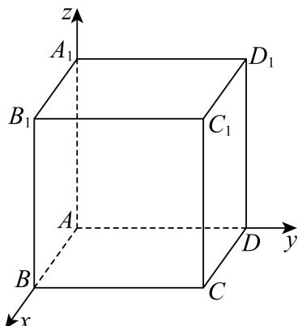

<!-- question-source:start -->
16. 已知空间直角坐标系中有一正方体，其三组棱分别与 $x$ 轴、 $y$ 轴、 $z$ 轴重合，顶点 $A$ 与坐标原点重合，点 $C$ 是正方体底面中与 $A$ 相对的对角顶点，点 $C_{1}$ 在点 $C$ 的正上方．将正方体绕直线 $AC_{1}$ 旋转一周，试问点 $C$ 的运动轨迹会经过几个空间卦限（）.

A. 1 B. 3 C. 4 D. 7

【
<!-- question-source:end -->

![[高中/真题/按年份分类/2026/2026年高考上海卷数学高考真题_解析版_/选择题/题目/answers/Q00022370A1.md]]
