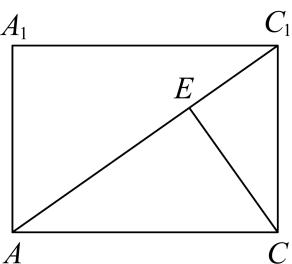
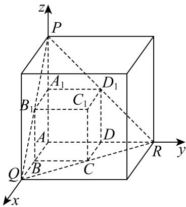

> [!faq]- 2026年高考上海卷数学高考真题（解析版）解析
>
> > [!success]- **【答案】** A
>
> > [!note]- **【分析】**
> > 不妨设正方体的棱长为3，分析可知点 $C$ 的轨迹是以点 $E(2,2,2)$ 为圆心，半径 $r = \sqrt{6}$ 的圆，解法一：设 $P(x,y,z)$ ，列方程分析点 $C$ 的轨迹与各坐标面的交点即可判断；解法二：利用补形法，可知点 $C$ 的轨迹即为 $\triangle PQR$ 的内切圆，即可判断结果.
>
> > [!note]- **【解析】**
> > 不妨设正方体的棱长为3，
> >
> > 则 $A(0,0,0)$ ， $C(3,3,0)$ ， $C_{1}(3,3,3)$ ，
> >
> > 可得 $\overrightarrow{AC} = (3,3,0)$ ， $\overrightarrow{AC_1} = (3,3,3)$
> >
> > 设点 C 在体对角线 $AC_{1}$ 上的投影为 E， $\overrightarrow{AE} = \lambda \overrightarrow{AC_{1}} = (3\lambda, 3\lambda, 3\lambda)$ ， $\lambda \in [0, 1]$ ，
> >
> > 
> >
> > 则 $\overrightarrow{CE} = \overrightarrow{AE} - \overrightarrow{AC} = (3\lambda - 3, 3\lambda - 3, 3\lambda)$ ,
> >
> > 可得 $\overrightarrow{CE} \cdot \overrightarrow{AC_1} = 9\lambda - 9 + 9\lambda - 9 + 9\lambda = 0$ ，解得 $\lambda = \frac{2}{3}$ ，
> >
> > 则 $\overrightarrow{AE} = (2,2,2)$ ，即 $E(2,2,2)$ ，且 $CE = \sqrt{6}$
> >
> > 可知点 C 的轨迹是以点 $E(2,2,2)$ 为圆心，半径 $r=\sqrt{6}$ 的圆，
> >
> > 解法一：在点 C 的轨迹任取一点 $P(x,y,z)$ ，则 $\overrightarrow{EP}=(x-2,y-2,z-2)$ ，
> >
> > 则 $\left\{ \begin{array}{l} \overrightarrow{EP} \cdot \overrightarrow{AC_1} = 3(x - 2) + 3(y - 2) + 3(z - 2) = 0 \\ \left|\overrightarrow{EP}\right| = \sqrt{(x - 2)^2 + (y - 2)^2 + (z - 2)^2} = \sqrt{6} \end{array} \right.$ ，整理可得 $\left\{ \begin{array}{l} x + y + z = 6 \\ (x - 2)^2 + (y - 2)^2 + (z - 2)^2 = 6 \end{array} \right.$ ，
> >
> > 令 $z = 0$ 可得 $\left\{ \begin{array}{l}x + y = 6\\ (x - 2)^2 +(y - 2)^2 = 2 \end{array} \right.$ ，解得 $\left\{ \begin{array}{l}x = 3\\ y = 3 \end{array} \right.$ ，可知点 $C$ 的轨迹与平面 $xOy$ 相切，
> >
> > 令 $y = 0$ 可得 $\left\{ \begin{array}{l}x + z = 6\\ (x - 2)^2 +(z - 2)^2 = 2 \end{array} \right.$ ，解得 $\left\{ \begin{array}{l}x = 3\\ z = 3 \end{array} \right.$ ，可知点 $C$ 的轨迹与平面 $xOz$ 相切，
> >
> > 令 $x = 0$ 可得 $\left\{ \begin{array}{l} y + z = 6 \\ (y - 2)^2 + (z - 2)^2 = 2 \end{array} \right.$ ，解得 $\left\{ \begin{array}{l} y = 3 \\ z = 3 \end{array} \right.$ ，可知点 $C$ 的轨迹与平面 $yOz$ 相切，
> >
> > 所以点 C 的轨迹经过空间中的 1 个卦限；
> >
> > 解法二：将正方体补成边长为6的正方体，如图所示：
> >
> > 
> >
> > 则 $P(0,0,6)$ ， $Q(6,0,0)$ ， $R(0,6,0)$ ，
> >
> > 可知 $\triangle PQR$ 为边长为 $6\sqrt{2}$ 的正三角形，且其中心为 $E(2,2,2)$ ，且内切圆半径 $r = \frac{\sqrt{3}}{6} \times 6\sqrt{2} = \sqrt{6}$ ，即可知点 $C$ 的轨迹即为 $\triangle PQR$ 的内切圆，所以点 $C$ 的轨迹经过空间中的1个卦限.
> >
> > ##
