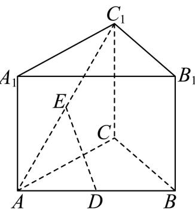

<!-- question-source:start -->
15. 如图，在直三棱柱 $ABC - A_{1}B_{1}C_{1}$ 中， $\angle ACB = 90^{\circ}$ ， $AC = BC$ ， $D$ ， $E$ 分别为 $AB$ ， $AC_{1}$ 的中点.

（1）证明： $DE \parallel$ 平面 $BCC_{1}B_{1}$ ;

(2) 设 $CC_{1} = 2$ , 直线 $DE$ 与平面 $ACC_{1}A_{1}$ 所成的角为 $45^{\circ}$ , 求直线 $DE$ 到平面 $BCC_{1}B_{1}$ 的距离.
<!-- question-source:end -->

![[高中/真题/按年份分类/2026/2026年高考全国1卷数学高考真题_解析版_/四_解答题/题目/answers/Q00020289A1.md]]
