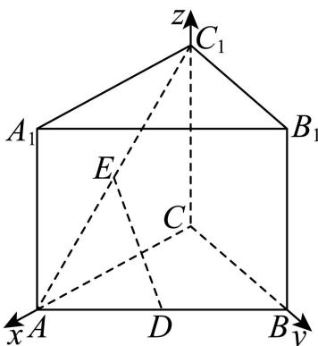
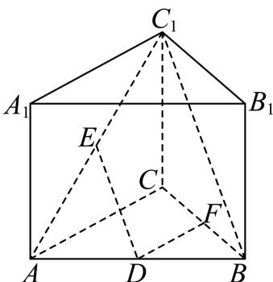

> [!faq]- 2026年高考全国1卷数学高考真题（解析版）解析
>
> > [!success]- **【答案】** (1) 由题意证明如下: 如图，作出符合题意的图形，连接 $BC_{1}$ ，  在 $\triangle ABC_{1}$ 中，D，E 分别为 AB， $AC_{1}$ 中点，∴ $DE \parallel BC_{1}$ ， ∵ $DE \not\subset$ 平面 $BCC_{1}B_{1}$ ， $BC_{1} \subset$ 平面 $BCC_{1}B_{1}$ ， ∴ DE// 平面 $BCC_{1}B_{1}$ . (2) 距离为 1. 【
>
> > [!note]- **【分析】**
> > （1）通过证明 $DE \parallel BC_{1}$ ，即可得出结论；
> > （2）方法一：设出 $AC = BC = 2t (t > 0)$ ，建立空间直角坐标系并表达出各点的坐标，得出向量 $\overrightarrow{ED}$ 与面
>
> > [!note]- **【解析】**
> > 略
> >
> > 【
> >
> > 小问 2
> >
> > 法一：由题意及
> > （1）得， $CC_{1}=2$
> >
> > 在直三棱柱 $ABC-A_{1}B_{1}C_{1}$ 中， $\angle ACB=90^{\circ}$ ，设 $AC=BC=2t(t>0)$ ，
> >
> > 四边形 $ACC_{1}A_{1}$ 与四边形 $BCC_{1}B_{1}$ 是矩形，
> >
> > $$
> > \therefore A C \perp B C, A C \perp C C _ {1}, B C \perp C C _ {1}
> > $$
> >
> > 建立空间直角坐标系，如下图所示，
> >
> > 
> >
> > 得到 $A(2t,0,0)$ ， $B(0,2t,0)$ ， $C(0,0,0)$ ， $D(t,t,0)$ ， $E(t,0,1)$ ，
> >
> > $\therefore \overrightarrow{ED} = (0,t, - 1)$ ，面 $ACC_{1}A_{1}$ 的一个法向量为 $\vec{n_1} = (0,1,0)$
> >
> > ∵直线 DE 与平面 $ACC_{1}A_{1}$ 所成的角为 $45^{\circ}$ ,
> >
> > 设直线 $DE$ 与平面 $ACC_{1}A_{1}$ 所成的角为 $\theta$
> >
> > $$
> > \therefore \sin \theta = \cos \left\langle \overrightarrow {E D}, \overrightarrow {n _ {1}} \right\rangle = \frac {\left| \overrightarrow {E D} \cdot \overrightarrow {n _ {1}} \right|}{\left| \overrightarrow {E D} \right| \cdot \left| \overrightarrow {n _ {1}} \right|} = \frac {\left| 0 + t \times 1 + 0 \right|}{\sqrt {0 + t ^ {2} + (- 1) ^ {2}} \times \sqrt {0 + 1 ^ {2} + 0}} = \sin 4 5 ^ {\circ}
> > $$
> >
> > 解得 $t = 1$ ， $\therefore A(2,0,0)$ ， $B(0,2,0)$ ， $C(0,0,0)$ ， $D(1,1,0)$ ， $E(1,0,1)$
> >
> > ∵ $DE \parallel$ 面 $BCC_{1}B_{1}$ ，∴由几何知识得，DE 到面 $BCC_{1}B_{1}$ 的距离为 $x_{D}=1$ .
> >
> > 法二：由题意及
> > （1）得，
> >
> > 在直三棱柱 $ABC - A_{1}B_{1}C_{1}$ 中， $\angle ACB = 90^{\circ}$ ， $AC = BC$
> >
> > 四边形 $ACC_{1}A_{1}$ 与四边形 $BCC_{1}B_{1}$ 是矩形，
> >
> > $$
> > \therefore A C \perp B C, A C \perp C C _ {1}, B C \perp C C _ {1}
> > $$
> >
> > $\because AC \cap CC_{1} = C, AC \subset \text{平面 } ACC_{1}A_{1}, CC_{1} \subset \text{平面 } ACC_{1}A_{1}, BC \not\subset \text{平面 } ACC_{1}A_{1}$
> >
> > ∴ BC ⊥ 平面 $ACC_{1}A_{1}$ ， $\angle BCC_{1}=90^{\circ}$
> >
> > ∴由几何知识得， $\angle BC_{1}C$ 即为直线 $BC_{1}$ 与平面 $ACC_{1}A_{1}$ 所成的角，
> >
> > 直线 DE 与平面 $ACC_{1}A_{1}$ 所成的角为 $45^{\circ}$ ,
> >
> > 在 $\triangle ABC_{1}$ 中， $D$ ， $E$ 分别为 $AB$ ， $AC_{1}$ 中点， $DE / / BC_{1}$
> >
> > ∴直线 $BC_{1}$ 与平面 $ACC_{1}A_{1}$ 所成的角为 $45^{\circ}$ ，即 $\angle BC_{1}C = 45^{\circ}$ ，
> >
> > 在 $\mathrm{Rt}\triangle BCC_1$ 中， $\angle BC_1C = 45^\circ$ ， $\angle BCC_{1} = 90^{\circ}$ ， $CC_{1} = 2$
> >
> > $$
> > \therefore A C = B C = C C _ {1} = 2
> > $$
> >
> > 在 Rt△ABC 中， $AC \perp BC$ ，AC = BC，
> >
> > $\triangle ABC$ 为等腰直角三角形，过点 D 作 $DF \parallel AC$ ，
> >
> > 则点 F 为 BC 中点， $DF = \frac{1}{2} AC = 1$ ， $DF \perp BC$ ，
> >
> > 由几何知识得， $DE$ 到面 $BCC_{1}B_{1}$ 的距离即为 $DF = 1$
> >
> > 
