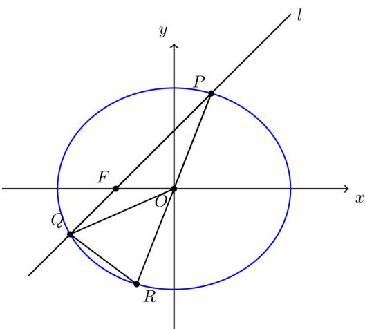
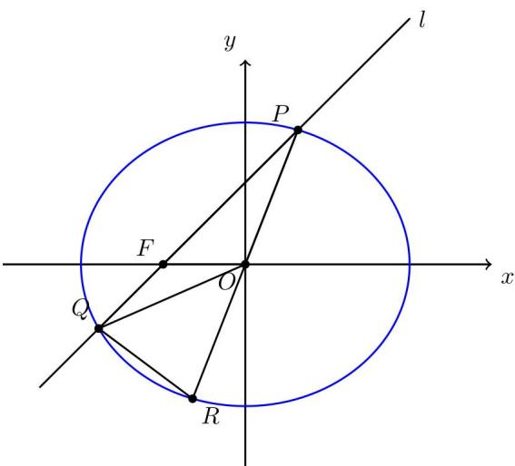

> [!faq]- 2026年高考全国1卷数学高考真题（解析版）解析
>
> > [!success]- **【答案】** （1） $\frac{x^{2}}{4}+\frac{y^{2}}{3}=1$ (2) (i) $y = \frac{\sqrt{5}}{2} (x + 1)$ ; (ii) $4\sqrt{3}$ 【
>
> > [!note]- **【分析】**
> > （1）根据焦点以及离心率的定义即可求解；
>
> > [!note]- **【解析】**
> > 已知椭圆 $\frac{x^2}{a^2} +\frac{y^2}{b^2} = 1$ 的左焦点为 $F(-1,0)$ ，离心率 $e = \frac{1}{2}$
> >
> > 则 $c = 1, e = \frac{c}{a} = \frac{1}{2}$ ，解得 $a = 2$ ， $b^2 = a^2 - c^2 = 2^2 - 1^2 = 4 - 1 = 3$ ，
> >
> > 因此椭圆方程为 $\frac{x^{2}}{4}+\frac{y^{2}}{3}=1$ .
> >
> > 【
> >
> > 小问 2
> >
> > 解法一：
> >
> > 设 $l:y = k(x + 1)(k > 0)$ ，点 $P(x_{1},y_{1})$ ，点 $Q(x_{2},y_{2})$ ，其中 $x_{1} > x_{2}$
> >
> > 联立直线 l 与椭圆方程 $\left\{\begin{aligned}y&=k(x+1)\\ \frac{x^{2}}{4}&+\frac{y^{2}}{3}=1\end{aligned}\right.$ ，得 $\left(3+4k^{2}\right)x^{2}+8k^{2}x+4k^{2}-12=0$ ，
> >
> > 由韦达定理得 $x_{1} + x_{2} = -\frac{8k^{2}}{3 + 4k^{2}}, x_{1}x_{2} = \frac{4k^{2} - 12}{3 + 4k^{2}}$
> >
> > 由于 P, R 两点在椭圆上，关于原点对称，
> >
> > 所以点 $R\left(-x_{1}, - y_{1}\right)$ ，且 $y_{1} = k(x_{1} + 1),y_{2} = k(x_{2} + 1)$
> >
> > (i)
> >
> > 
> >
> > 由面积公式， $S_{\triangle PQO} = \frac{1}{2}\big|OF\big|\cdot \big|y_1 - y_2\big| = \frac{1}{2}\cdot 1\cdot \big|y_1 - y_2\big| = \frac{1}{2}\big|y_1 - y_2\big| = \frac{k}{2}\big(x_1 - x_2\big),$
> >
> > 又因为 $O$ 是线段 $PR$ 的中点，所以 $S_{\triangle PQO} = S_{\triangle RQO}$ ，所以 $S_{\triangle PQR} = 2S_{\triangle PQO} = k(x_1 - x_2)$ ，
> >
> > $S_{\triangle PFO} = \frac{1}{2}\left|OF\right|\cdot \left|y_1\right| = \frac{y_1}{2} = \frac{k(x_1 + 1)}{2},$
> >
> > 由于 $\frac{S_{\triangle PQR}}{S_{\triangle PFO}} = 3$ ，得 $2(x_{1} - x_{2}) = 3(x_{1} + 1)$ ，即 $x_{1} + 2x_{2} = -3$
> >
> > 令 $u = k^2$ ，由 $x_{1} + x_{2} = -\frac{8u}{3 + 4u}$ 与 $x_{1} + 2x_{2} = -3$ ，得 $x_{1} = \frac{9 - 4u}{3 + 4u},x_{2} = -\frac{9 + 4u}{3 + 4u}$
> >
> > 代入 $x_{1}x_{2} = \frac{4u - 12}{3 + 4u}$ ，得 $-\frac{(9 - 4u)(9 + 4u)}{(3 + 4u)^{2}} = \frac{4u - 12}{3 + 4u}$ ，解得 $u = \frac{5}{4}$
> >
> > 所以 $k = \frac{\sqrt{5}}{2}$ ，所以直线 $l$ 的方程为 $y = \frac{\sqrt{5}}{2}(x + 1)$ .
> >
> > （ii）直线 $QR$ 的斜率为 $\frac{-y_1 - y_2}{-x_1 - x_2} = k\frac{x_1 + x_2 + 2}{x_1 + x_2} = -\frac{3}{4k}$
> >
> > 于是 $\tan \angle PQR = \left|\frac{k + \frac{3}{4k}}{1 - \frac{3}{4}}\right| = 4k + \frac{3}{k}\geq 2\sqrt{4k\cdot\frac{3}{k}} = 4\sqrt{3}$ ，当且仅当 $k = \frac{\sqrt{3}}{2}$ 时取等号，故 $\tan \angle PQR$ 的最小值为 $4\sqrt{3}$ ：
> >
> > 解法二：
> >
> > （i）如图所示，设直线 l 的方程为 x=my-1，其中斜率 $k=\frac{1}{m}>0\Rightarrow m>0$ ，
> >
> > 
> >
> > 设点 $P\left(x_{1},y_{1}\right)$ ，点 $Q\left(x_{2},y_{2}\right)$ ，且 $x_{2},y_{2} < 0$
> >
> > 根据椭圆的中心对称性可知，点 $R\left(-x_{1},-y_{1}\right)$ ,
> >
> > 联立直线与椭圆方程，得 $\left\{\begin{aligned}x&=my-1\\\frac{x^{2}}{4}&+\frac{y^{2}}{3}=1\end{aligned}\right.$ ，化简得 $(3m^{2}+4)y^{2}-6my-9=0$ ，
> >
> > 由韦达定理可得 $y_{1} + y_{2} = \frac{6m}{3m^{2} + 4}, y_{1}y_{2} = \frac{-9}{3m^{2} + 4}$
> >
> > 因为 R 是 P 关于原点 O 的对称点，所以 O 是线段 PR 的中点，
> >
> > 因此 $S_{\triangle PQO} = S_{\triangle RQO}$ ，所以 $S_{\triangle PQR} = 2S_{\triangle PQO}$
> >
> > 由于 $S_{\triangle PQR} = 3S_{\triangle PFO}$ ，所以 $2S_{\triangle PQO} = 3S_{\triangle PFO}$
> >
> > $$
> > { } _ { \triangle P Q O } = \frac { 1 } { 2 } | O F | \cdot | y _ { 1 } - y _ { 2 } | = \frac { 1 } { 2 } \cdot 1 \cdot | y _ { 1 } - y _ { 2 } | = \frac { 1 } { 2 } | y _ { 1 } - y _ { 2 } | ,
> > $$
> >
> > $S_{\triangle PFO} = \frac{1}{2}\left|OF\right|\cdot \left|y_1\right| = \frac{1}{2}\cdot 1\cdot \left|y_1\right| = \frac{1}{2}\left|y_1\right|$
> >
> > 所以 $2 \cdot \left( \frac{1}{2} |y_1 - y_2| \right) = 3 \cdot \left( \frac{1}{2} |y_1| \right)$ ，即 $|y_1 - y_2| = \frac{3}{2} |y_1|$ ，
> >
> > 由于 $y_{1} > 0, y_{2} < 0$ ，所以简化为 $y_{1} - y_{2} = \frac{3}{2} y_{1} \Rightarrow y_{1} = -2y_{2}$ ，
> >
> > 代入韦达定理，得 $y_{2}=\frac{-6m}{3m^{2}+4}$ ，则 $y_{1}y_{2}=-2y_{2}^{2}=-2\left(\frac{-6m}{3m^{2}+4}\right)^{2}=\frac{-9}{3m^{2}+4}$ ，
> >
> > 化简得 $45m^{2} = 36$ ，由于 $m > 0$ ，解得 $m = \frac{2}{\sqrt{5}} = \frac{2\sqrt{5}}{5}$
> >
> > 所以直线 l 的方程为 $x=\frac{2\sqrt{5}}{5}y-1$ ，即 $y=\frac{\sqrt{5}}{2}(x+1)$ .
> >
> > （ii）由题意， $\angle PQR$ 即为直线 $QP$ 与直线 $QR$ 的夹角，
> >
> > 直线 QP 即直线 l，方程为 $x = my - 1 (m > 0)$ ,
> >
> > 点 $Q(x_{2},y_{2})$ ，点 $P(x_{1},y_{1})$ ，点 $R(-x_{1},-y_{1})$ ，直线QP的斜率 $k_{QP}=\frac{1}{m}$ ，
> >
> > 直线 QR 的斜率 $k_{QR} = \frac{y_{2} - (-y_{1})}{x_{2} - (-x_{1})} = \frac{y_{2} + y_{1}}{x_{2} + x_{1}}$ ,
> >
> > 由于 $P, Q$ 在直线 $x = my - 1(m > 0)$ 上，有 $x_{1} = my_{1} - 1, x_{2} = my_{2} - 1$
> >
> > 则 $k_{QR} = \frac{y_1 + y_2}{m(y_1 + y_2) - 2}$ ，代入 $y_{1} + y_{2} = \frac{6m}{3m^{2} + 4}$ ，
> >
> > $$
> > k _ {Q R} = \frac {\frac {6 m}{3 m ^ {2} + 4}}{m \cdot \frac {6 m}{3 m ^ {2} + 4} - 2} = \frac {6 m}{6 m ^ {2} - 2 (3 m ^ {2} + 4)} = \frac {6 m}{- 8} = - \frac {3 m}{4},
> > $$
> >
> > 设直线 $QP$ 的倾斜角为 $\alpha$ ，直线 $QR$ 的倾斜角为 $\beta$ ，则 $\angle PQR = \pi -\beta +\alpha$
> >
> > $$
> > \tan \angle P Q R = \tan (\pi - \beta + \alpha) = \tan (\alpha - \beta) = \frac {\tan \alpha - \tan \beta}{1 + \tan \alpha \tan \beta} = \frac {k _ {Q P} - k _ {Q R}}{1 + k _ {Q P} \cdot k _ {Q R}},
> > $$
> >
> > $$
> > \tan \angle P Q R = \frac {k _ {Q P} - k _ {Q R}}{1 + k _ {Q P} \cdot k _ {Q R}} = \frac {\frac {1}{m} - \left(- \frac {3 m}{4}\right)}{1 + \frac {1}{m} \cdot \left(- \frac {3 m}{4}\right)} = \frac {4 + 3 m ^ {2}}{m} = 3 m + \frac {4}{m},
> > $$
> >
> > 由基本不等式得 $3m + \frac{4}{m} \geq 2\sqrt{3m \cdot \frac{4}{m}} = 4\sqrt{3}$ ，当且仅当 $3m = \frac{4}{m}$ ，即 $m = \frac{2\sqrt{3}}{3}$ 时取等号，所以 $\tan \angle PQR$ 的最小值为 $4\sqrt{3}$ .
