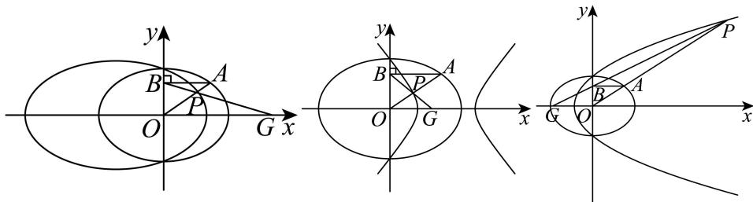

> [!faq]- 2026年高考全国2卷数学高考真题（解析版）解析
>
> > [!success]- **【答案】** 详见解析
>
> > [!note]- **【分析】**
> > （1）利用过右焦点垂直于 $x$ 轴的直线被 $E$ 所截线段长为 $\sqrt{2}$ ，通过求出坐标解出线段的长，求得 $a, b, c$ 再求出离心率；
> >
> > (2) (i) 通过联立方程求出点 P 的坐标, 再反解出点 A 的坐标代入椭圆方程, 从而求出 P 的轨迹 M 的方程;
> >
> > （ii）先讨论 $t_0$ 在不同取值时，中心存在的情况；再假设中心点坐标为 $(m, n)$ ，求出中心坐标的表达式，再通过平移求出 $M'$ 的方程，再讨论不同情况下 $M'$ 的形状.
>
> > [!note]- **【解析】**
> > (1) $\frac{\sqrt{2}}{2}$
> >
> > (2) (i) $M$ 的方程为 $\left(\frac{1}{2} - \frac{1}{t_0^2}\right)x^2 + y^2 + \frac{2}{t_0}x - 1 = 0(y \neq 0)$ ; 当 $|t_0| > \sqrt{2}$ 时, $t_0^2 - 2 > 0$ , 则方程表示椭圆去掉与 $x$ 轴交点; 当 $0 < |t_0| < \sqrt{2}$ 时, $t_0^2 - 2 < 0$ , 则方程表示双曲线去掉与 $x$ 轴交点; 当 $t_0 = \pm \sqrt{2}$ 时, 轨迹 $M$ 的方程为 $y^2 + \frac{2}{t_0}x - 1 = 0(y \neq 0)$ , 为抛物线去掉与 $x$ 轴交点;
> >
> > (ii) 当 $t_0 = \pm \sqrt{2}$ 时，轨迹 $M$ 的方程为 $y^2 + \frac{2}{t_0} x - 1 = 0 (y \neq 0)$ ，为抛物线去掉与 $x$ 轴交点，无中心点；当 $t_0 \neq \pm \sqrt{2}$ 时， $M$ 有中心点 $\left(-\frac{2t_0}{t_0^2 - 2}, 0\right)$ ，平移 $M$ 到 $M'$ ，使 $O$ 为 $M'$ 的中心点时，此时 $M'$ 的方程为
> >
> > $$
> > \frac {\left(t _ {0} ^ {2} - 2\right) ^ {2} x ^ {2}}{4 t _ {0} ^ {4}} + \frac {t _ {0} ^ {2} - 2}{2 t _ {0} ^ {2}} y ^ {2} = 1 (y \neq 0),
> > $$
> >
> > 当 $|t_0| > \sqrt{2}$ 时， $M'$ 形状为椭圆去掉与 $x$ 轴交点，当 $0 < |t_0| < \sqrt{2}$ 时， $M'$ 形状为双曲线去掉与 $x$ 轴交点.
> >
> > 【小问 1 详解】
> >
> > 设椭圆 $\frac{x^2}{a^2} + y^2 = 1$ 的右焦点为 $(c,0)$ ，其中 $c = \sqrt{a^2 - 1}$ ，
> >
> > 那么过右焦点且垂直于 x 轴的直线为 x = c ，代入椭圆得
> >
> > $\frac{c^{2}}{a^{2}}+y^{2}=1$ ，即 $y^{2}=1-\frac{c^{2}}{a^{2}}=1-\frac{a^{2}-1}{a^{2}}=\frac{1}{a^{2}}$
> >
> > 所以 $y = \pm \frac{1}{a}$ ，由于截线段长为 $\frac{2}{a} = \sqrt{2}$ ，解得 $a = \sqrt{2}$
> >
> > 故 $c = \sqrt{2 - 1} = 1$ ，离心率 $e = \frac{c}{a} = \frac{1}{\sqrt{2}} = \frac{\sqrt{2}}{2}$
> >
> > 【小问 2 详解】
> >
> > (i) 方法一:
> >
> > 由(1)知椭圆方程为 $\frac{x^{2}}{2} + y^{2} = 1$ ，由于点 $A(x_{0}, y_{0})$ 满足 $\frac{x_{0}^{2}}{2} + y_{0}^{2} = 1$ ，且 $y_{0} \neq 0$ ，过 A 作 y 轴的垂线，交 y 轴于点 $B(0, y_{0})$ ，
> >
> > 那么当 $x_0 = 0$ 时，点 $A(0, \pm 1)$ ，点 $P$ 与点 $A(0, \pm 1)$ 重合；
> >
> > 当 $x_0 \neq 0$ 时，直线 $AO$ 方程为： $y = \frac{y_0}{x_0} x$ ，直线 $GB$ 方程为： $\frac{x}{t_0} + \frac{y}{y_0} = 1$ ，即 $y=-\frac{y_{0}}{t_{0}}x+y_{0}$ 联立 $\left\{\begin{aligned}y&=\frac{y_{0}}{x_{0}}x\\ y&=-\frac{y_{0}}{t_{0}}x+y_{0}\end{aligned}\right.$ ，解得 $\left\{\begin{aligned}x&=\frac{x_{0}t_{0}}{x_{0}+t_{0}}\\ y&=\frac{y_{0}t_{0}}{x_{0}+t_{0}}\end{aligned}\right.$ 即点 $P\left(\frac{x_{0}t_{0}}{x_{0}+t_{0}},\frac{y_{0}t_{0}}{x_{0}+t_{0}}\right)(y_{0}\neq0)$ ，
> >
> > 设 $P(x,y)$ ，则由 $\left\{\begin{aligned}x&=\frac{x_{0}t_{0}}{x_{0}+t_{0}}\\ y&=\frac{y_{0}t_{0}}{x_{0}+t_{0}}\end{aligned}\right.\Rightarrow\left\{\begin{aligned}x_{0}&=\frac{xt_{0}}{t_{0}-x}\\ y&=\frac{yt_{0}}{t_{0}-x}\end{aligned}\right.(y\neq0)$ ，
> >
> > 代入椭圆方程 $\frac{x_{0}^{2}}{2}+y_{0}^{2}=1$ 得 $\frac{1}{2}\left(\frac{xt_{0}}{t_{0}-x}\right)^{2}+\left(\frac{yt_{0}}{t_{0}-x}\right)^{2}=1$ ，即 $\frac{t_{0}^{2}x^{2}}{2(t_{0}-x)^{2}}+\frac{t_{0}^{2}y^{2}}{(t_{0}-x)^{2}}=1$ 两边乘以 $\frac{(t_{0}-x)^{2}}{t_{0}^{2}}$ 得 $\frac{x^{2}}{2}+y^{2}=\frac{(t_{0}-x)^{2}}{t_{0}^{2}}$ 整理得 $\left(\frac{1}{2}-\frac{1}{t_{0}^{2}}\right)x^{2}+y^{2}+\frac{2}{t_{0}}x-1=0$ ，
> >
> > 把点 $P(0,\pm1)$ 代入，仍然成立，
> >
> > 故轨迹 M 的方程为 $\left(\frac{1}{2}-\frac{1}{t_{0}^{2}}\right)x^{2}+y^{2}+\frac{2}{t_{0}}x-1=0(y\neq0)$ ;
> >
> > 方法二：
> >
> > 由于 $G(t_{0},0)(t_{0}\neq0)$ ，点 B 在 y 轴，故直线 GB 必有斜率；
> >
> > 设直线 GB 方程为 $y=k(x-t_{0})$ ， $P(u,v)$ ，那么点 $B(0,-kt_{0})$ ，
> >
> > 由于 AB ⊥ y 轴，则 $y_{0}=-kt_{0}$ ，
> >
> > 由于点 P, O, A 三点共线，则 $\overrightarrow{OP}/\overrightarrow{OA}\Rightarrow x_{0}v=-kt_{0}u$ ，
> >
> > 因为点 P 在直线 GB 上，所以， $\left\{\begin{aligned}x_{0}v&=-kt_{0}u\\ v&=k(u-t_{0})\end{aligned}\right.\Rightarrow\left\{\begin{aligned}x_{0}&=\frac{t_{0}u}{t_{0}-u}\\ y&=-kt_{0}=\frac{x_{0}v}{u}=\frac{t_{0}v}{t_{0}-u}(v\neq0)\end{aligned}\right.$ ，
> >
> > 把 $A(x_{0},y_{0})$ 代入椭圆 E 方程： $\frac{x_{0}^{2}}{2}+y_{0}^{2}=1$ ，得 $\frac{1}{2}\left(\frac{ut_{0}}{t_{0}-u}\right)^{2}+\left(\frac{vt_{0}}{t_{0}-v}\right)^{2}=1$ ，即 $\frac{t_{0}^{2}u^{2}}{2(t_{0}-u)^{2}}+\frac{t_{0}^{2}v^{2}}{(t_{0}-u)^{2}}=1$ ，
> >
> > 整理化简，得 $\left(\frac{1}{2}-\frac{1}{t_{0}^{2}}\right)u^{2}+v^{2}+\frac{2}{t_{0}}u-1=0$
> >
> > 故轨迹 M 的方程为 $\left(\frac{1}{2}-\frac{1}{t_{0}^{2}}\right)x^{2}+y^{2}+\frac{2}{t_{0}}x-1=0(y\neq0)$ ;
> >
> > 当 $|t_0| > \sqrt{2}$ 时， $t_0^2 - 2 > 0$ ，则方程表示椭圆去掉与 $x$ 轴交点；
> >
> > 当 $0 < |t_0| < \sqrt{2}$ 时， $t_0^2 - 2 < 0$ ，则方程表示双曲线去掉与 $x$ 轴交点；
> >
> > 当 $t_0 = \pm \sqrt{2}$ 时，轨迹 $M$ 的方程为 $y^{2} + \frac{2}{t_{0}} x - 1 = 0(y\neq 0)$ ，为抛物线去掉与 $x$ 轴交点；
> >
> > (ii) 当 $\frac{1}{2} - \frac{1}{t_0^2} = 0$ 即 $t_0^2 = 2$ 时，轨迹 $M$ 的方程为 $y^2 + \frac{2}{t_0} x - 1 = 0 (y \neq 0)$ ，为抛物线去掉与 $x$ 轴交点，无中心点；
> >
> > 当 $\frac{1}{2} -\frac{1}{t_0^2}\neq 0$ 即 $t_0\neq \pm \sqrt{2}$ 且 $t_0\neq 0$ 时，设轨迹 $M$ 的中心点为 $(m,n)$ ，那么
> >
> > 若点 $P(x,y)$ 在轨迹 $M$ 上，那么点 $(2m - x,2n - y)$ ，也在轨迹 $M$ 上，则
> >
> > $$
> > \left\{ \begin{array}{l} \left(\frac {1}{2} - \frac {1}{t _ {0} ^ {2}}\right) x ^ {2} + y ^ {2} + \frac {2}{t _ {0}} x - 1 = 0 (y \neq 0) \\ \left(\frac {1}{2} - \frac {1}{t _ {0} ^ {2}}\right) (2 m - x) ^ {2} + (2 n - y) ^ {2} + \frac {2}{t _ {0}} (2 m - x) - 1 = 0 \end{array} , \right.
> > $$
> >
> > 两式相减得， $\left(\frac{1}{2}-\frac{1}{t_{0}^{2}}\right)(2x-2m)\cdot2m+(2y-2n)\cdot2n+\frac{2}{t_{0}}\cdot(2x-2m)=0$
> >
> > 整理，得 $\left[m\left(\frac{1}{2} -\frac{1}{t_0^2}\right) + \frac{1}{t_0}\right](x - m) + (y - n)n = 0$
> >
> > 要使用等式恒成立，则
> >
> > $$
> > \left\{ \begin{array}{l} m \left(\frac {1}{2} - \frac {1}{t _ {0} ^ {2}}\right) + \frac {1}{t _ {0}} = 0 \\ n = 0 \end{array} \Rightarrow \left\{ \begin{array}{l} m = - \frac {2 t _ {0}}{t _ {0} ^ {2} - 2} \text {即中心点为} \left(- \frac {2 t _ {0}}{t _ {0} ^ {2} - 2}, 0\right), \\ n = 0 \end{array} \right. \right.
> > $$
> >
> > 所以 M 有中心点当且仅当 $t_{0} \neq \pm\sqrt{2}$ 且 $t_{0} \neq 0$ ，且中心坐标为 $\left(-\frac{2t_{0}}{t_{0}^{2}-2}, 0\right)$ .
> > 将 M 平移使其中心与原点重合，设 $P(x_{1}, y_{1})$ 平移后的点为 $P'(x, y)$ ，那么$\overrightarrow{PP'} = \left(\frac{2t_0}{t_0^2 - 2}, 0\right)$ ，即 $\left\{ \begin{array}{l} x - x_1 = \frac{2t_0}{t_0^2 - 2} \\ y - y_1 = 0 \end{array} \right. \Rightarrow \left\{ \begin{array}{l} x_1 = x - \frac{2t_0}{t_0^2 - 2} \\ y_1 = y \end{array} \right.$
> >
> > 代入轨迹 M 方程可得 $\left(\frac{1}{2}-\frac{1}{t_{0}^{2}}\right)\left(x-\frac{2t_{0}}{t_{0}^{2}-2}\right)^{2}+y^{2}+\frac{2}{t_{0}}\left(x-\frac{2t_{0}}{t_{0}^{2}-2}\right)-1=0(y\neq0)$ ,
> >
> > 整理化简，得 $x^{2} + \frac{2t_{0}^{2}}{t_{0}^{2} - 2} y^{2} = \frac{4t_{0}^{4}}{\left(t_{0}^{2} - 2\right)^{2}}$ ，即 $\frac{\left(t_0^2 - 2\right)^2 x^2}{4t_0^4} + \frac{t_0^2 - 2}{2t_0^2} y^2 = 1(y \neq 0)$
> >
> > 即 $M'$ 的方程为 $\frac{\left(t_{0}^{2}-2\right)^{2}x^{2}}{4t_{0}^{4}}+\frac{t_{0}^{2}-2}{2t_{0}^{2}}y^{2}=1(y\neq0)$ ,
> >
> > 当 $|t_0| > \sqrt{2}$ 时， $t_0^2 - 2 > 0$ ，则方程表示椭圆去掉与 $x$ 轴交点；
> >
> > 当 $0 < |t_0| < \sqrt{2}$ 时， $t_0^2 - 2 < 0$ ，则方程表示双曲线去掉与 $x$ 轴交点，
> >
> > 综上，当 $t_0 = \pm \sqrt{2}$ 时，轨迹 $M$ 的方程为 $y^2 +\frac{2}{t_0} x - 1 = 0(y\neq 0)$ ，为抛物线去掉与 $x$ 轴交点，无中心点；当 $t_0\neq \pm \sqrt{2}$ 时， $M$ 有中心点 $\left(-\frac{2t_0}{t_0^2 - 2},0\right)$ ，平移 $M$ 到 $M^{\prime}$ ，使 $O$ 为 $M^{\prime}$ 的中心点时，此时 $M^{\prime}$ 的方程为 $\frac{\left(t_0^2 - 2\right)^2x^2}{4t_0^4} +\frac{t_0^2 - 2}{2t_0^2} y^2 = 1(y\neq 0),$
> >
> > 当 $|t_0| > \sqrt{2}$ 时， $M'$ 形状为椭圆去掉与 $x$ 轴交点，当 $0 < |t_0| < \sqrt{2}$ 时， $M'$ 形状为双曲线去掉与 $x$ 轴交点.
> >
> > 
