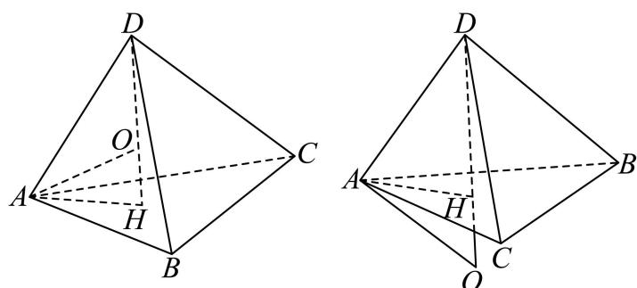

> [!faq]- 2026年高考全国2卷数学高考真题（解析版）解析
>
> > [!success]- **【答案】** $\frac{5\sqrt{3}}{4}$
>
> > [!note]- **【分析】**
> > 根据球的体积得出球的半径，由正三棱锥的对称性得出球心的位置，然后由勾股定理，列方程组求解.
>
> > [!note]- **【解析】**
> > 由球的体积公式， $V_{0}=\frac{4}{3}\pi R^{3}=4\sqrt{3}\pi$ ，解得 $R=\sqrt{3}$ ，
> >
> > 设 $\triangle ABC$ 的外心为H，连接DH，
> >
> > 由题意知 DH 为该三棱锥的高，所以该三棱锥的外接球的球心 O 在 DH 上，
> >
> > 不妨设O在线段DH上，连接AO,DO,AH，
> >
> > 设 $\triangle ABC$ 的边长为 $\sqrt{3} x$ ，由正弦定理可得， $AH = \frac{\sqrt{3}x}{2\sin 60^{\circ}} = x$
> >
> > 再设 OH = y，由题知， $\left\{\begin{aligned}x^{2}+y^{2}&=3\\ x^{2}+\left(y+\sqrt{3}\right)^{2}&=2\end{aligned}\right.$
> >
> > 解得 $y = -\frac{2}{\sqrt{3}}$ （负值表示球心 $O$ 在线段 $DH$ 的延长线上，实际情况如右图），
> >
> > 所以 $x^{2}=\frac{5}{3}$ ,
> >
> > 由三角形面积公式， $S_{\triangle ABC} = \frac{1}{2}\times (\sqrt{3} x)^{2}\times \sin 60^{\circ} = \frac{5\sqrt{3}}{4}.$
> >
> > 
> >
> > ##
