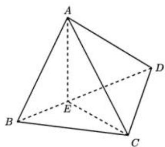

<!-- question-source:start -->
16. 如图，在三棱锥 A-BCD 中，点 E 在 BD 上， $AE \perp CE$ ， $AE \perp DE$ ， $CD \perp AD$ 。

（1）求证： $CD \perp AB$ ；

（2）若 $DE = 2$ ， $BE = 1$ ， $AE = \sqrt{2}$ ， $CD = 2\sqrt{3}$ ．求直线 $AD$ 与平面 $ABC$ 所成角的正弦值.

【
<!-- question-source:end -->

![[高中/真题/按年份分类/2026/2026年高考全国2卷数学高考真题_解析版_/解答题/题目/answers/Q00021847A1.md]]
