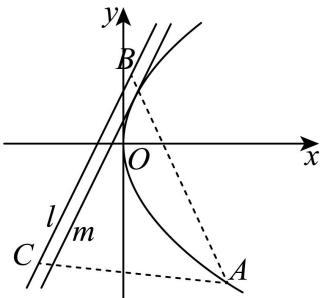

> [!faq]- 2026年高考全国2卷数学高考真题（解析版）解析
>
> > [!success]- **【答案】** ABD
>
> > [!note]- **【分析】**
> > A 选项，根据抛物线方程得 p，进而得出准线方程；B 选项，设直线 l 为 $y = k(x + 1)$ ，和抛物线方程联立消去 x，令 $\Delta < 0$ 求解；C 选项，先根据直线和抛物线相切，求出切点 B，假设 AB 过焦点，则得到 $k_{AB}$ ，根据两直线的夹角的公式推出 $\angle ABC$ 的正切值，从而判断；D 选项，可将问题转化为抛物线上一点到直线的距离最小值来处理.
>
> > [!note]- **【解析】**
> > A 选项， $y^{2}=8x=2px$ ，则 p=4，故准线 $x=-\frac{p}{2}=-2$ ，A 选项正确；
> > B 选项，设直线 l 为 $y = k(x + 1)$ ，则 $8y = 8kx + 8$ ，
> > 联立 $y^{2}=8x$ 得到， $ky^{2}-8y+8k=0$ 直线和抛物线无交点，则 $\Delta = 64 - 32k^{2} < 0$ 结合 k > 0 ，解得 $k > \sqrt{2}$ ，B 选项正确；
> > C 选项，由联立方程 $ky^{2}-8y+8k=0$ ，
> >
> > 若 l 与 E 相交于唯一点 B，只可能是相切，
> >
> > 则 $\Delta = 64 - 32k^{2} = 0$ ，解得 $k = \sqrt{2}$ ，
> >
> > 此时 $\sqrt{2} y^2 - 8y + 8\sqrt{2} = 0$ ，解得 $y = 2\sqrt{2}$ ，进而得 $x = 1$ ，则 $B(1, 2\sqrt{2})$ ，
> >
> > 若 $AB$ 过焦点 $F$ （如图），由于 $B(1,2\sqrt{2}), F(2,0)$ ， $k_{BF} = -2\sqrt{2}$ ，而 $k_{BC} = \sqrt{2}$ ，
> >
> > 根据倾斜角的定义， $\tan \angle BFx = -2\sqrt{2}$ ， $\tan \angle BPF = \sqrt{2}$
> >
> > 而 $\angle ABC = \angle BFx - \angle BPF$ ，此时 $\angle ABC$ 的正切值为 $\frac{-2\sqrt{2} - \sqrt{2}}{1 - 4} = \sqrt{2} \neq \sqrt{3}$
> >
> > 即 $\angle ABC \neq 60^{\circ}$ ，这与 $\triangle ABC$ 为等边三角形矛盾，C 选项错误；
> >
> > 
> >
> > D 选项，当 k=2 ，此时直线方程为 $y=2x+2$ ，
> >
> > 设 $A\left(\frac{t^2}{8}, t\right)$ ，则 $A$ 到 $l$ 的距离为 $d = \frac{\left|\frac{t^2}{4} - t + 2\right|}{\sqrt{5}} = \frac{\frac{(t - 2)^2}{4} + 1}{\sqrt{5}} \geq \frac{1}{\sqrt{5}}$ ，
> >
> > 即等边三角形的高的最小值为 $\frac{1}{\sqrt{5}}$ ，此时面积 $S = \frac{1}{2}\times d\times \frac{2d}{\sqrt{3}} = \frac{d^2}{\sqrt{3}}\geq \frac{\sqrt{3}}{15}$ ，D选项正确.
> >
> > C 选项方法二：求得 $B(1,2\sqrt{2})$ ，则 $\overrightarrow{BP} = (-2, -2\sqrt{2})$ ， $\overrightarrow{BF} = (1, -2\sqrt{2})$
> >
> > $$
> > \cos \angle P B F = \frac {\overrightarrow {B P} \cdot \overrightarrow {B F}}{\left| \overrightarrow {B P} \right| \cdot \left| \overrightarrow {B F} \right|} = \frac {- 2 + (- 2 \sqrt {2}) ^ {2}}{\sqrt {(- 2) ^ {2} + (- 2 \sqrt {2}) ^ {2}} \sqrt {1 ^ {2} + (- 2 \sqrt {2}) ^ {2}}} = \frac {\sqrt {3}}{3} \neq \frac {1}{2},
> > $$
> >
> > 则 $\angle\angle PBF\neq60^{\circ}$ ，抛物线 E 的焦点不在直线 AB 上，故 C 错误.
> >
> > D 选项方法二：A 到 BC 的最小距离可转化为抛物线和 BC 平行的切线，求得两平行线的距离即可，由于 $k_{BC} = 2$ ，设直线 m 为 $y = 2x + p$ ，
> >
> > 联立 $y^{2}=8x$ ，得到 $y^{2}-4y+4p=0$ ，
> >
> > 由 $\Delta = 0 \Rightarrow p = 1$ ，此时直线 m 为 $y = 2x + 1$ ，
> >
> > 由平行线的距离公式可推出 $l, m$ 直线间距离为 $\frac{1}{\sqrt{5}}$ ，其余同上.
> >
> > 
> >
> > ##
