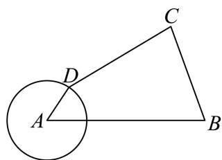

<!-- question-source:start -->
10. 摇杆机械装置, 如图, A, B 为定点, C, D 是动点, AD = 1, CD = 3, BC = $\frac{5}{2}$ , AB = 4, 则 $\cos\angle ABC$ 的取值范围（）

A. $\left[\frac{5}{16},\frac{53}{80}\right]$ B. $\left[\frac{5}{16},\frac{73}{80}\right]$ C. $\left[\frac{5}{12},\frac{53}{80}\right]$ D. $\left[\frac{5}{12},\frac{73}{80}\right]$
<!-- question-source:end -->

![[高中/真题/按年份分类/2026/2026年高考北京卷数学高考真题_解析版_/一/题目/answers/Q00020344A1.md]]
