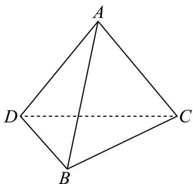

<!-- question-source:start -->
14. 已知三棱锥 $A - BCD$ ， $AD = AB = AC = 2\sqrt{2}$ ， $BD = BC = 2$ ， $DC = 2\sqrt{3}$ ，则它的底面 $BCD$ 的面积为 \_\_\_\_，体积为 \_\_\_\_。

<!-- question-source:end -->

![[高中/真题/按年份分类/2026/2026年高考北京卷数学高考真题_解析版_/一/题目/answers/Q00020348A1.md]]
