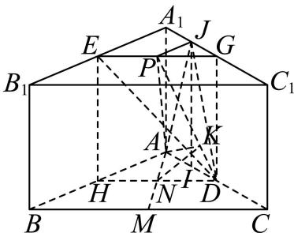
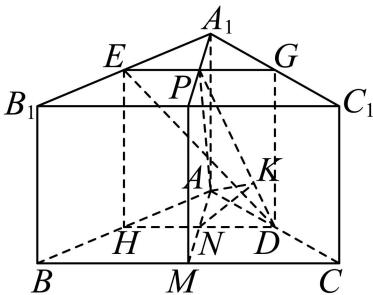

> [!faq]- 2026年高考北京卷数学高考真题（解析版）解析
>
> > [!success]- **【答案】** A
>
> > [!note]- **【分析】**
> > 本题未单列分析。
>
> > [!note]- **【解析】**
> > 【小问 1 详解】
> >
> > 略
> >
> > 【小问 2 详解】
> >
> > 由
> > （1）可知 $EG // B_{1}C_{1}$ ，则 $P \in EG$ ，
> >
> > 若选①：解法一：设 $AD$ ， $A_{1}G$ ， $EG$ 的中点分别为 $I, J, P$
> >
> > 
> >
> > 可知 $IJ$ 为线段 $AD$ 的中垂线，则 $AJ = DJ$ ，
> >
> > 因为 $PJ // A_{1}B_{1}$ ，由题意可知： $A_{1}B_{1} \perp$ 平面 $ACC_{1}A_{1}$ ，即 $PJ \perp$ 平面 $ACC_{1}A_{1}$ ，
> >
> > 则 $PJ \perp JA$ ， $PJ \perp JD$ ，可得 $PA = PD$ ，符合题意，
> >
> > 取 BC 的中点 M，连接 AM，设 $AM \cap DH = N$ ，
> >
> > 因为 AB = AC，则 $AM \perp BC$ ，
> >
> > 又因为 $BB_{1} \perp$ 平面 ABC， $AM \subset$ 平面 ABC，则 $AM \perp BB_{1}$ ，
> >
> > 且 $BC \cap BB_{1} = B$ ， $BC, BB_{1} \subset$ 平面 $BB_{1}C_{1}C$ ，则 $AM \perp$ 平面 $BB_{1}C_{1}C$ ，即 $AN \perp$ 平面 $BB_{1}C_{1}C$ 且平面 $DGEH //$ 平面 $BB_{1}C_{1}C$ ，可得 $AN \perp$ 平面 $DGEH$ ，
> >
> > 且 $PD \subset$ 平面 $DGEH$ ，可得 $AN \perp PD$
> >
> > 过点 N 作 $NK \perp PD$ ，
> >
> > 且 $AN \cap NK = N$ ， $AN, NK \subset$ 平面 $ANK$ ，
> >
> > 则 $PD \perp$ 平面 $ANK$ ，可得 $AK \perp PD$ ，
> >
> > 可知平面 PDE 与平面 PAD 的夹角为 $\angle AKN$ ，
> >
> > 由题意可知： $AN = ND = PG = \frac{1}{2} AM = \frac{\sqrt{2}}{2},\quad GD = \sqrt{2}$
> >
> > 则 $PD = \frac{\sqrt{10}}{2}$ ， $\sin \angle PDN = \cos \angle PDG = \frac{GD}{PD} = \frac{2}{\sqrt{5}}$
> >
> > 则 $NK = ND \cdot \sin \angle PDN = \frac{2}{\sqrt{10}}$ ， $AK = \frac{3}{\sqrt{10}}$
> >
> > 所以平面 $PDE$ 与平面 $PAD$ 的夹角余弦值为 $\cos \angle AKN = \frac{NK}{AK} = \frac{2}{3}$
> >
> > 解法二：设 $P(a,1 - a,\sqrt{2})$
> >
> > 因为 $PA = PD$ ，则 $\sqrt{a^2 + (1 - a)^2 + 2} = \sqrt{a^2 + (-a)^2 + 2}$ ，解得 $a = \frac{1}{2}$ ，即 $P\left(\frac{1}{2}, \frac{1}{2}, \sqrt{2}\right)$
> >
> > 则 $\overrightarrow{AP} = \left(\frac{1}{2},\frac{1}{2},\sqrt{2}\right),\quad \overrightarrow{AD} = (0,1,0)$
> >
> > 设平面 PAD 的法向量为 $\overrightarrow{n_{2}} = (x_{2}, y_{2}, z_{2})$ ，则 $\left\{\begin{aligned}\overrightarrow{n_{2}} \cdot \overrightarrow{AP} &= \frac{1}{2} x_{2} + y_{2} + \sqrt{2} z_{2} = 0 \\ \overrightarrow{n_{2}} \cdot \overrightarrow{AD} &= y_{2} = 0\end{aligned}\right.$ ,
> >
> > 令 $x_{2} = 2\sqrt{2}$ ，则 $y_{2} = 0$ ， $z_{2} = -1$ ，可得 $\overrightarrow{n_2} = (2\sqrt{2},0, - 1)$
> >
> > 因为平面 $DEG //$ 平面 $BB_{1}C_{1}C$ ，可知平面 $PDE$ 的法向量为 $\overrightarrow{n_1} = (1,1,0)$
> >
> > 则 $\cos \overrightarrow{n_1},\overrightarrow{n_2} = \frac{\overrightarrow{n_1}\cdot\overrightarrow{n_2}}{\left|\overrightarrow{n_1}\right|\cdot\left|\overrightarrow{n_2}\right|} = \frac{2\sqrt{2}}{\sqrt{2}\times 3} = \frac{2}{3},$
> >
> > 所以平面 $PDE$ 与平面 $PAD$ 的夹角余弦值为 $\frac{2}{3}$ ;
> >
> > 若选②：解法一：取 BC 的中点 M，连接 AM，设 $AM \cap DH = N$ ，
> >
> > 
> >
> > 因为 AB = AC，则 $AM \perp BC$ ，
> >
> > 又因为 $BB_{1} \perp$ 平面 ABC， $AM \subset$ 平面 ABC，则 $AM \perp BB_{1}$ ，
> >
> > 且 $BC \cap BB_{1} = B$ ， $BC, BB_{1} \subset$ 平面 $BB_{1}C_{1}C$ ，则 $AM \perp$ 平面 $BB_{1}C_{1}C$ ，即 $AN \perp$ 平面 $BB_{1}C_{1}C$
> >
> > 且平面 DGEH // 平面 $BB_{1}C_{1}C$ ，可得 $AN \perp$ 平面 DGEH，
> >
> > 取 $B_{1}C_{1}$ 的中点 Q，连接 $A_{1}Q$ ，QM，可知 $A_{1}Q // AM$ ，
> >
> > 设 $A_{1}Q \cap EG = P$ ，可知点 $P$ 为 $EG$ 的中点，
> >
> > 因为 $AM \perp BC$ ， $QM \perp BC$ ，可得 $BC \perp$ 平面 $AMQA_{1}$ ，则 $AP \perp BC$ ，
> >
> > 因为 $AN \perp$ 平面 DGEH 且 $PD \subset$ 平面 DGEH，可得 $AN \perp PD$ ，
> >
> > 过点 N 作 $NK \perp PD$ ，
> >
> > 且 $AN \cap NK = N$ ， $AN, NK \subset$ 平面 $ANK$
> >
> > 则 $PD \perp$ 平面 $ANK$ ，可得 $AK \perp PD$ ，
> >
> > 可知平面 PDE 与平面 PAD 的夹角为 $\angle AKN$ ，
> >
> > 由题意可知： $AN = ND = PG = \frac{1}{2} AM = \frac{\sqrt{2}}{2},\quad GD = \sqrt{2}$
> >
> > 则 $PD = \frac{\sqrt{10}}{2}$ ， $\sin \angle PDN = \cos \angle PDG = \frac{GD}{PD} = \frac{2}{\sqrt{5}}$
> >
> > 则 $NK = ND \cdot \sin \angle PDN = \frac{2}{\sqrt{10}}$ ， $AK = \frac{3}{\sqrt{10}}$
> >
> > 所以平面 PDE 与平面 PAD 的夹角余弦值为 $\cos \angle AKN = \frac{NK}{AK} = \frac{2}{3}$ ;
> >
> > 解法二：设 $P(a,1 - a,\sqrt{2})$ ，则 $\overrightarrow{AP} = (a,1 - a,\sqrt{2})$
> >
> > 因为 $AP \perp BC$ ，则 $\overrightarrow{AP} \cdot \overrightarrow{BC} = a + 1 - a = 0$ ，解得 $a = \frac{1}{2}$ ，即 $P\left(\frac{1}{2}, \frac{1}{2}, \sqrt{2}\right)$
> >
> > 则 $\overrightarrow{AP} = \left(\frac{1}{2},\frac{1}{2},\sqrt{2}\right),\quad \overrightarrow{AD} = (0,1,0)$
> >
> > 设平面 PAD 的法向量为 $\overrightarrow{n_{2}} = (x_{2}, y_{2}, z_{2})$ ，则 $\left\{\begin{aligned}\overrightarrow{n_{2}} \cdot \overrightarrow{AP} &= \frac{1}{2} x_{2} + y_{2} + \sqrt{2} z_{2} = 0 \\ \overrightarrow{n_{2}} \cdot \overrightarrow{AD} &= y_{2} = 0\end{aligned}\right.$ 令 $x_{2}=2\sqrt{2}$ ，则 $y_{2}=0,\quad z_{2}=-1$ ，可得 $\overrightarrow{n_{2}}=\left(2\sqrt{2},0,-1\right)$
> >
> > 因为平面 $DEG //$ 平面 $BB_{1}C_{1}C$ ，可知平面 $PDE$ 的法向量为 $\overrightarrow{n_1} = (1,1,0)$
> >
> > 则 $\cos \overrightarrow{n_1},\overrightarrow{n_2} = \frac{\overrightarrow{n_1}\cdot\overrightarrow{n_2}}{|\overrightarrow{n_1}| \cdot |\overrightarrow{n_2}|} = \frac{2\sqrt{2}}{\sqrt{2}\times 3} = \frac{2}{3},$
> >
> > 所以平面 PDE 与平面 PAD 的夹角余弦值为 $\frac{2}{3}$ ;
> >
> > 若选③：由
> > （1）可知：平面 DGEH // 平面 $BB_{1}C_{1}C$ ，
> >
> > 因为 $P \in EG$ ，平面 DGEH 即为平面 PDE，即平面 $PDE \parallel$ 平面 $BB_{1}C_{1}C$ ，
> >
> > 可得 $BB_{1}$ // 平面 PDE，此时点 P 不唯一，不合题意.
