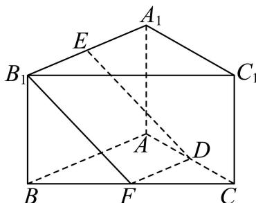
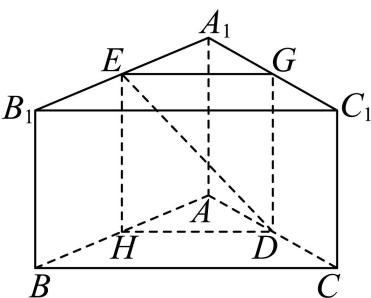
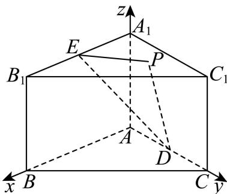

> [!faq]- 2026年高考北京卷数学高考真题（解析版）解析
>
> > [!success]- **【答案】** 详见解析
>
> > [!note]- **【分析】**
> > （1）解法一：作辅助线，可证 $DE // B_{1}F$ ，根据线面平行的判定定理分析证明；解法二：作辅助线，可证平面 $DGEH //$ 平面 $BB_{1}C_{1}C$ ，根据面面平行证明线面平行；解法三：建立空间直角坐标系，利用空间向量证明线面平行；
>
> > [!note]- **【解析】**
> > （1）解法一：取 BC 的中点 F，连接 DF， $B_{1}F$ ，
> >
> > 
> >
> > 因为 D, F 分别为 AC，BC 的中点，则 $DF \parallel AB$ ，且 $DF = \frac{1}{2} AB$ ，
> > 又因为 $ABB_{1}A_{1}$ 为矩形，且 E 为 $A_{1}B_{1}$ 的中点，则 $B_{1}E \parallel AB$ ，且 $B_{1}E = \frac{1}{2} AB$ ，
> > 可得 $DF \parallel B_{1}E$ ，且 $DF = B_{1}E$ ，可知 $DFB_{1}E$ 为平行四边形，则 $DE \parallel B_{1}F$ ，
> > 且 $DE \not\subset$ 平面 $BB_{1}C_{1}C$ ， $B_{1}F \subset$ 平面 $BB_{1}C_{1}C$ ，所以 DE // 平面 $BB_{1}C_{1}C$ ；
> > 解法二：设 $A_{1}C_{1}$ ，AB 的中点分别为 G，H，连接 DG，GE，EH，DH，因为 $D, G$ 分别为 $AC$ ， $A_{1}C_{1}$ 的中点，则 $DG // CC_{1}$ ， $DG // AA_{1}$ ，且 $DG \not\subset$ 平面 $BB_{1}C_{1}C$ ， $CC_{1} \subset$ 平面 $BB_{1}C_{1}C$ ，所以 $DG //$ 平面 $BB_{1}C_{1}C$ ，又因为 $G, E$ 分别为 $A_{1}C_{1}$ ， $A_{1}B_{1}$ 的中点，则 $GE // B_{1}C_{1}$ ，且 $GE \not\subset$ 平面 $BB_{1}C_{1}C$ ， $B_{1}C_{1} \subset$ 平面 $BB_{1}C_{1}C$ ，所以 $GE //$ 平面 $BB_{1}C_{1}C$ ，又因为 $E, H$ 分别为 $A_{1}C_{1}$ ， $AC$ 的中点，则 $EH // AA_{1}$ ，可得 $EH // DG$ ，可知 $E, H, D, G$ 四点共面，因为 $DG \cap GE = G$ ， $DG, GE \subset$ 平面 $DEG$ ，则平面 $DGEH //$ 平面 $BB_{1}C_{1}C$ ，且 $DE \subset$ 平面 $DGEH$ ，所以 $DE //$ 平面 $BB_{1}C_{1}C$ ；
> >
> > 
> >
> > 解法三：以 A 为坐标原点， $AB, AC, AA_{1}$ 分别为 x, y, z 轴，建立空间直角坐标系，
> >
> > 
> >
> > 则 $A(0,0,0)$ ， $B(2,0,0)$ ， $C(0,2,0)$ ， $A_{1}(0,0,\sqrt{2})$ ， $B_{1}(2,0,\sqrt{2})$ ， $C_1(0,2,\sqrt{2})$
> >
> > 且 $D(0,1,0)$ ， $E\left(1,0,\sqrt{2}\right)$
> >
> > 可得 $\overrightarrow{DE} = (1, - 1,\sqrt{2})$ ， $\overrightarrow{BB_1} = (0,0,\sqrt{2})$ ， $\overrightarrow{CB} = (2, - 2,0)$
> >
> > 设平面 $BB_{1}C_{1}C$ 的法向量为 $\overrightarrow{n_1} = (x_1,y_1,z_1)$ ，则 $\left\{ \begin{array}{l}\overrightarrow{n_1}\cdot \overrightarrow{BB_1} = \sqrt{2} z_1 = 0\\ \overrightarrow{n_1}\cdot \overrightarrow{BC} = 2x_1 - 2y_1 = 0 \end{array} \right.$
> >
> > 令 $x_{1} = 1$ ，则 $y_{1} = 1$ ， $z_{1} = 0$ ，可得 $\overrightarrow{n_1} = (1,1,0)$
> >
> > 因为 $\overrightarrow{DE} \cdot \overrightarrow{n_1} = 1 - 1 + 0 = 0$ ，即 $\overrightarrow{DE} \perp \overrightarrow{n_1}$ ，
> >
> > 因为 $DE \not\subset$ 平面 $BB_{1}C_{1}C$ ，所以 $DE //$ 平面 $BB_{1}C_{1}C$ 。
> > (2) $\frac{2}{3}$
