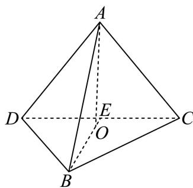

> [!faq]- 2026年高考北京卷数学高考真题（解析版）解析
>
> > [!success]- **【答案】** ①. $\sqrt{3}$ ②. $\frac{2\sqrt{3}}{3}$ 【
>
> > [!note]- **【分析】**
> > 先由底面三角形 $BCD$ 的边长求面积；再由 $AD = AB = AC$ ，可知点 $A$ 在底面 $BCD$ 上的投影 $O$ 为 $\triangle BCD$ 的外心，由此求出三棱锥的高.
>
> > [!note]- **【解析】**
> > 
> >
> > 法一：底面三角形 BCD 中，BD = BC = 2， $DC = 2\sqrt{3}$ .
> >
> > 取 DC 中点 E，连接 BE，则 $BE \perp DC$ ， $DE = EC = \sqrt{3}$ .
> >
> > 在 $Rt_{\triangle}BDE$ 中， $BE = \sqrt{BD^2 - DE^2} = \sqrt{4 - 3} = 1$
> >
> > 故底面面积 $S_{\triangle BCD} = \frac{1}{2}\cdot DC\cdot BE = \frac{1}{2}\times 2\sqrt{3}\times 1 = \sqrt{3}.$
> >
> > 由 $AB = AC = AD = 2\sqrt{2}$ 可知，点 $A$ 在底面 $BCD$ 上的投影 $O$ 为 $\triangle BCD$ 的外心.
> >
> > 在 $\triangle BCD$ 中，由余弦定理得 $\cos \angle DBC = \frac{2^2 + 2^2 - (2\sqrt{3})^2}{2 \times 2 \times 2} = \frac{4 + 4 - 12}{8} = -\frac{1}{2}$ ，
> >
> > 且 $0^{\circ} < \angle DBC < 180^{\circ}$ ，故 $\angle DBC = 120^{\circ}$
> >
> > 由正弦定理， $\triangle BCD$ 的外接圆半径 $R = \frac{DC}{2\sin\angle DBC} = \frac{2\sqrt{3}}{2\times\frac{\sqrt{3}}{2}} = 2$
> >
> > 则高 $h = AO = \sqrt{AB^2 - R^2} = \sqrt{(2\sqrt{2})^2 - 2^2} = \sqrt{8 - 4} = 2$
> >
> > 三棱锥 $A - BCD$ 的体积 $V = \frac{1}{3} \cdot S_{\triangle BCD} \cdot h = \frac{1}{3} \times \sqrt{3} \times 2 = \frac{2\sqrt{3}}{3}$ .
> >
> > 综上，底面面积为 $\sqrt{3}$ ，体积为 $\frac{2\sqrt{3}}{3}$ .
> >
> > 法二：在 $\triangle BCD$ 中，已知 $BD = BC = 2$ ， $DC = 2\sqrt{3}$
> >
> > 由余弦定理得 $\cos\angle DBC=\frac{2^{2}+2^{2}-\left(2\sqrt{3}\right)^{2}}{2\times2\times2}=\frac{4+4-12}{8}=-\frac{1}{2}$
> >
> > 且 $0^{\circ} < \angle DBC < 180^{\circ}$ ，故 $\angle DBC = 120^{\circ}$ ， $\sin 120^{\circ} = \frac{\sqrt{3}}{2}$ .
> >
> > 所以底面面积 $S_{\triangle BCD} = \frac{1}{2}\cdot BD\cdot BC\cdot \sin \angle DBC = \frac{1}{2}\cdot 2\cdot 2\cdot \frac{\sqrt{3}}{2} = \sqrt{3}.$
> >
> > 由 $AB = AC = AD = 2\sqrt{2}$ 可知，点 $A$ 在底面 $BCD$ 上的投影 $O$ 为 $\triangle BCD$ 的外心.
> >
> > 由正弦定理， $\triangle BCD$ 的外接圆半径 $R = \frac{DC}{2\sin\angle DBC} = \frac{2\sqrt{3}}{2\times\frac{\sqrt{3}}{2}} = 2$
> >
> > 则高 $h = AO = \sqrt{AB^2 - R^2} = \sqrt{(2\sqrt{2})^2 - 2^2} = \sqrt{8 - 4} = 2$
> >
> > 三棱锥 A-BCD 的体积 $V=\frac{1}{3}\cdot S_{\triangle BCD}\cdot h=\frac{1}{3}\times\sqrt{3}\times2=\frac{2\sqrt{3}}{3}$ .
> >
> > 综上，底面面积为 $\sqrt{3}$ ，体积为 $\frac{2\sqrt{3}}{3}$ .
