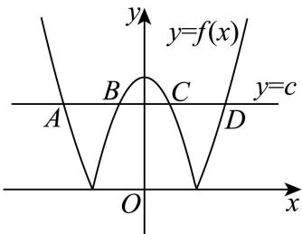

> [!faq]- 2026年高考北京卷数学高考真题（解析版）解析
>
> > [!success]- **【答案】** ①②③④ 【
>
> > [!note]- **【分析】**
> > ①，构造函数 $g(x) = x^2 - \cos x - c^2$ 并求其单调性和奇偶性，求出 $f(x)$ 的奇偶性，分 $g(x)$ 在 $(-1, 1]$ 内有零点和 $g(x)$ 在 $(-1, 1]$ 内无零点两种情况讨论，即可判断；②，求出 $f(x)$ 在 $(1, 2]$ 上的单调性，即可判断；③，求出 $f(x)$ 在 $c$ 取任意实数的单调性，结合零点存在性定理即可求出 $f(x) = 1$ 时 $x$ 的值，即可判断；④，求出 $f(0) = 1 + c^2 > c$ ，结合 $f(x)$ 单调性即可得出与直线 $y = c$ 的交点个数，即可判断.
>
> > [!note]- **【解析】**
> > 由题意，
> >
> > ①在 $g(x) = x^2 -\cos x - c^2$ 中， $g^{\prime}(x) = 2x + \sin x$ ， $g(1) = 1 - \cos 1 - c^2$
> >
> > $g(-x) = (-x)^{2} - \cos (-x) - c^{2} = x^{2} - \cos x - c^{2} = g(x)$ ，函数为偶函数，
> >
> > 在 $h(x)=g'(x)=2x+\sin x$ 中， $h'(x)=2+\cos x>0$
> >
> > ∴函数 $h(x)=g'(x)=2x+\sin x$ 单调递增，
> >
> > $$
> > \because h (0) = g ^ {\prime} (0) = 0 + 0 = 0,
> > $$
> >
> > ∴当x<0时， $h(x)=g'(x)<0$ ，当x>0时， $h(x)=g'(x)>0$ ，
> >
> > $\therefore g(x)$ 在 $(- \infty, 0)$ 上单调递减，在 $(0, +\infty)$ 上单调递增，
> >
> > ∴函数在 x=0 处取最小值， $g(0)=0-\cos0-c^{2}=-1-c^{2}$
> >
> > 在 $f(x) = \left|x^{2} - \cos x - c^{2}\right|$ 中，
> >
> > $f(-x) = \left|(-x)^2 -\cos (-x) - c^2\right| = \left|x^2 -\cos x - c^2\right| = f(x)$ ，为偶函数，
> >
> > 当 $g(x)$ 在 $(-1, 1]$ 内有零点时，
> >
> > 即 $\exists x_{1}\in (-1,0)$ ， $x_{2}\in (0,1)$ ，使得 $g(x) = 0$
> >
> > 此时 $f(x)$ 在 $(-1, x_{1}]$ ， $[0, x_{2}]$ 上单调递减，在 $[x_{1}, 0]$ ， $[x_{2}, 1]$ 上单调递增，
> >
> > $$
> > f \left(x _ {1}\right) = f \left(x _ {2}\right) = 0, f (0) = - g (0) = 1 + c ^ {2}, f (1) = g (1) = 1 - \cos 1 - c ^ {2},
> > $$
> >
> > $$
> > \because 1 + c ^ {2} > 1 - \cos 1 - c ^ {2}
> > $$
> >
> > $$
> > \therefore f (0) > f (1),
> > $$
> >
> > ∴ $f(x)$ 在 $x = x_{1}$ 和 $x = x_{2}$ 处取最小值， $f(x)_{\min} = 0$ ，
> >
> > 在 $x = 0$ 处取最大值， $f(x)_{\max} = 1 + c^2$
> >
> > 当 $g(x)$ 在 $(-1, 1]$ 内无零点时， $f(x) = -g(x) = -x^2 + \cos x + c^2$
> >
> > $f(x)$ 在 $(-1,0]$ 上单调递增，在 $[0,1]$ 上单调递减，
> >
> > ∴ $f(x)$ 在 x=1 处取得最小值， $f(x)_{\min}=f(1)=-1+\cos1+c^{2}$
> >
> > 在 $x = 0$ 处取得最大值， $f(x)_{\max} = f(0) = 0 + \cos 0 + c^2 = c^2 + 1$
> >
> > 故①正确；
> >
> > ②当 $c = 1$ 时，
> >
> > $$
> > f (x) = \left| x ^ {2} - \cos x - 1 \right|, g (x) = x ^ {2} - \cos x - 1, f (1) = | 1 - \cos 1 - 1 | = \cos 1 > 0,
> > $$
> >
> > 由①可得， $g(x)$ 在 $(0,+\infty)$ 上单调递增，
> >
> > $$
> > \because g (1) = 1 - \cos 1 - 1 = - \cos 1 <   0, \quad g (2) = 2 ^ {2} - \cos 2 - 1 = 3 - \cos 2 > 0,
> > $$
> >
> > ∴ $\exists x_{5}(1,2)$ ，使得 $g(x_{5})=0$ ，
> >
> > $$
> > \therefore \text {在} f (x) = \left| x ^ {2} - \cos x - 1 \right| \text {中,} x \in (1, 2 ],
> > $$
> >
> > 此时 $f(x)$ 在 $(1, x_{5}]$ 上单调递减，在 $[x_{5}, 2]$ 上单调递增，
> >
> > ∴ $f(x)$ 在 x=2 处取最大值，
> >
> > ②正确；
> >
> > ③同①可得推广结论，
> >
> > 在 $f(x) = \left|x^{2} - \cos x - c^{2}\right|$ 中， $f(0) = \left|0 - \cos 0 - c^{2}\right| = 1 + c^{2}$ ，
> >
> > $f(-x) = \left|(-x)^2 -\cos (-x) - c^2\right| = \left|x^2 -\cos x - c^2\right| = f(x)$ ，为偶函数，
> >
> > 即 $\exists x_{1}\in(-\infty,0)$ ， $x_{2}\in(0,+\infty)$ ，使得 $g(x_{1})=0$ ， $g(x_{2})=0$ ，
> >
> > 此时 $f(x)$ 在 $\left(-\infty, x_1\right]$ ， $[0, x_2]$ 上单调递减，在 $[x_1, 0]$ ， $[x_2, +\infty)$ 上单调递增，
> >
> > ∴ $f(x)$ 在 $x = x_{1}$ 和 $x = x_{2}$ 处取极小值，
> >
> > 当 $c = 0$ 时， $f(x) = |x^2 - \cos x|$ ， $g(x) = x^2 - \cos x$ ， $f(0) = 1$
> >
> > $\because f(x)$ 在 $\left(-\infty, x_1\right]$ 上单调递减， $f(x_1) = 0$
> >
> > $\therefore \exists x_{3} \in (-\infty, x_{1}]$ ，使得 $f(x_{3}) = 1$ ，
> >
> > $\because f(x)$ 在 $[x_2, +\infty)$ 上单调递增， $f(x_2) = 0$
> >
> > $\therefore \exists x_{4}\in \left[x_{2}, + \infty\right)$ ，使得 $f(x_4) = 1$
> >
> > ∴当 $x=x_{3},x_{4},0$ 时， $f(x)=1$ ，
> >
> > $\therefore c=0,\quad f(x)$ 有 3 解，
> >
> > 故③正确；
> >
> > ④由③可得，
> >
> > 在 $f(x) = \left|x^{2} - \cos x - c^{2}\right|$ 中， $f(0) = 1 + c^2$
> >
> > 此时 $f(x)$ 在 $\left(-\infty, x_1\right]$ ， $[0, x_2]$ 上单调递减，在 $[x_1, 0]$ ， $[x_2, +\infty)$ 上单调递增，
> >
> > 在 $\omega (x) = 1 + x^2 -x$ 中， $\Delta = (-1)^{2} - 4\times 1\times 1 = -3 <   0$
> >
> > $1 > 0$ ，开口向上，
> >
> > ∴函数 $\omega(x)=1+x^{2}-x>0$ ，即 $1+x^{2}>x$ 恒成立，
> >
> > $\therefore f(0) = 1 + c^2 >c$
> >
> > $\therefore y=c$ 在 $(0,f(0))$ 下方，
> >
> > $\because c>0,$
> >
> > $\therefore y=c$ 在 x 轴上方，
> >
> > 此时 y=c 与 $f(x)$ 有 4 个交点，
> >
> > 故④正确.
> >
> > 
