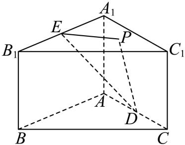

<!-- question-source:start -->
18. 已知直三棱柱 $ABC - A_{1}B_{1}C_{1}$ , $\angle BAC = 90^{\circ}$ , $AB = AC = 2$ , $BB_{1} = \sqrt{2}$ , $E$ 、 $D$ 分别为 $A_{1}B_{1}$ 、 $AC$ 的中点.

（1）证明： $DE \parallel$ 平面 $BB_{1}C_{1}C$ ；

(2) 点 $P$ 在平面 $A_{1}B_{1}C_{1}$ 内, 且 $EP // B_{1}C_{1}$ , 再从条件①、条件②、条件③这三个条件中选择一个作为已知,使得 $P$ 唯一确定, 求平面 PAD 与平面 PDE 的夹角的余弦值.

① PA = PD ;

② $PA \perp BC$ ;

③ $BB_{1}$ // 平面 PDE.

注：如果选择条件①、条件②、条件③分别
<!-- question-source:end -->

![[高中/真题/按年份分类/2026/2026年高考北京卷数学高考真题_解析版_/一_试卷全图/题目/answers/Q00022351A1.md]]
