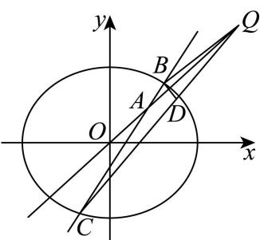

> [!faq]- 2026年高考北京卷数学高考真题（解析版）解析
>
> > [!success]- **【答案】** （1） $\frac{x^{2}}{4}+\frac{y^{2}}{3}=1$ (2) $k = \pm \frac{\sqrt{2}}{4}$ 【
>
> > [!note]- **【分析】**
> > （1）利用顶点坐标及离心率计算即可得；
>
> > [!note]- **【解析】**
> > 由题意可得 $a = 2$ ，则 $e = \frac{c}{a} = \frac{\sqrt{a^2 - b^2}}{a} = \frac{\sqrt{4 - b^2}}{2} = \frac{1}{2}$ ，即 $b = \sqrt{3}$ ，故 $E$ 的方程为 $\frac{x^2}{4} +\frac{y^2}{3} = 1$
> >
> > 【
> >
> > 小问2
> >
> > 由题意可得 $l_{BC}:y = k(x - 1) + 1$ ，设 $B(x_{1},y_{1})$ 、 $C(x_{2},y_{2})$ 由 $B$ 关于直线 $y = x$ 对称的点为 $D$ ，则 $D(y_{1},x_{1})$ 联立 $\left\{ \begin{array}{l}\frac{x^2}{4} +\frac{y^2}{3} = 1\\ y = k(x - 1) + 1 \end{array} \right.$ ，消去 $y$ 得： $(4k^{2} + 3)x^{2} - 8k(k - 1)x + 4k^{2} - 8k - 8 = 0,$ 由 $\frac{1^2}{4} +\frac{1^2}{3} = \frac{7}{12} <  1$ ，故 $A$ 在椭圆内部，故 $\Delta >0$ 恒成立，有 $x_{1} + x_{2} = \frac{8k(k - 1)}{4k^{2} + 3}$ 、 $x_{1}x_{2} = \frac{4k^{2} - 8k - 8}{4k^{2} + 3}$ 则 $y_{1} + y_{2} = k(x_{1} - 1) + 1 + k(x_{2} - 1) + 1 = k(x_{1} + x_{2}) - 2k + 2,$ $y_{1}y_{2} = [k(x_{1} - 1) + 1]\cdot [k(x_{2} - 1) + 1] = k^{2}x_{1}x_{2} + (k - k^{2})(x_{1} + x_{2}) + k^{2} - 2k + 1,$ $l_{CD}:y = \frac{y_2 - x_1}{x_2 - y_1}(x - y_1) + x_1,$ 联立 $\left\{ \begin{array}{ll}y = \frac{y_2 - x_1}{x_2 - y_1}(x - y_1) + x_1\\ y = x \end{array} \right.$ 则 $x = \frac{y_2 - x_1}{x_2 - y_1}(x - y_1) + x_1$ ，即 $(x_{2} - y_{1})x = (y_{2} - x_{1})x - (y_{2} - x_{1})y_{1} + x_{1}(x_{2} - y_{1}),$ 整理得 $x = \frac{x_1x_2 - y_1y_2}{(x_1 + x_2) - (y_1 + y_2)}$ ，即 $Q\left(\frac{x_1x_2 - y_1y_2}{(x_1 + x_2) - (y_1 + y_2)},\frac{x_1x_2 - y_1y_2}{(x_1 + x_2) - (y_1 + y_2)}\right),$ 点 $B$ 到直线 $AQ$ 的距离 $d_{1} = \frac{|x_{1} - y_{1}|}{\sqrt{2}}$ ，点 $C$ 到直线 $AQ$ 的距离 $d_{2} = \frac{|x_{2} - y_{2}|}{\sqrt{2}}$ 又 $|AQ| = \sqrt{2}|x_Q - 1|$ ，则 $S_{\triangle ABQ} = \frac{1}{2}\cdot \sqrt{2}|x_Q - 1|\cdot \frac{|x_1 - y_1|}{\sqrt{2}}, S_{\triangle ACQ} = \frac{1}{2}\cdot \sqrt{2}|x_Q - 1|\cdot \frac{|x_2 - y_2|}{\sqrt{2}},$ 故 $\left|S_{\triangle ABQ} - S_{\triangle ACQ}\right| = \frac{\sqrt{2}}{2}\left|x_Q - 1\right|\cdot \left|\frac{|x_1 - y_1|}{\sqrt{2}} -\frac{|x_2 - y_2|}{\sqrt{2}}\right| = \frac{1}{2}\left|x_Q - 1\right|\cdot \| x_1 - y_1| - |x_2 - y_2\|$ $= \frac{1}{2}\left|\frac{x_1x_2 - y_1y_2}{(x_1 + x_2) - (y_1 + y_2)} - 1\right|\cdot \left|(x_1 + x_2) - (y_1 + y_2)\right| = \frac{1}{2}\left|(x_1x_2 - y_1y_2) - (x_1 + x_2) + (y_1 + y_2)\right|$ $= \frac{1}{2}\left|(x_1x_2 - y_1y_2) - (x_1 + x_2) + (y_1 + y_2)\right|$
> >
> > $$
> > \begin{array}{l} = \frac {1}{2} \left| x _ {1} x _ {2} - k ^ {2} x _ {1} x _ {2} - (k - k ^ {2}) (x _ {1} + x _ {2}) - k ^ {2} + 2 k - 1 - (x _ {1} + x _ {2}) + k (x _ {1} + x _ {2}) - 2 k + 2 \right| \\ = \frac {1}{2} \left| (1 - k ^ {2}) x _ {1} x _ {2} - (1 - k ^ {2}) (x _ {1} + x _ {2}) - k ^ {2} + 1 \right| \\ = \frac {1}{2} \left| \frac {(1 - k ^ {2}) (4 k ^ {2} - 8 k - 8)}{4 k ^ {2} + 3} - \frac {(1 - k ^ {2}) 8 k (k - 1)}{4 k ^ {2} + 3} - k ^ {2} + 1 \right| \\ = \frac {1}{2} \left| \frac {4 k ^ {2} - 8 k - 8 - 4 k ^ {4} + 8 k ^ {3} + 8 k ^ {2}}{4 k ^ {2} + 3} - \frac {8 k ^ {2} - 8 k - 8 k ^ {4} + 8 k ^ {3}}{4 k ^ {2} + 3} + \frac {- 4 k ^ {4} - 3 k ^ {2} + 4 k ^ {2} + 3}{4 k ^ {2} + 3} \right| \\ = \frac {1}{2} \left| \frac {5 k ^ {2} - 5}{4 k ^ {2} + 3} \right| = \frac {5}{8}, \end{array}
> > $$
> >
> > 即有 $\left|5k^2 - 5\right| = 5k^2 + \frac{15}{4}$ ，若 $k^2 > 1$ ，则 $5 = \frac{15}{4}$ ，无解，不符；
> >
> > 则 $k^{2}<1$ ，有 $5-5k^{2}=5k^{2}+\frac{15}{4}$ ，解得 $k=\pm\frac{\sqrt{2}}{4}$ ;
> >
> > 故 $k=\pm\frac{\sqrt{2}}{4}$ .
> >
> > 
