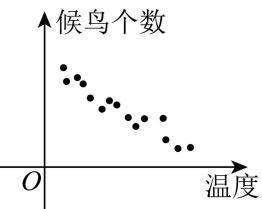

<!-- question-source:start -->
3. 调查候鸟和温度的关系，在不同温度下统计候鸟的数量，所得数据如图所示，其中相关系数 $r = -0.91$ ，根据最小二乘法算得： $\hat{y} = -1.17x + 1370.7$ ，下列说法正确的是（）

A. $y$ 与 $x$ 负相关 B.当 $x = 10$ 时， $y$ 一定为1359C.当 $x = 10$ 时， $y$ 一定小于1359 D.两变量无线性关系
<!-- question-source:end -->

![[高中/真题/按年份分类/2026/2026年高考天津卷数学高考真题_解析版_/一_单选题/题目/answers/Q00020296A1.md]]
