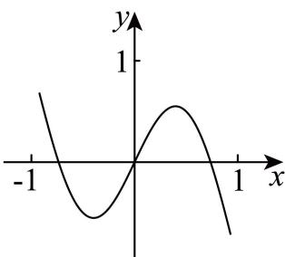

<!-- question-source:start -->
4. 函数 $f(x)$ 的部分图象如图所示，则 $f(x)$ 的解析式可能为（）

A. $x + \sin \pi x$ B. $x - \sin \pi x$ C. $-x + \sin \pi x$ D. $x\cdot \sin \pi x$
<!-- question-source:end -->

![[高中/真题/按年份分类/2026/2026年高考天津卷数学高考真题_解析版_/单选题/题目/answers/Q00020297A1.md]]
