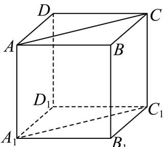
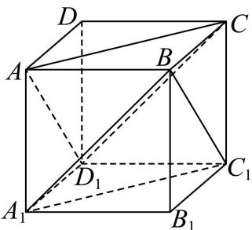
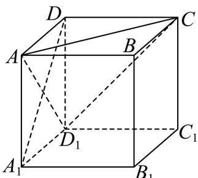
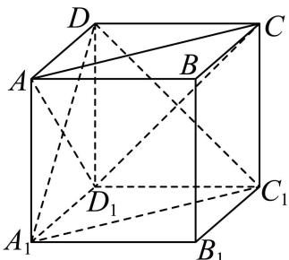

> [!faq]- 2026年高考天津卷数学高考真题（解析版）解析
>
> > [!success]- **【答案】** D
>
> > [!note]- **【分析】**
> > A 项, 通过证明四边形 $ACC_{1}A_{1}$ 是平行四边形, 即可证明结论; B 项, 通过 $CC_{1} \perp BC$ , $CC_{1} \perp CD$ , 即可证明 $CC_{1} \perp$ 平面 $ABC$ ; C 项, 通过证明 $AC //$ 平面 $A_{1}C_{1}B$ , $CD_{1} //$ 平面 $A_{1}C_{1}B$ , 即可证明结论; D 项, 假设垂直, 得出 $AD \perp$ 平面 $ACD_{1}$ , 结合几何知识得出矛盾, 即可得出结论.
>
> > [!note]- **【解析】**
> > 由题意，
> >
> > 在正方体 $ABCD - A_{1}B_{1}C_{1}D_{1}$ 中，
> >
> > A项，
> >
> > 
> >
> > $AA_{1} // CC_{1}, \quad AA_{1} = CC_{1},$
> >
> > ∴四边形 $ACC_{1}A_{1}$ 是平行四边形，
> >
> > $\therefore AC // A_{1}C_{1}$ ，A 正确；
> >
> > B项，
> >
> > 由几何知识得， $CC_{1} \perp BC$ ， $CC_{1} \perp CD$ ，
> >
> > $BC\cap CD = C$ ， $BC\subset$ 平面ABC， $CD\subset$ 平面ABC，
> >
> > $\therefore CC_{1} \perp$ 平面 ABC，故 B 正确；
> >
> > C 项，
> >
> > 
> >
> > ∵ $AC // A_{1}C_{1}$ ， $A_{1}C_{1} \subset$ 平面 $A_{1}C_{1}B$ ，AC ∉ 平面 $A_{1}C_{1}B$
> >
> > ∴ AC // 平面 $A_{1}C_{1}B$ ,
> >
> > 由几何知识得， $BC // A_{1}D_{1}$ ， $BC = A_{1}D_{1}$ ，
> >
> > ∴四边形 $A_{1}BCD_{1}$ 是平行四边形，
> >
> > $\therefore CD_{1} // A_{1}B,$
> >
> > ∵ $A_{1}B \subset$ 平面 $A_{1}C_{1}B$ ， $CD_{1} \not\subset$ 平面 $A_{1}C_{1}B$ ，
> >
> > ∴ $CD_{1}$ // 平面 $A_{1}C_{1}B$
> >
> > $$
> > \because A C \cap C D _ {1} = C, A _ {1} B \cap A _ {1} C _ {1} = A _ {1}
> > $$
> >
> > ∴平面 $ACD_{1}$ // 平面 $A_{1}C_{1}B$ ，C 正确；
> >
> > D 项，
> >
> > 
> >
> > 假设平面 $ADD_{1} \perp$ 平面 $ACD_{1}$ ，则交线为 $AD_{1}$
> >
> > 此时有 $A_{1}D \perp AD_{1}$
> >
> > $\therefore A_{1}D \perp$ 平面 $ACD_{1}$ ,
> >
> > $\because AC \subset$ 平面 $ACD_{1}$ ,
> >
> > $\therefore A_{1}D \perp AC,$
> >
> > 连接 $A_{1}C_{1}$ ， $C_{1}D$ ，
> >
> > 
> >
> > 由几何知识得， $AC // A_{1}C_{1}$ ，则 $A_{1}D \perp A_{1}C_{1}$ ，故 $\angle C_{1}A_{1}D = 90^{\circ}$
> >
> > 在 $\triangle A_{1}C_{1}D$ 中，由几何知识得， $A_{1}C_{1}=A_{1}D=C_{1}D$ ，
> >
> > ∴三角形为等边三角形， $\angle C_{1}A_{1}D=60^{\circ}$ ，矛盾，
> >
> > 故 D 错误.
