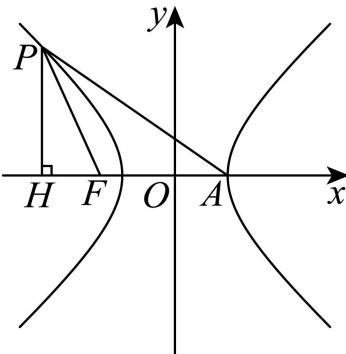

> [!faq]- 2026年高考天津卷数学高考真题（解析版）解析
>
> > [!success]- **【答案】** D
>
> > [!note]- **【分析】**
> > 过点 P 作 PH 垂直 x 轴，垂足为 H，根据几何关系用 a, c 表示出点 P 坐标，代入双曲线方程构造齐次式，然后可得离心率.
>
> > [!note]- **【解析】**
> > 如图，过点 P 作 PH 垂直于 x 轴，垂足为 H，
> >
> > 因为 $\left|FA\right|=\left|FP\right|$ ，所以 $\angle FPA=\angle FAP=30^{\circ}$ ，所以 $\angle PFH=60^{\circ}$ ，
> >
> > 又 $\left|PF\right|=\left|FA\right|=a+c$ ，所以 $\left|HF\right|=\frac{1}{2}(a+c),\left|PH\right|=\frac{\sqrt{3}}{2}(a+c)$ ,
> >
> > 根据双曲线对称性，不妨设点 $P$ 在第二象限，则 $P\left(-\frac{1}{2} a - \frac{3}{2} c, \frac{\sqrt{3}}{2} a + \frac{\sqrt{3}}{2} c\right)$ ，
> >
> > 将点 P 坐标代入双曲线方程得： $\frac{\left(-\frac{1}{2}a-\frac{3}{2}c\right)^{2}}{a^{2}}-\frac{\left(\frac{\sqrt{3}}{2}a+\frac{\sqrt{3}}{2}c\right)^{2}}{b^{2}}=1$
> >
> > 整理得 $\left(a + 3c\right)^2 b^2 -3\left(a + c\right)^2 a^2 = 4a^2 b^2$
> >
> > 将 $b^{2} = c^{2} - a^{2}$ 代入上式，整理得 $\left(a + 3c\right)^{2}\left(c^{2} - a^{2}\right) - 3\left(a + c\right)^{2}a^{2} = 4a^{2}\left(c^{2} - a^{2}\right)$ ，
> >
> > 两边同时除以 $a^4$ ，整理得 $(3e - 4)(e + 1)^2 = 0$ ，解得 $e = \frac{4}{3}$
> >
> > 
> >
> > 第 II 卷（非选择题）
> >
> > 注意事项：
> > （1）用黑色墨水的钢笔或签字笔将
