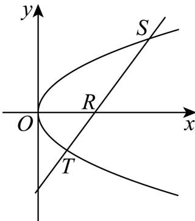
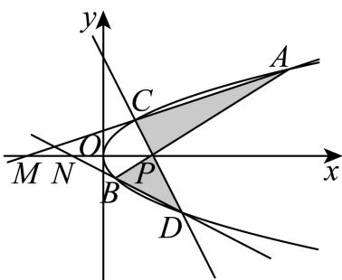

> [!faq]- 2026年高考天津卷数学高考真题（解析版）解析
>
> > [!success]- **【答案】** ②④
>
> > [!note]- **【分析】**
> > 首先探求抛物线弦与 $x$ 轴交点坐标与弦端点纵坐标积的关系，再利用关系式逐项分析，①②易得，③④⑤将长度与面积都转化为纵坐标表示，化简求解可得.
>
> > [!note]- **【解析】**
> > 由题意 A、B、C、D 为抛物线 $y^{2}=2x$ 上四个点可知， $y_{A}, y_{B}, y_{C}, y_{D}$ 两两不等.
> >
> > 设抛物线 $y^{2} = 2x$ 上任意两点 $S\left(\frac{s^2}{2}, s\right), T\left(\frac{t^2}{2}, t\right)$ ，其中 $s \neq t$ .
> >
> > 当 $s + t \neq 0$ 时，直线 $ST$ 的斜率 $k = \frac{s - t}{\frac{s^2}{2} - \frac{t^2}{2}} = \frac{2}{s + t}$ ，
> >
> > 则直线 ST 方程为 $y-t=\frac{2}{s+t}(x-\frac{t^{2}}{2})$ ,
> >
> > 令 $y = 0$ ，则直线 $ST$ 与 $x$ 轴的交点 $R$ 横坐标 $x_0 = -\frac{st}{2}$
> >
> > 特别地，当 $s+t=0$ 时，s=-t，
> >
> > 此时直线 $ST$ 垂直于 $x$ 轴， $x_0 = -\frac{st}{2}$ 也成立，
> >
> > 因此，直线 $ST$ 与 $x$ 轴的交点 $R$ 横坐标 $x_0 = -\frac{st}{2}$ （\*）.
> >
> > 
> >
> > ①由题意直线 AB 交 x 轴于点 P，若 P 与抛物线焦点重合，则其横坐标为 $\frac{1}{2}$
> >
> > 故由\*式可得 $\frac{1}{2} = -\frac{y_A y_B}{2}$ ，即 $y_A y_B = -1 \neq -2$ ，故①错误；
> >
> > ②由题意直线 AB 与直线 CD 交 x 轴于点 P，
> >
> > 则由\*式可得点P横坐标 $x_{0}=-\frac{y_{A}y_{B}}{2}=-\frac{y_{C}y_{D}}{2}$ ,
> >
> > 可得 $y_A y_B = y_C y_D$ ，故②正确；
> >
> > ③由题意直线 AC 交 x 轴于点 M ，直线 BD 交 x 轴于点 N ，
> >
> > 则由\*式可得
> >
> > $$
> > \left| O M \right| = \left| x _ {M} \right| = \left| - \frac {y _ {A} y _ {C}}{2} \right|, \left| O N \right| = \left| x _ {N} \right| = \left| - \frac {y _ {B} y _ {D}}{2} \right|, \left| O P \right| = \left| x _ {0} \right| = \left| - \frac {y _ {A} y _ {B}}{2} \right| = \left| - \frac {y _ {C} y _ {D}}{2} \right|,
> > $$
> >
> > 则 $\left|OM\right|\left|ON\right|=\frac{\left|y_{A}y_{B}y_{C}y_{D}\right|}{4}=\frac{\left|y_{A}y_{B}\right|^{2}}{4},\left|OP\right|^{2}=\frac{\left|y_{A}y_{B}\right|^{2}}{4},$
> >
> > 故 $\left|OM\right|\left|ON\right|=\left|OP\right|^{2}$ ，故③错误；
> >
> > ④由\*式可得 $\left|y_{A}-y_{C}\right|\left|OP\right|=\left|y_{A}-y_{C}\right|\frac{\left|y_{A}y_{B}\right|}{2},\left|y_{B}-y_{D}\right|\left|OM\right|=\left|y_{B}-y_{D}\right|\frac{\left|y_{A}y_{C}\right|}{2}$
> >
> > 当点 A 或 C 为原点时，则点 P, M 也重合于原点，此时 $\left|y_{A}-y_{C}\right|\left|OP\right|=\left|y_{B}-y_{D}\right|\left|OM\right|$ ;
> >
> > 当点 A 与 C 均不为原点时，即 $y_{A} \neq 0$ ，且 $y_{C} \neq 0$ ，
> >
> > 则结合②结论可知， $\frac{\left|y_{A}-y_{C}\right|\frac{\left|y_{A}y_{B}\right|}{2}}{\left|y_{B}-y_{D}\right|\frac{\left|y_{A}y_{C}\right|}{2}}=\frac{\left|y_{A}y_{B}-y_{C}y_{B}\right|}{\left|y_{B}y_{C}-y_{D}y_{C}\right|}=\frac{\left|y_{D}y_{C}-y_{C}y_{B}\right|}{\left|y_{B}y_{C}-y_{D}y_{C}\right|}=1,$
> >
> > 则有 $\left|y_{A}-y_{C}\right|\left|OP\right|=\left|y_{B}-y_{D}\right|\left|OM\right|$ ，故④正确；
> >
> > ⑤由 $y_{A}y_{B}=y_{C}y_{D}$ ，可知 $\frac{\left|y_{A}\right|}{\left|y_{D}\right|}=\frac{\left|y_{C}\right|}{\left|y_{B}\right|}$ ，则 $\frac{\left|OM\right|}{\left|ON\right|}=\frac{\left|x_{M}\right|}{\left|x_{N}\right|}=\frac{\left|y_{A}y_{C}\right|}{\left|y_{B}y_{D}\right|}=\left(\frac{y_{A}}{y_{D}}\right)^{2}$
> >
> > $$
> > \frac {S _ {\triangle A C P}}{S _ {\triangle B D P}} = \frac {\frac {1}{2} | M P | \left| y _ {A} - y _ {C} \right|}{\frac {1}{2} | N P | \left| y _ {B} - y _ {D} \right|} = \frac {\left| \frac {y _ {A} y _ {C}}{2} - \frac {y _ {A} y _ {B}}{2} \right| \left| y _ {A} - y _ {C} \right|}{\left| \frac {y _ {B} y _ {D}}{2} - \frac {y _ {C} y _ {D}}{2} \right| \left| y _ {B} - y _ {D} \right|}
> > $$
> >
> > $$
> > = \frac {\left| y _ {A} \right| \left| y _ {A} - y _ {C} \right|}{\left| y _ {D} \right| \left| y _ {B} - y _ {D} \right|} = \frac {\left| y _ {A} \right| \left| y _ {A} - y _ {C} \right|}{\left| y _ {D} \right| \left| \frac {y _ {C} y _ {D}}{y _ {A}} - y _ {D} \right|} = \frac {\left| y _ {A} \right| ^ {2}}{\left| y _ {D} \right| ^ {2}} = \left(\frac {y _ {A}}{y _ {D}}\right) ^ {2} = \frac {| O M |}{| O N |},
> > $$
> >
> > 如图，当 $\frac{|OM|}{|ON|} \neq 1$ 时， $\frac{S_{\triangle ACP}}{S_{\triangle BDP}} = \left(\frac{|OM|}{|ON|}\right)^2$ 不成立，故⑤错误；
> >
> > 故答案为: ②④
> >
> > 
> >
> > ##
