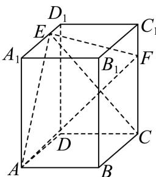

<!-- question-source:start -->
17. 在长方体 $ABCD - A_{1}B_{1}C_{1}D_{1}$ 中， $AB = 2$ ， $AA_{1} = 3$ ， $AD = 4$ ， $A_{1}E = 3ED_{1}$ ， $2C_{1}F = FC$ 。

（1）求证： $BD \perp$ 面 CEF；

(2) 求面 $AEF$ 与面 $CEF$ 的夹角的余弦值;

（3）求三棱锥 A-CEF 的体积.

【
<!-- question-source:end -->

![[高中/真题/按年份分类/2026/2026年高考天津卷数学高考真题_解析版_/解答题/题目/answers/Q00022413A1.md]]
