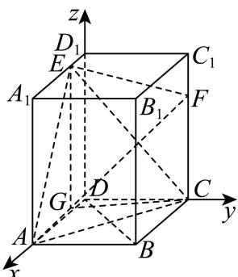

> [!faq]- 2026年高考天津卷数学高考真题（解析版）解析
>
> > [!success]- **【答案】** 详见解析
>
> > [!note]- **【分析】**
> > （1）由线面垂直的判定定理可证；
> > (2) 建立空间直角坐标系, 根据平面与平面的夹角的定义转化为异面直线所成的角, 利用向量法求该角的余弦值可得; 或由面面角的向量求法可得;
> > （3）由向量法证明 $AE \perp EF$ ，从而求得 $\triangle AEF$ 的面积，由向量法求得点 $C$ 到平面 $AEF$ 的距离，再根据棱锥的体积公式求得三棱锥 $A-CEF$ 的体积；或由向量法求得点 $A$ 到平面 $CEF$ 的距离，根据棱锥的体积公式可得三棱锥 $A-CEF$ 的体积.
>
> > [!note]- **【解析】**
> > （1）方法一：如图，过点 E 作 $EG \parallel CC_{1}$ ，交 AD 于点 G，则有 AG = 3GD, GD = 1.
> >
> > 连接 $CG$ ，则 $C,C_1,E,G$ 四点共面，平面 $CEF$ 即平面 $CC_{1}EG$
> >
> > 由 $\frac{GD}{CD} = \frac{CD}{BC} = \frac{1}{2}$ ， $\angle GDC = \angle DCB = 90^{\circ}$ ，可得 $\triangle GDC$ 与 $\triangle DCB$ 相似，
> >
> > 所以 $\angle GCD = \angle DBC$ ，则可得 $\angle GCD + \angle BDC = 90^{\circ}$ ，所以 $CG \perp BD$ 。
> >
> > 长方体 $ABCD-A_{1}B_{1}C_{1}D_{1}$ 中， $CC_{1}\perp$ 平面 ABCD，
> >
> > 因为 $BD \subset$ 平面 ABCD，所以 $CC_{1} \perp BD$ .
> >
> > 方法二：
> >
> > 又 $CC_{1}\cap CG=C,CC_{1},CG\subset$ 平面CEF，所以 $BD\perp$ 平面CEF.
> >
> > 如图，以 D 为坐标原点建立空间直角坐标系 D-xyz.
> >
> > 则 $D(0,0,0),A(4,0,0),B(4,2,0),C(0,2,0),F(0,2,2),E(1,0,3)$
> >
> > 所以 $\overrightarrow{DB}=(4,2,0),\overrightarrow{CE}=(1,-2,3),\overrightarrow{CF}=(0,0,2)$ .
> >
> > 所以 $\overrightarrow{DB} \cdot \overrightarrow{CE} = 4 - 4 + 0 = 0, \overrightarrow{DB} \cdot \overrightarrow{CF} = 0 + 0 + 0 = 0$
> >
> > 所以 $\overrightarrow{DB} \perp \overrightarrow{CE}, \overrightarrow{DB} \perp \overrightarrow{CF}$ ，即 $BD \perp CE, BD \perp CF$ .
> >
> > 又 $CE \cap CF = C, CE, CF \subset$ 平面 $CEF$ ，所以 $BD \perp$ 平面 $CEF$ .
> > (2) $\frac{\sqrt{15}}{5}$
> >
> > (3) 2
> >
> > 【小问 1 详解】
> >
> > 略
> >
> > 【小问 2 详解】
> >
> > 方法一：过点 E 作 $EG \parallel CC_{1}$ ，交 AD 于点 G，则有 AG = 3GD，GD = 1，
> >
> > 连接 $CG$ ，则 $C,F,E,G$ 四点共面，平面 $CEF$ 即平面 $CFEG$
> >
> > 如图，以 D 为坐标原点建立空间直角坐标系 D-xyz，则
> >
> > $D(0,0,0),A(4,0,0),F(0,2,2),E(1,0,3),G(1,0,0)$
> >
> > $\overrightarrow{EF} = (-1,2,-1)$ ， $\overrightarrow{AE} = (-3,0,3)$ ，所以 $\overrightarrow{AE}\cdot \overrightarrow{EF} = 0$
> >
> > 所以 $\overrightarrow{AE} \perp \overrightarrow{EF}$ .
> >
> > 取 EF 的中点 P，则 $P\left(\frac{1}{2},1,\frac{5}{2}\right)$ ，所以 $\overrightarrow{GP}=\left(-\frac{1}{2},1,\frac{5}{2}\right)$ ,
> >
> > $\overrightarrow{GP} \cdot \overrightarrow{EF} = \frac{1}{2} + 2 - \frac{5}{2} = 0$ ，所以 $\overrightarrow{GP} \perp \overrightarrow{EF}$ .
> >
> > 所以异面直线 AE 与 GP 所成的角等于平面 AEF 与平面 CEF 的夹角.
> >
> > 又 $\cos \left\langle \overrightarrow{AE},\overrightarrow{GP}\right\rangle = \frac{\overrightarrow{AE}\cdot\overrightarrow{GP}}{\left|\overrightarrow{AE}\right|\left|\overrightarrow{GP}\right|} = \frac{\frac{3}{2} + \frac{15}{2}}{3\sqrt{2}\times\frac{\sqrt{30}}{2}} = \frac{\sqrt{15}}{5},$
> >
> > 所以平面 AEF 与平面 CEF 的夹角的余弦值为 $\frac{\sqrt{15}}{5}$ .
> >
> > 方法二：如图，以 D 为坐标原点建立空间直角坐标系 D-xyz.
> >
> > 则 $D(0,0,0), A(4,0,0), B(4,2,0), C(0,2,0), F(0,2,2), E(1,0,3)$ .
> >
> > 所以 $\overrightarrow{AE} = (-3, 0, 3)$ , $\overrightarrow{AF} = (-4, 2, 2)$ ,
> >
> > 设平面 AEF 的法向量为 $\vec{n}=(x,y,z)$ ,
> >
> > 则 $\left\{ \begin{array}{l} \vec{n} \cdot \overrightarrow{AE} = -3x + 3z = 0 \\ \vec{n} \cdot \overrightarrow{AF} = -4x + 2y + 2z = 0 \end{array} \right.$ ，故可取 $\vec{n} = (1,1,1)$ .
> >
> > 由
> > （1）知平面 CEF 的一个法向量为 $\overrightarrow{DB} = (4, 2, 0)$ ,
> >
> > 所以 $\cos\left\langle\vec{n},\overrightarrow{DB}\right\rangle=\frac{\vec{n}\cdot\overrightarrow{DB}}{\left|\vec{n}\right|\left|\overrightarrow{DB}\right|}=\frac{4+2}{\sqrt{3}\times2\sqrt{5}}=\frac{\sqrt{15}}{5}$
> >
> > 所以平面 $AEF$ 与平面 $CEF$ 的夹角的余弦值为 $\frac{\sqrt{15}}{5}$ .
> >
> > 【小问 3 详解】
> >
> > 方法一：由 $\overrightarrow{EF} = (-1,2, - 1)$ ， $\overrightarrow{AE} = (-3,0,3)$ ，得 $\overrightarrow{AE}\cdot \overrightarrow{EF} = 0$
> >
> > 所以 $\overrightarrow{AE} \perp \overrightarrow{EF}$ .
> >
> > 所以 $\triangle AEF$ 的面积为 $\frac{1}{2} AE \cdot EF = \frac{1}{2} \times 3\sqrt{2} \times \sqrt{6} = 3\sqrt{3}$ .
> >
> > 由
> > （2）知，平面 $AEF$ 的一个法向量为 $\vec{n} = (1,1,1)$ ， $\overrightarrow{AC} = (-4,2,0)$
> >
> > 点 $C$ 到平面 $AEF$ 的距离为 $\left|\frac{\overrightarrow{AC} \cdot \vec{n}}{|\vec{n}|}\right| = \left|\frac{-4 + 2}{\sqrt{3}}\right| = \frac{2\sqrt{3}}{3}$ .
> >
> > 所以三棱锥 C-AEF 的体积 $V=\frac{1}{3}\times3\sqrt{3}\times\frac{2\sqrt{3}}{3}=2$ ，
> >
> > 所以三棱锥 A-CEF 的体积为 2.
> >
> > 方法二：点 $A$ 到平面 $CEF$ 的距离为 $\left|\frac{\overrightarrow{AE} \cdot \overrightarrow{DB}}{\left|\overrightarrow{DB}\right|}\right| = \frac{12}{2\sqrt{5}} = \frac{6\sqrt{5}}{5}$ .
> >
> > 因为 $EG \parallel CF$ ，所以E,G到CF的距离相等，
> >
> > 所以 $\triangle CEF$ 的面积等于 $\triangle GCF$ 的面积，即 $\frac{1}{2} \times CG \times CF = \frac{1}{2} \times \sqrt{1 + 4} \times 2 = \sqrt{5}$ .
> >
> > 所以三棱锥 A-CEF 的体积为 $V=\frac{1}{3}\times\sqrt{5}\times\frac{6\sqrt{5}}{5}=2$ .
> >
> > 
