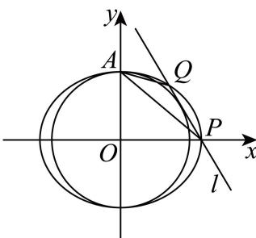

> [!faq]- 2026年高考天津卷数学高考真题（解析版）解析
>
> > [!success]- **【答案】** （1） $\frac{x^{2}}{4}+\frac{y^{2}}{3}=1$ (2) 3 【
>
> > [!note]- **【分析】**
> > （1）根据椭圆的离心率可知 a=2c， $b^{2}=3c^{2}$ ，然后将 x=b 代入椭圆方程即可求解；
> > （2）根据直线与圆相切即可求出 $m = \pm 2\sqrt{3}$ ，分类讨论即可.
>
> > [!note]- **【解析】**
> > 由于椭圆的离心率为 $\frac{1}{2}$ ，所以 $e=\frac{c}{a}=\frac{1}{2}$ ，即a=2c，
> >
> > 由于 $a^2 = b^2 + c^2$ ，所以 $b^2 = 3c^2$
> >
> > 将 $x = b$ 代入椭圆方程，得 $\frac{b^2}{a^2} +\frac{y^2}{b^2} = 1$ ，即 $\frac{3c^2}{4c^2} +\frac{y^2}{3c^2} = 1$ ，解得 $y^{2} = \frac{3}{4} c^{2}$ ，即 $y = \pm \frac{\sqrt{3}}{2} c$ 由题意，所截得的线段长为 $\sqrt{3}$ ，所以 $2\times \frac{\sqrt{3}}{2} c = \sqrt{3}$ ，解得 $c = 1$ ，从而 $a^2 = 4,b^2 = 3$ 所以椭圆的方程为 $\frac{x^2}{4} +\frac{y^2}{3} = 1.$
> >
> > 【
> >
> > 小问 2
> >
> > 由
> > （1）可知， $b^{2}=3$ ，所以圆的方程为 $x^{2}+y^{2}=3$ ，
> >
> > 设直线 $l$ 的方程为 $y = -\sqrt{3} x + m$ ，因为直线 $l$ 与圆相切，如图所示，
> >
> > 
> >
> > 则圆心到直线 $l$ 的距离 $d = \frac{|m|}{\sqrt{(-\sqrt{3})^2 + 1^2}} = \frac{|m|}{2} = \sqrt{3}$ ，解得 $m = \pm 2\sqrt{3}$ ，
> >
> > 椭圆上顶点 $A(0, \sqrt{3})$ ，分两种情况讨论：
> >
> > ①当 $m=2\sqrt{3}$ 时，直线 l 的方程为 $y=-\sqrt{3}x+2\sqrt{3}$ ，代入椭圆方程 $\frac{x^{2}}{4}+\frac{y^{2}}{3}=1$ ，
> >
> > 化简得 $5x^{2} - 16x + 12 = 0$ ，解得 $x = 2$ 或 $x = \frac{6}{5}$
> >
> > 则当 $x = 2$ 时， $y = 0$ ，当 $x = \frac{6}{5}$ 时， $y = \frac{4\sqrt{3}}{5}$ ，由于 $y_{1} < y_{2}$ ，所以 $P(2,0), Q\left(\frac{6}{5}, \frac{4\sqrt{3}}{5}\right)$ ，
> >
> > 则 $k_{1} = \frac{0 - \sqrt{3}}{2 - 0} = -\frac{\sqrt{3}}{2}, k_{2} = \frac{\frac{4\sqrt{3}}{5} - \sqrt{3}}{\frac{6}{5} - 0} = -\frac{\sqrt{3}}{6}$ 此时 $\frac{k_1}{k_2} = \frac{-\frac{\sqrt{3}}{2}}{-\frac{\sqrt{3}}{6}} = 3$
> >
> > ②当 $m = -2\sqrt{3}$ 时，直线 $l$ 的方程为 $y = -\sqrt{3} x - 2\sqrt{3}$ ，代入椭圆方程 $\frac{x^2}{4} + \frac{y^2}{3} = 1$
> >
> > 化简得 $5x^{2} + 16x + 12 = 0$ ，解得 $x = -2$ 或 $x = -\frac{6}{5}$
> >
> > 当 $x = -2$ 时， $y = 0$ ，当 $x = -\frac{6}{5}$ 时， $y = -\frac{4\sqrt{3}}{5}$ ，由于 $y_{1} < y_{2}$ ，所以 $P\left(-\frac{6}{5}, -\frac{4\sqrt{3}}{5}\right), Q(-2,0)$ ，
> >
> > 则 $k_{1} = \frac{-\frac{4\sqrt{3}}{5} - \sqrt{3}}{-\frac{6}{5} - 0} = \frac{3\sqrt{3}}{2}, k2 = \frac{0 - \sqrt{3}}{-2 - 0} = \frac{\sqrt{3}}{2}$ ，此时 $\frac{k_1}{k_2} = \frac{\frac{3\sqrt{3}}{2}}{\frac{\sqrt{3}}{2}} = 3.$
> >
> > 综上所述， $\frac{k_{1}}{k_{2}}$ 的值为3.
