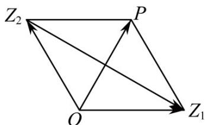

> [!faq]- 《专题02 复数》真题解析
>
> > [!success]- **【答案】** $2 \sqrt{3}$
>
> > [!note]- **【分析】**
> > 方法一：令 $z_{1} = a + bi, (a \in R, b \in R)$ ， $z_{2} = c + di, (c \in R, d \in R)$ ，根据复数的相等可求得 $ac + bd = -2$ ，代入复数模长的公式中即可得到结果。
> >
> > 方法二：设复数 $Z_{1}, z_{2}$ 所对应的点为 $Z_{1}, Z_{2}, OP = OZ_{1} + OZ_{2}$ ，根据复数的几何意义及复数的模，判定平行四边形 $OZ_{1}PZ_{2}$ 为菱形， $\left|OP\right| = \left|OZ_{1}\right| = \left|OZ_{2}\right| = 2$ ，进而根据复数的减法的几何意义用几何方法计算 $\left|z_{1} - z_{2}\right|$ .
>
> > [!note]- **【解析】**
> > 方法一：设 $z_{1} = a + bi, (a \in R, b \in R)$ ， $z_{2} = c + di, (c \in R, d \in R)$
> > $$
> > \therefore z _ {1} + z _ {2} = a + c + (b + d) i = \sqrt {3} + i
> > $$
> > $\therefore \left\{ \begin{array}{l} a + c = \sqrt{3} \\ b + d = 1 \end{array} \right.$ 又 $|z_1| = |z_2| = 2$ 所以 $a^2 + b^2 = 4, c^2 + d^2 = 4$
> > $$
> > \therefore (a + c) ^ {2} + (b + d) ^ {2} = a ^ {2} + c ^ {2} + b ^ {2} + d ^ {2} + 2 (a c + b d) = 4
> > $$
> > $$
> > \therefore a c + b d = - 2
> > $$
> > $\therefore \left|z_{1} - z_{2}\right| = \left|(a - c) + (b - d)i\right| = \sqrt{(a - c)^{2} + (b - d)^{2}} = \sqrt{8 - 2(ac + bd)}$ $= \sqrt{8 + 4} = 2\sqrt{3}$ .
> > 故答案为： $2 \sqrt{3}$
> > 方法二：如图所示，设复数 $Z_{1}, Z_{2}$ 所对应的点为 $Z_{1}, Z_{2}, OP = OZ_{1} + OZ_{2}$ ，
> > 由已知 $\left|OP\right|=\sqrt{3+1}=2=\left|OZ_{1}\right|=\left|OZ_{2}\right|$
> > ∴平行四边形 $OZ_{1}PZ_{2}$ 为菱形，且 $\triangle OPZ_{1},\triangle OPZ_{2}$ 都是正三角形，∴ $\angle Z_{1}OZ_{2}=120^{\circ}$
> > $$
> > \left| Z _ {1} Z _ {2} \right| ^ {2} = \left| O Z _ {1} \right| ^ {2} + \left| O Z _ {2} \right| ^ {2} - 2 \left| O Z _ {1} \right| \left| O Z _ {2} \right| \cos 1 2 0 ^ {\circ} = 2 ^ {2} + 2 ^ {2} - 2 \cdot 2 \cdot 2 \cdot \left(- \frac {1}{2}\right) = 1 2
> > $$
> > $$
> > \therefore \left| z _ {1} - z _ {2} \right| = \left| Z _ {1} Z _ {2} \right| = 2 \sqrt {3}
> > $$
> > 
> > 【点睛】方法一：本题考查复数模长的求解，涉及到复数相等的应用；考查学生的数学运算求解能力，是一道中档题·
> > 方法二：关键是利用复数及其运算的几何意义，转化为几何问题求解
