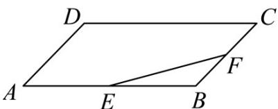

<!-- question-source:start -->
2.（2020·山东·高考真题）已知平行四边形ABCD，点E，F分别是AB，BC的中点（如图所示），设 $\overline{AB} = a$ ， $\overline{AD} = b$ ，则EF等于（ ）

A. $\frac{1}{2} (\vec{a} +\vec{b})$ B. $\frac{1}{2} (\vec{a} -\vec{b})$ C. $\frac{1}{2} (\vec{b} -\vec{a})$ D. $\frac{1}{2}\vec{a} +\vec{b}$
<!-- question-source:end -->

![[高中/真题/按题型分类/专题03 平面向量/考点03_平面向量的基本定理及其应用/真题/answers/Q00033771A1.md]]
